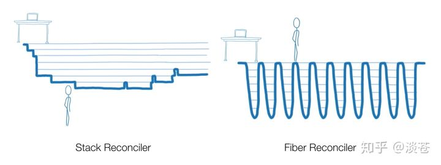

深入剖析 React Concurrent - 知乎

随着 React 16.8 正式发布，意味着 hooks 可以被正式使用了。根据官方发布的 React 16.x Roadmap，2019 Q2，下一个 minor 将正式发布 Concurrent Mode。你或许会对 Concurrent 略感陌生，但你一定对异步渲染（Async Mode）与时间分片（Time Slicing）印象深刻。Concurrent Mode 只是 Async Mode 的 重新定义，来凸显出 React 在不同优先级上的执行能力，与其它的异步渲染方式进行区分。

Concurrent 究竟是什么？

Concurrent 并不是一个新的概念，在 Fiber 诞生之初就被不停地提及。如果你是 React 的忠实关注者，你一定会对 React Conf 2017 上 Lin Clark 的 A Cartoon Intro to Fiber，以及 2018 JSConf Iceland 上 Dan Abramov 的 Beyond React 16 记忆犹新。早在 2 年前，Lin Clark 就用漫画的方式形象地向我们展现了 Stack Reconciler 与 Fiber Reconciler 运行区别，Fiber Reconciler 就是 Concurrent 的雏形。

Dan 在 JSConf Iceland 上演示的 Demo (演示代码已放到 codesandbox，读者可自行体验）一度引起了社区广泛的关注，我们可以明显感受到三种模式带来的体验差异，Sync 模式下页面是完全卡顿的，input 连续输入得不到响应，Debounced 模式下尽管连续输入流畅，但由于变更被统一延迟，下方图表没有随输入改变而重渲染，只有 Concurrent 下是正常的体验，输入流畅，图表也随之而变更。

这就是 Concurrent，它能使 React 在长时间渲染的场景下依旧保持良好的交互性，能优先执行高优先级变更，不会使页面处于卡顿或无响应状态，从而提升应用的用户体验。

从浏览器原理说起

你是否曾想过 Concurrent 的思路是从何而来？Concurrent 目的在于提升卡顿页面的体验，那么首先让我们结合浏览器运行原理来谈谈页面卡顿的原因，众所周知，JS 是单线程的，浏览器是多线程的，除了 JS 线程以外，还包括 UI 渲染线程、事件线程、定时器触发线程、HTTP 请求线程等等。JS 线程是可以操作 DOM 的，如果在操作 DOM 的同时 UI 线程也在进行渲染的话，就会发生不可预期的展示结果，因此 JS 线程与 UI 渲染线程是互斥的，每当 JS 线程执行时，UI 渲染线程会挂起，UI 更新会被保存在队列中，等待 JS 线程空闲后立即被执行。对于事件线程而言，当一个事件被触发时该线程会把事件添加到队列末尾，等待 JS 线程空闲后处理。因此，长时间的 JS 持续执行，就会造成 UI 渲染线程长时间地挂起，触发的事件也得不到响应，用户层面就会感知到页面卡顿甚至卡死了，Sync 模式下的问题就由此引起。

那么 JS 执行时间多久会是合理的呢？这里就需要提到帧率了，大多数设备的帧率为 60 次/秒，也就是每帧消耗 16.67 ms 能让用户感觉到相当流畅。浏览器的一帧中包含如下图过程：

在一帧中，我们需要将 JS 执行时间控制在合理的范围内，不影响后续 Layout 与 Paint 的过程。而经常被大家所提及的 requestIdleCallback 就能够充分利用帧与帧之间的空闲时间来执行 JS，可以根据 callback 传入的 dealine 判断当前是否还有空闲时间（timeRemaining）用于执行。由于浏览器可能始终处于繁忙的状态，导致 callback 一直无法执行，它还能够设置超时时间（timeout），一旦超过时间（didTimeout）能使任务被强制执行。

// 浏览器执行线程空闲时间调用 myWork，超过 2000ms 后立即必须执行requestIdleCallback(myWork,{timeout:2000});functionmyWork(deadline){// 如果有剩余时间，或者任务已经超时，并且存在任务就需要执行while((deadline.timeRemaining()>0||deadline.didTimeout)&&tasks.length>0){doWorkIfNeeded();}// 当前存在任务，再次调用 requestIdleCallback，会在空闲时间执行 myWorkif(tasks.length>0){requestIdleCallback(myWork,{timeout:2000});}}

结合上图，我们可以得知 requestIdleCallback 是在 Layout 与 Paint 之后执行的，这也就意味着 requestIdleCallback 里适合做 JS 计算，如果再进行 DOM 的变更，会重新触发 Layout 与 Paint，帧的时间也会因此不可控，requestIdleCallback 的兼容性也比较差。在 React 内部采用 requestAnimationFrame 作为 ployfill，通过 帧率动态调整，计算 timeRemaining，模拟 requestIdleCallback，从而实现时间分片（Time Slicing），一个时间片就是一个渲染帧内 JS 能获得的最大执行时间。requestAnimationFrame 触发在 Layout 与 Paint 之前，方便做 DOM 变更。

注意：我们这里把卡顿问题都归结于 JS 长时间执行，这针对 Concurrent 模式所解决的问题而言，卡顿也有可能是大量 Layout 或是 Paint 造成的。

写在 Concurrent 之前

介绍完浏览器原理与 requestIdleCallback 之后，相信你对 Concurrent 应该有所体会了。为了避免长时间的 JS 运行对于 UI 渲染以及界面交互产生影响，我们需要对 JS 进行控制。你不能一直执行下去，一个时间片后，要“踩刹车”，停下来，让页面完成交互和渲染，而交互所产生的变更要及时反馈给用户，比之前“踩刹车”任务更重要，需要“插个队”，等该任务完成后，再继续“踩刹车”任务。由此可见，在 Concurrent 模式下，我们需要思考如下几个问题：

1. 任务如何按时间片拆分、时间片间如何中断与恢复？

1. 任务是怎样设定优先级的？

1. 如何让高优先级任务后生成而先执行，低优先级任务如又何恢复？

在详细阐述上述问题之前，你需要对 Fiber 的基本概念有所了解。你在代码中写的 JSX，通过 Babel 或 TS 的处理后，会转化为 React.createElement，进一步转化为 Fiber 树，Fiber 树是链表结构，如下图所示，具体代码：

无论是类组件（ClassComponent）、函数组件（FunctionComponent）还是宿主组件（HostComponent，在 DOM 环境中就是 DOM 节点，例如 div），在底层都会统一抽象为 Fiber 节点 ，拥有父节点（return）、子节点（child）或者兄弟节点（sibling）的引用，方便对于 Fiber 树的遍历，同时组件与 Fiber 节点会建立唯一映射关系。

我们在组件中通过 setState 来进行更新，根据先前建立好的映射关系找到组件对应 Fiber，在 Fiber 的 updateQueue 中插入一个 update 对象，updateQueue 也是一个链表结构，会记录所属 Fiber 节点上收集到的更新。然后，我们会从触发 setState 的 Fiber 节点，不断 向上回溯，通知沿途上的 Fiber 节点，你有子孙节点被更新了，直至最顶端的 HostRoot。

接着，我们从 HostRoot 开始对 Fiber 树进行深度优先遍历。每个 Fiber 节点在遍历到时，若自身存在变更，会根据 Fiber 类型对节点执行创建/更新，其中包含了执行部分生命周期，给 Fiber 节点打上 effectTag 等操作。effectTag 代表了 Fiber 节点做了怎样的变更，具有 effectTag 的 Fiber 会成为 effect。每个 Fiber 中带有自身子节点的信息，据此来判断是否需要继续向下深度遍历，这个过程被称为 beginWork。

若不需要再向下遍历，Fiber 节点会开始回溯，判断是否存在兄弟节点需要进行遍历，如果没有，则回溯到父节点，并将自身及自身子树上的 effect 形成 effect list 向父节点传递，以此往复，直至 HostRoot，这个过程被称为 completeUnitOfWork。

合在一起，就是 render 过程，它是纯粹的 JS 计算，不（应）带有任何“副作用”。

在 render 过程中，effect 会随着 completeUnitOfWork 的过程，不断被 向上收集，最终在 HostRoot 完成所有 effect 收集。它代表着，对于本次更新，我们需要做哪些具体变更。之后我们进入 commit 阶段，把 effect list 变更到真实的宿主环境中，在浏览器中就是操作 DOM。

Concurrent 运行机制

了解 Fiber 的基本概念和整体流程后，我们再回到那三个与 Concurrent 相关的问题，看看 Concurrent 具体是如何实现的。

任务如何按时间片拆分、时间片间如何中断与恢复？

上文可知 Fiber 树的更新流程分为 render 阶段与 commit 阶段，render 阶段的纯粹意味着可以被拆分，在 Sync 模式下，render 阶段一次性执行完成，而在 Concurrent 模式下，render 阶段可以被拆解，每个时间片内分别运行一部分，直至完成，commit 模式由于带有 DOM 更新，不可能 DOM 变更到一半中断，因此必须一次性执行完成。

while(当前还有空闲时间&&下一个节点不为空){下一个节点=子节点=beginWork(当前节点);if(子节点为空){下一个节点=兄弟节点=completeUnitOfWork(当前节点);}当前节点=下一个节点;}

Concurrent 模式下，render 阶段遍历 Fiber 树的过程会在上述 while 循环中进行，每结束一次循环就会进行一次时间片的检查，如果时间片到了，while 循环将被 break，相当于 render 过程暂时被中断，当前处理到的节点会被保留下来，等待下一个时间分片到来时，继续处理。

任务是怎样划分优先级的？

在 Fiber 早期，曾对优先级有过明确 定义，但后面 被移除 了，提出了 expiration time 的概念。expiration time 顾名思义是过期时间，在 Fiber 中有两层不同的含义，注意区分：

- 解决调度中经典的饥饿（Starvation）问题，假设高优先级任务一直执行，低优先级任务将无法得到执行，我们给低优先级任务设定一个过期时间，一旦过期后，就需要被当做同步任务，立即执行，这与 requestIdleCallback 中的 didTimeout 是异曲同工的。

- 代表 update 优先级，expiration time 越大，优先级越高，如果你在其它资料中阅读到 expiration time 越小优先级越高，不要感到诧异，因为这块有过 变更。

时间线（time）在 Concurrent 模式下是一个非常重要的概念，当前时间（current time）一方面会与时间片的截止时间（frameDeadline）比较，告诉当前运行的 JS，是否需要暂停，另一方面，与 Fiber 的 expiration time 比较，来决定是否需要更新与向下遍历。你是否还记得上文中 setState 后更新 Fiber 节点会向上回溯到 HostRoot，在此过程中，会更新 Fiber 的 expirationTime，与其祖先节点上的 childExpirationTime。在之后节点遍历过程中：

- 如果 Fiber props 没有变化且 Fiber.expirationTime < currentExpirationTime，说明当前 Fiber 节点本身低优先级或没有变更，不需要执行更新的操作，比如打 effectTag。

- 如果 Fiber.childExpirationTime < currentExpirationTime，说明当前 Fiber 的子孙均为低优先级节点或没有变更，不需要向下继续遍历。

具体 expirationTime 的 设定，在 React 内部是这样划分的：

- Sync 具有最高优先级

- 异步方面，优先级分为 InteractiveExpiration 与 AsyncExpiration，同等时刻触发的 InteractiveExpiration 的优先级大于 AsyncExpiration

- InteractiveExpiration 一般指在 InteractiveEvent 中触发的更新，例如：blur, click, focus，keyDown, mouseDown 等等

React 对外暴露了 unstable_scheduleCallback 与 flushSync 两个 API，通过它们包裹的 setState 将具有不同的优先级，给开发者手动控制的能力。

unstable_scheduleCallback(()=>{// 异步低优先级任务，AsyncExpirationthis.setState();});flushSync(()=>{// 同步任务，最高优先级this.setState();});onClick={()=>{// 异步高优先级任务，InteractiveExpirationthis.setState();}}

如何让高优先级任务后生成而先执行，低优先级任务如何恢复？

高优先级任务在 render 阶段、commit 阶段、时间片间隙均有可能生成，一旦生成，低优先级任务会按问题 1 中断，跳出循环，变更全局 currentExpirationTime，从 HostRoot 重新开始遍历。

while(当前还有空闲时间// 不等于说明有更高优先级任务发生&&当前currentExpirationTime===当前最高优先级任务expirationTime&&下一个节点不为空){...}

上文可知，Fiber 节点在变更后会形成 update 对象，带有 expirationTime，插入 updateQueue 中，updateQueue 中所有 update 对象均按照变更（插入）顺序排列，若高优先级 update 与低优先级 update 同处一个队列，对于低优先级的 update 会采用跳过方式处理，来保证 Sync 模式与 Concurrent 模式下，最终变更结果是一致的，类似于 git rebase，如下图所示：

当我们优先完成高优先级任务后，还能继续低优先级任务么？不行，高优先级任务的变更可能对低优先级任务产生影响，低优先级任务必须重新来过，之前收集的 effectList 会被重置为 null，updateQueue 会从 current tree 中恢复回来。之前社区曾广泛 讨论，未来 React 中 componentWillMount 可能被调用多次，原因就在这里，低优先级任务的 render 阶段可能被重复执行，而 componentWillMount 包含在 render 阶段中。

实际中的 Concurrent

Concurrent 的出现无疑是革命性的，在此之前，无论 Angular、React 还是 Vue，前端框架解决的永远是工程效率问题，帮助前端从数据层面到 UI 层面更好地完成映射。似乎，用户体验与框架总是无关的，但 React Concurrent 做到了从框架层面去提升应用的体验，“Make it easier to build great UIs”，不得不说，近期的 React 从工程层面与体验层面均提升了一个 level。

回到我们的日常研发，Concurrent 真的是银弹么？我想，并不是，大家不应该把 React 性能优化全部寄托在 Concurrent 上。Concurrent 更适用于带有大量长时间渲染并含有富交互的应用，大部分应用中出现的性能问题，我认为主要是由工程代码层面引入的，而非业务，还是要从代码优化角度入手。Concurrent 正式发布后，用户感知应该不会很强烈，因为对于一般的应用而言，下一次变更前上一次更新早就完成了，是否 Concurrent 其实是一样的。这意味着，如果你的 React 应用目前是流畅的，开启 Concurrent 并不会对你的应用带来性能体验上的提升，如果你的 React 应用目前是卡顿的，或者在某些场景下是卡顿的，那么 Concurrent 或许可以挽救你一下，带来一些改变。

当然 Concurrent 还包含另一部分 Suspense，我们下篇文章再讲。我们正在深入研究 React16，欢迎社区小伙伴与我们一起前行，近期我们正在招聘 2020 届实习生，社招岗位也继续开放，欢迎私聊或投递简历 dancang.hj@alibaba-inc.com

