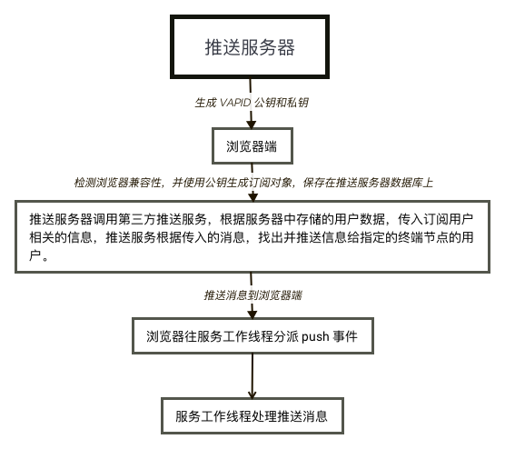

第九章：网页消息推送通知机制

> 原文请查阅[这里](https://blog.sessionstack.com/how-javascript-works-the-mechanics-of-web-push-notifications-290176c5c55d)，略有删减，本文采用[知识共享署名 4.0 国际许可协议](http://creativecommons.org/licenses/by/4.0/)共享，BY [Troland](https://github.com/Troland)。

**这是 JavaScript 工作原理的第九章。**

现在让我们把注意力转移到网页推送通知：我们将会查看其构造，探索发送／接收通知背后的过程以及最后分享一下我们在 [SessionStack](https://www.sessionstack.com/?utm_source=medium&utm_medium=blog&utm_content=javascript-series-push-notifications-2nd) 是如何计划利用这些功能来创建新的产品功能的。

推送通知这一功能在移动端已经非常普遍。不知为何，网页端的推送通知是千呼万唤始出来，即使大多数开发者强烈地要求实现这一功能。

## <a id="user-content-概述"></a>[](#概述)概述

网页推送通知允许用户选择定时从网络应用获取及时信息。它旨在为用户重新获取其感兴趣，重要和及时的信息。

推送服务是基于服务工作线程的，服务工作线程在之前的[文章](https://github.com/Troland/how-javascript-works/blob/master/service-worker.md)中有详细阐述过。

这个情况下，之所以采用服务工作线程是因为它会在后台运行，从而不会阻塞界面的渲染。对于推送通知来说，这是相当重要的，因为这意味着只有当用户和推送通知本身进行交互操作才会执行推送通知的相关代码。

## <a id="user-content-消息推送和通知"></a>[](#消息推送和通知)消息推送和通知

消息推送和通知是两个不同的接口。

- [消息推送](https://developer.mozilla.org/en-US/docs/Web/API/Push_API)－消息推送服务器向服务工作线程推送消息时调用。
- [消息通知](https://developer.mozilla.org/en-US/docs/Web/API/Notifications_API)－网络应用中的服务工作线程或者脚本进行操作向用户显示消息通知。

## <a id="user-content-消息推送"></a>[](#消息推送)消息推送

实现消息推送大概有以下三个步骤：

- 界面－添加客户端逻辑来让用户订阅推送服务。在网络应用界面中书写 JavaScript 代码逻辑来让用户注册消息推送服务。
- 发送消息－在服务器端实现接口调用来触发向用户设备推送消息。
- 接收消息－一旦在浏览器端接收到推送消息则处理之。

现在，让我们详细阐述整个过程。

## <a id="user-content-兼容性检测"></a>[](#兼容性检测)兼容性检测

首先，需要检测当前浏览器是否支持消息推送服务。可以采用以下两种简单的检查：

- 检测 `navigator` 对象上的 `serviceWorker` 属性
- 检测 `window` 对象上的 `PushManager` 属性

都检测代码如下：

```
if (!('serviceWorker' in navigator)) {
   // 当前浏览器不支持服务器工作线程，禁用或者隐藏界面
  return; 
}

if (!('PushManager' in window)) {
  // 当前浏览器不支持推送服务，禁用或者隐藏界面 
  return; 
}

```

## <a id="user-content-注册服务工作线程"></a>[](#注册服务工作线程)注册服务工作线程

现在，消息推送功能是支持的。下一下即注册服务工作线程。

从之前的[文章](https://github.com/Troland/how-javascript-works/blob/master/service-worker.md)中你应该很熟悉如何注册服务工作线程。

## <a id="user-content-请求授权"></a>[](#请求授权)请求授权

当注册服务工作线程之后，接下来进行用户订阅的相关操作。这需要获得用户的授权来向其推送消息。

获得授权的接口相当的简单但有一个缺点即接口 [接受的参数以前是一个回调函数现在是一个 Promise](https://developer.mozilla.org/en-US/docs/Web/API/Notification/requestPermission)。因为无法知晓当前浏览器支持的接口版本，所以需要进行兼容处理。

类似这样：

```
function requestPermission() {
  return new Promise(function(resolve, reject) {
    const permissionResult = Notification.requestPermission(function(result) {
      // 使用回调来处理废弃的接口版本
      resolve(result);
    });

    if (permissionResult) {
      permissionResult.then(resolve, reject);
    }
  })
  .then(function(permissionResult) {
    if (permissionResult !== 'granted') {
      throw new Error('Permission not granted.');
    }
  });
}

```

调用 `Notification.requestPermission()` 会向用户弹出以下的提示框：

[](https://user-images.githubusercontent.com/1475173/40720629-f3d8c418-6449-11e8-8f8c-a9e9b866ece8.png)

当获得，关闭以及禁止权限的时候，就可以得到 `granted`，`default` 或者 `denied` 的结果字符串。

需要注意的是当用户点击 `禁止` 按钮，网络应用将不会再次询问用户授权直到用户手动开启更改授权状态。该选项隐藏于设置面板中。

**点击地址栏最左边的信息按钮即可弹出授权的弹窗。**

## <a id="user-content-通过-pushmanager-订阅用户"></a>[](#通过-pushmanager-订阅用户)通过 PushManager 订阅用户

一旦服务工作线程注册成功且获得授权，就可以在注册服务器线程的时候通过调用 `registration.pushManager.subscribe()` 来订阅用户。

整个代码片断如下（包括注册服务工作线程）：

```
function subscribeUserToPush() {
  return navigator.serviceWorker.register('service-worker.js')
  .then(function(registration) {
    var subscribeOptions = {
      userVisibleOnly: true,
      applicationServerKey: btoa(
        'BEl62iUYgUivxIkv69yViEuiBIa-Ib9-SkvMeAtA3LFgDzkrxZJjSgSnfckjBJuBkr3qBUYIHBQFLXYp5Nksh8U'
      )
    };

    return registration.pushManager.subscribe(subscribeOptions);
  })
  .then(function(pushSubscription) {
    console.log('PushSubscription: ', JSON.stringify(pushSubscription));
    return pushSubscription;
  });
}

```

`registration.pushManager.subscribe(options）` 中有一个 *options* 对象参数，其中包含有必须或者可选的参数：

- **userVisibleOnly**：返回的推送订阅是否仅对订阅用户可见。必须设置为 `true` 否则会出错（这是历史原因造成的）。
- **applicationServerKey**：一个包含公钥的 Base64 编码的 `DOMString` 字符串或者 `ArrayBuffer` ，消息推送服务器用来验证应用服务器。

消息推送服务器需要生成一对应用服务器密钥对－即 VAPID 密钥对，这对于消息推送服务器来说是唯一的。它们是由一对公钥和私钥所组成的。私钥秘密存储于推送服务器端，公钥用来和客户端进行交换通讯用的。这些密钥让推送服务辨别订阅用户的应用服务器以及确保触发推送消息到指定用户的是同一个应用服务器。

你只需要一次性生成应用程序私有/公有密钥对。可以访问 [https://web-push-codelab.glitch.me/](https://web-push-codelab.glitch.me/) 生成密钥对。

当订阅用户的时候，浏览器向推送服务传入 `applicationServerKey` (公钥)，意即推送服务把应用服务器公钥和用户的 `PushSubscription` 绑定在一起。

过程如下：

- 网络应用加载完成然后，调用 `subscribe` ，传入服务器公钥。
- 浏览器向消息推送服务发起请求生成一个端点信息并连同密钥信息一起返回给浏览器。
- 浏览器把端信息添加到由 `subscribe()` promise 所返回的 `PushSubscription` 对象中。

之后，每当需要推送信息的时候，必须发送一个认证头其中包含应用服务器私钥签名的信息。

每当推送服务接收到推送消息的请求，它会通过在传输头中查找已经和指定端（第二步中）绑定的公钥来进行验证。

## <a id="user-content-pushsubscription-对象"></a>[](#pushsubscription-对象)PushSubscription 对象

`PushSubscription` 包含了向用户设备推送信息所必备的一切信息。大概包含如下信息：

```
{
  "endpoint": "https://domain.pushservice.com/some-id",
  "keys": {
    "p256dh":
"BIPUL12DLfytvTajnryr3PJdAgXS3HGMlLqndGcJGabyhHheJYlNGCeXl1dn18gSJ1WArAPIxr4gK0_dQds4yiI=",
    "auth":"FPssMOQPmLmXWmdSTdbKVw=="
  }
}

```

`endpoint` 即是推送服务地址。当需要推送消息时，向该地址发起 POST 请求。

`keys` 对象包含用来加密随推送消息一起发送的信息数据的值。

当用户订阅之后且返回了 `PushSubscription` 对象，你需要把它保存在推送服务器上。这样就可以把该订阅相关数据保存在数据库之中然后从今以后，就可以根据数据库中的存储值来给指定的用户发送消息。

[](https://user-images.githubusercontent.com/1475173/40720627-f2dad902-6449-11e8-8988-9eaeae0f09b7.png)

## <a id="user-content-消息推送-1"></a>[](#消息推送-1)消息推送

当需要发送消息到用户的时候，首先需要有一个消息推送服务。你通知推送服务（通过接口调用）需要推送的数据，消息推送的目标用户以及任意条件下如何发送消息。一般情况下，这些接口调用是由消息推送服务器来完成的。

## <a id="user-content-消息推送服务"></a>[](#消息推送服务)消息推送服务

消息推送服务是用来接收消息推送请求，验证请求以及推送消息到指定的用户浏览器端。

请注意这里的消息推送服务并不是由你来控制的－它是第三方服务。服务器只是通过接口来和消息推送服务进行通讯。[Google’s FCM](https://firebase.google.com/docs/cloud-messaging/) 是消息推送服务之一。

消息推送服务会处理核心的事务。比如，当浏览器离线，推送服务在发送各自的消息之前会排队消息且等待直到浏览器连网。

开发人员可以选择让浏览器使用任意的消息推送服务。

然而，所有的消息推送服务都拥有一样的接口，这样就不会由于接口不一而增加消息推送实现的难度。

可以从 `PushSubscription` 对象的 `endpoint` 属性值获得处理消息推送的请求 URL 地址。

## <a id="user-content-消息推送接口"></a>[](#消息推送接口)消息推送接口

消息推送服务接口提供了向用户发送消息的一种方法。该接口是一个被称为 [Web Push Protocol](https://tools.ietf.org/html/draft-ietf-webpush-protocol-12) 的 IETF 标准协议，里面定义了如何调用消息推送服务。

推送的消息必须得加密。这样可以防止消息推送服务窥视到发送的数据。这是至关重要的因为客户端可以决定使用哪个消息推送服务（可能会使用一些不被信任和不安全的消息推送服务）。

消息推送参数：

- **TTL**－定义消息在被删除且不能够传输之前在队列中的保存时长。
- **Priority**－定义了每条消息的优先级，这样就可以让消息推送服务只推送高优先级的消息以方便用户节省设备的电力。
- **Topic**－为推送消息设置主题名称这样就可以使用相同的主题名称来置换掉挂起的消息，所以一旦设备激活，用户就不会收到过期的消息。

[](https://user-images.githubusercontent.com/1475173/40720628-f3673e1a-6449-11e8-8194-93452b0bd76a.png)

## <a id="user-content-浏览器消息推送事件"></a>[](#浏览器消息推送事件)浏览器消息推送事件

每当发送消息到如上的推送服务，消息会处于待发送状态直到发生以下几种情况：

- 设备连网。
- 队列中的消息停留时长超过设置的 TTL。

当消息推送服务传输消息到浏览器，浏览器会接收到，解密，然后分派给服务工作线程 `push` 事件。

划重点这里即使没有打开网页，浏览器仍然可以执行服务工作线程。会发生如下事件：

- 浏览器解密接收的推送消息。
- 浏览器唤醒服务工作线程。
- 服务工作线程接收到 `push` 事件。

监听推送事件和在 JavaScript 中写的其它事件监听非常类似。

```
self.addEventListener('push', function(event) {
  if (event.data) {
    console.log('This push event has data: ', event.data.text());
  } else {
    console.log('This push event has no data.');
  }
});

```

需要理解服务工作线程的一点即其运行时间是不可人为控制的。只有浏览器可以唤醒和结束它。

在服务工作线程中，`event.waitUntil(promise)` 告诉浏览器服务工作线程正在处理消息直到 promise 解析完成，如果想要完成消息的处理，那么浏览器就不应该中止服务工作线程。

以下为处理 `push` 事件的示例：

```
self.addEventListener('push', function(event) {
  var promise = self.registration.showNotification('Push notification!');

  event.waitUntil(promise);
});

```

调用 `self.registration.showNotification()` 向用户弹出一个通知并且返回一个 promise，一旦通知显示完成即解析完成。

可以采用可视化的方法来设置符合自己需求的 `showNotification(title, options)` 方法。`title` 参数是字符串而 options 是一个类似如下的对象：

```
{
  "//": "视觉选项",
  "body": "<String>",
  "icon": "<URL String>",
  "image": "<URL String>",
  "badge": "<URL String>",
  "vibrate": "<Array of Integers>",
  "sound": "<URL String>",
  "dir": "<String of 'auto' | 'ltr' | 'rtl'>",

  "//": "行为选项",
  "tag": "<String>",
  "data": "<Anything>",
  "requireInteraction": "<boolean>",
  "renotify": "<Boolean>",
  "silent": "<Boolean>",

  "//": "视觉和行为选项",
  "actions": "<Array of Strings>",

  "//": "信息选项。没有视觉效果",
  "timestamp": "<Long>"
}

```

可以在[这里](https://developer.mozilla.org/en-US/docs/Web/API/ServiceWorkerRegistration/showNotification)查看到每个选项的更加详细的内容。

每当想要和用户分享紧急，重要及紧迫的信息的时候，消息推送服务是用来通知用户的一个绝佳的方式。

## <a id="user-content-参考资源"></a>[](#参考资源)参考资源

- [https://developers.google.com/web/fundamentals/push-notifications/](https://developers.google.com/web/fundamentals/push-notifications/)
- [https://developers.google.com/web/fundamentals/push-notifications/how-push-works](https://developers.google.com/web/fundamentals/push-notifications/how-push-works)
- [https://developers.google.com/web/fundamentals/push-notifications/subscribing-a-user](https://developers.google.com/web/fundamentals/push-notifications/subscribing-a-user)
- [https://developers.google.com/web/fundamentals/push-notifications/handling-messages](https://developers.google.com/web/fundamentals/push-notifications/handling-messages)

**以下皆为自己扩展的内容。**

## <a id="user-content-通知处理"></a>[](#通知处理)通知处理

服务工作线程可以采用类似如下的代码来进行处理：

```
self.addEventListener('notificationclick', function(event) {
  console.log('[Service Worker] Notification click Received.');
  
  event.notification.close();

  event.waitUntil(clients.openWindow('https://developers.google.com/web/'));
});

```

## <a id="user-content-总结"></a>[](#总结)总结

nodejs 可以使用[这里](https://github.com/web-push-libs/web-push)的库来构建推送服务器。

做一个网页消息推送所需要的条件即：

- 消息推送服务器（调用消息推送服务及生成 VAPID 公钥和私钥对）。
- 检查浏览器端兼容性，获取授权，使用消息推送服务器生成的公钥并生成订阅对象，保存该订阅对象到推送服务器上面。
- 消息推送服务（第三方服务）。

一张流程图来表示吧：

[](https://user-images.githubusercontent.com/1475173/40726275-f9e70f5a-6457-11e8-9f32-19cf0930aba8.png)