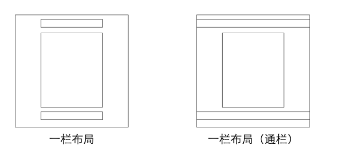
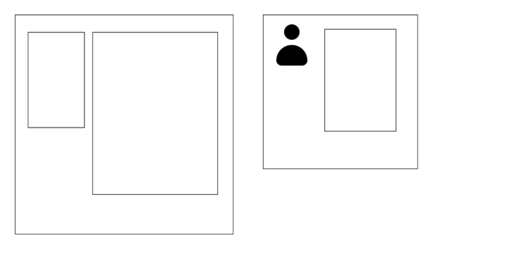
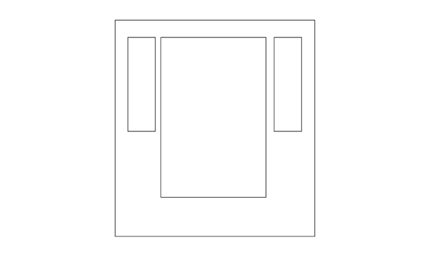

CSS布局&居中&媒体查询

布局

单栏布局

实现方式: 固定宽度+水平居中

width: 1000px; //或 max-width: 1000px;
margin-left: auto;
margin-right: auto;

通栏：

仅为内容限制宽度

双列布局

一列固定宽度，另一列自适应宽度

浮动元素+普通元素margin 

  

    
aside

    
content

  

  
footer

三列布局

两侧两列固定宽度，中间列自适应宽度

水平等距排列

http://js.jirengu.com/jusuv/1/edit

负margin

Flex

Grid

居中

水平居中

text-align

文本和行内元素，在父元素上设置

text-align:center;

margin

块级元素

宽度width + margin-left等于margin-right

margin: 0 auto

垂直居中

上下padding相等

绝对定位

弹出框，知道宽高, 宽高固定

margin-left: -width/2;

margin-top: -height/2;

.dialog {

  position: absolute;

  left: 50%;

  top: 50%;

  margin-left: -200px;

  margin-top: -150px;

  width: 400px;

  height: 300px;

}

transform

.dialog {

  position: absolute;

  left: 50%;

  top: 50%;

  width: 400px;

  height: 300px;

  transform: translate(-50%, -50%);

}

vertical-align

http://js.jirengu.com/nicuk/1/edit

table-cell

父容器

vertical-align: middle;

text-algin: center;

flex

display: flex;

align-items; center;

justify-content; center;

height = line-height

媒体查询

媒体查询

@media

媒体类型

1. all

1. handheld 手持

1. print 打印

1. projection: 投影

1. screen 屏幕

@media screen and (max-width: 990px)

引入

link

@media

 

