Ant Design 4.0 的一些杂事儿 - Form 篇

上一篇：[Ant Design 4.0 的一些杂事儿 - Table 篇](https://zhuanlan.zhihu.com/p/102037418)

是的，趁着手热，于是又开了一篇新的文章，用来讲讲我们在开发 Ant Design 4.0 的 Form 时遇到的一些杂事儿。当然，欢迎使用、吐槽以及贡献到开源项目中来。Ant Design 4.0.0-rc 版本已经发布，我们提供了一套[迁移指南和自动化迁移工具](https://link.zhihu.com/?target=https%3A//next.ant.design/docs/react/migration-v4-cn)（从社区反馈上来看，我相信不少朋友们已经升级体验了~）。

### 贤良淑德的 Form

我们的 Form 经过长年累月的改进，API 于业务中可以覆盖大部分场景，而一些特殊的需求也可以通过一些特殊的处理方式来搞定（没错，说的就是你！List Field）。因而在很长的一段时间内，Form 只是在样式和 Bug 上进行一些小修小补。

当然了，一个能用的 Form 并不等于是一个好用的 Form。面对“[创造高效愉悦的工作体验](https://link.zhihu.com/?target=https%3A//next.ant.design/)”的 slogan，我们的 Form 看起来还有更远的路要走。好在开源项目的一大优势就是有着大量的小伙伴们来提 issue。我们在 issue 的宝库中，可以找到一些共同点。从而得知应该如何进行改进~

### 为什么需要 Form.create ？

一些刚刚接触 React 的同学们，有时候复制示例代码会只拷贝一部分，然后逐渐添加内容，直到了解这些代码的到底是想要干什么。有时候就会遇到复制了代码却不知道为什么 `this.props.form` 不存在的情况。

当然，你可以不厌其烦的回答说瞧，你漏了一个 `Form.create` ，你需要了解一下 HOC 是如何工作的，以及 React 的 `props` 到底是怎么来的。然后再把 issue 关掉。但是如果一个 issue 总是时不时的出现（就像上篇文章里那个 Table fixed column 对不齐的问题一样），那么这就是一个可以让你优化的点~

antd 中通过 `Form.create` 创建了一个 form context，里面提供一个 `getFieldDecorator` 方法用于注册字段。 经由该方法调用后包裹的组件会被自动注入 `value` 和 `onChange` 属性进行双向绑定，从而简化用户的输入。但是到这里，你会发现一点，虽然 `value` 和 `onChange` 不用写了，但是 `Form.create` 却省不了啊。而且 `getFieldDecorator` 要不是自动补全单词一点都不好拼啊。况且，对于 antd 不熟悉的人，在经过层层嵌套的 HOC 后，会一脸懵逼的看着这个 `form` 不知道是哪里来的。


此外，另一个问题是。我们处处可以通过 `form.getFieldValue` 来进行一些渲染的控制。比如说字段 A 为某些值的时候，显示额外的字段 B，反之显示字段 C。 为了达到这个效果，我们在 Field 每次变更的时候都需要重新渲染整个组件，以达到 `getFieldValue` 获取了正确的值的需求。 这又导致了巨型表单会出现明显的性能问题（毕竟全都渲染了一遍嘛~）。

这么看来，`Form.create` 即淘气又割舍不了。

### Bug 也是 feature

### 小淘气一号：initialValue

v3 的版本，有个小淘气叫 `initialValue`。如果你“一不小心”将 `initialValue`受控并且用户在该输入框也没有输入过任何的值。你会惊喜的发现，这个输入框居然可以跟着 `initialValue`一同改变它的值！

是的，它是一个 bug……

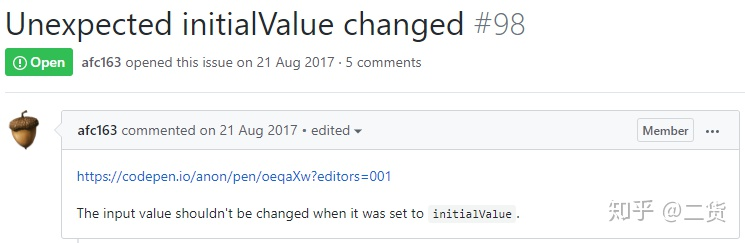

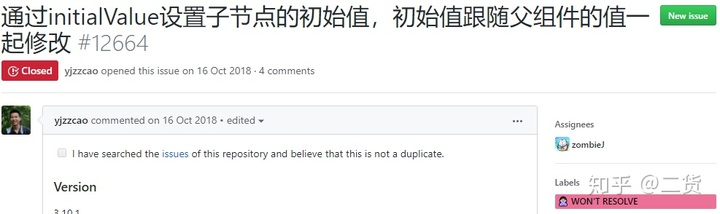

然而，开源项目的一个痛点就是由于用户基数众多。你不能够轻易的去改变一个行为。于是，这个 bug 就成了 v3 版本 Form 的 `initialValue` 的一个 “feature”……

更惨烈的是，用户有时候会发现这个 “feature”不好用，然后再给这个 “feature (bug)”又提交一个 bug……

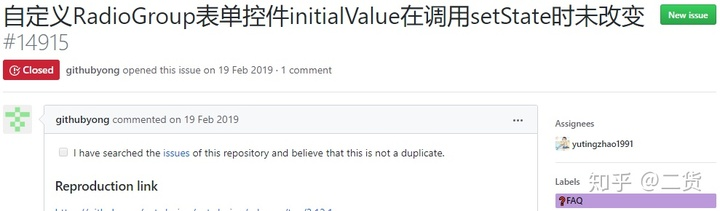

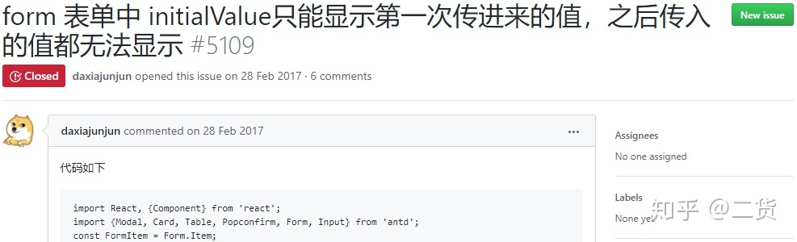


其实俺也很无奈啊……！！！

另外，还会出现诸如代码中动态注册了两遍相同的字段却赋值不同的 `initialValue` 结果不知道为啥设置的初始值居然不是预期的问题。

因而，我们在新版 Form 中，将 `initialValue` 提升至了 Form 的顶层。不会有冲突问题，顺便也修了它居然可以受控的问题。一个表单一旦创建，那么它的值再也不会被初始化值影响到，除非你通过 `resetFields` 重置了它。

### 小淘气二号：getFieldDecorator

是的，我们上面聊了一下这个方法如此不好记（我甚至在打这个标题的时候又打错了一次）外。它还有一点点反直觉。一个老练的 antd 开发者会明确的知道，经过 `getFieldDecorator` 注册过的字段在 Form 中是一个真正且独一无二的字段、所以如果你注册了一个 `user` 字段，然后又注册一个 `user.name` 字段。就会获得几个不能正常工作的 Field 和一个完全不知道如何解决的警告：

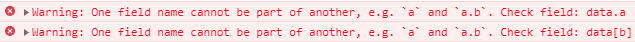

看得懂却不会修你说气不气~

原因在于，v3 Form 的内部，Field 是单独存储并与整体 store 进行关联。因而当你改变了一个 Field 且正好它又是另一个嵌套的 Field 中的一部分，那么这两个注册的 Field 就会产生冲突。然而初接触动态表单的开发者，总会很自然的想到设置顶层的值，然后一次性改掉整个列表：

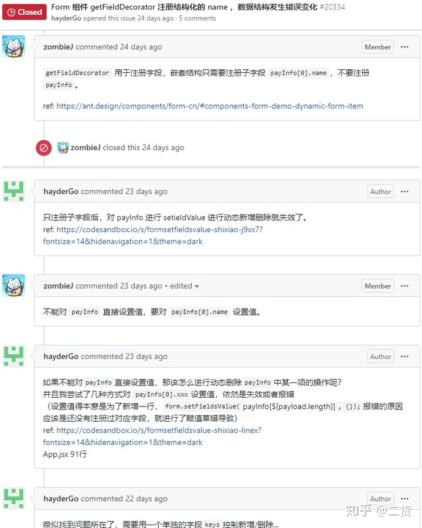

每个人都会在动态表单这儿摔一跤

在新版 Form 中，我们优化了这个问题。现在 Field 和 value 是弱关联。你可以注册 `user` 又注册 `user.name`（当然，除了动态表单外不建议这么做，因为你有很大的概率把自己绕进去~）。所有注册的字段都会正常工作。

### 小淘气三号：validateTrigger

如果说 `initialValue` 是一个美丽的错误，`getFieldValidator`是一个设计上的限制，那么 `validateTrigger` 就是设计上的失误。在旧版的 Form 中，我们错误的认为 `tirgger` 和 `validateTrigger` 应该返回相同的参数，因而我们可以获得最新的值（即 event.target.value）。因为当时设计的时候，仅仅是考虑到诸如 input、select、textarea 这种原生的组件以及 antd 的一些组件。一种常见的设置就是通过 `onChange` 事件收集值，而 `onBlur` 作为校验的时机。 而疏忽了这两个时机返回的参数可能不同，比如我们自己的 InputNumber 组件（笑 cry）：

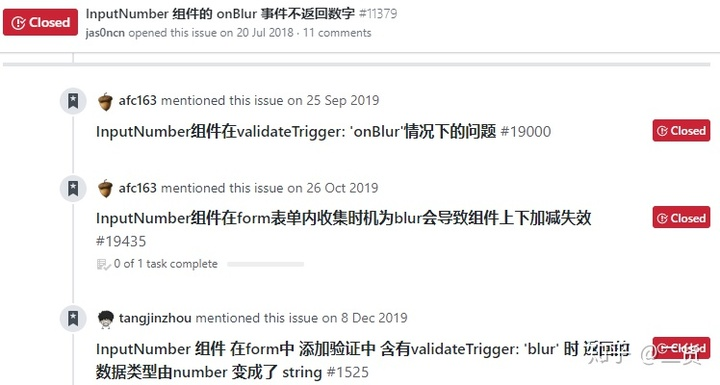

InputNumber：我的 onBlur 做错了啥……

当然，这个设计问题也并非无缘无故。在设计之初，我们担心用户封装不足导致 `trigger` 与 `validateTrigger` 不同时，`trigger` 时机没有收集到最新的值导致 `validateTrigger` 触发时校验了一个过时的值。现在看来，这是一个过度设计。如果用户开发的组件没有正确的返回值，这应该让用户来处理，而非框架层面。

因此，在新版的 Form 中。 `trigger`和 `validateTrigger` 变得各司其职，一个只用于收集值，而另一个只用于触发校验。于是，InputNumber 的 `onBlur` 终于不用再背锅啦~

### 性能优化

在上面我们已经提到了 Form.create 包裹的组件在字段更新后，会重新渲染整个组件。这在大部分场景下都很好使，但是在部分拥有大量表单项的页面时则会出现性能问题。因此，我们调整了 Form 的渲染逻辑。只有字段相关的部分更新才会被更改：

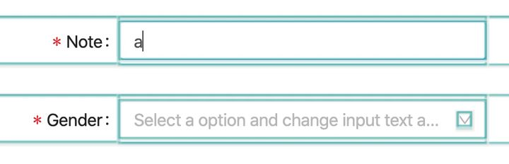

v3 Form


v4 Form

也因此，我们可以把字段控制收入到 Form.Item 中。没错，你再也不需要 `getFieldDecorator` 了。直接在 Form.Item 上设置 `name` 属性即可。所以，Form.create 也不需要了。[减少了代码就是减少了工作量，减少工作量岂不就是提前下班了](https://www.zhihu.com/question/363807174/answer/962708791)！

### 瞅瞅 shouldUpdate

大部分情况下，Form.Item 足够使用了。但是转念一下，就会发现不对呀。那些根据 `form.getFieldValue` 来展示的字段岂不就做不到了？

因此，我们为 Form.Item 提供了一个 `shouldUpdate` 属性。当 Form.Item 使用 `shouldUpdate` 后，它改为接收 render props。从而允许你对此进行控制：

```
<Form.Item shouldUpdate={(prev, next) => prev.name !== next.name}>
  {form => form.getFieldValue('name') === 'antd' && (
    <Form.Item name="version">
      <Input />
    </Form.Item>
  )}
</Form.Item> 
```

相信眼尖的你瞬间就想到了。直接包一层 `<Form.Item shouldUpdate>` 就可以退化成 v3 的全渲染方式！（当然，我们还是推荐使用高性能模式啦~）

### 依赖校验

在 v3 的版本中，两个存在关联的字段，例如注册用户的“密码”与“确认密码”。无论用户输入哪一个，“确认秘密”总是需要重新校验。于是你不得不写一些冗余的代码，在“密码”与“确认密码”的输入组件里都添加一个 `onChange` 事件，来手工触发一下规则校验。这相当啰嗦。

因而我们在新版 Form 中为 Form.Item 添加 `dependencies` 支持。当该字段依赖的字段更新时，它也会触发一遍自己的规则校验。 你可以参考[这个例子](https://link.zhihu.com/?target=https%3A//next.ant.design/components/form-cn/%23components-form-demo-register)查看效果。

新增的 `dependencies` 属性发布后，不少小伙伴表示耦合的代码变少，下班变早了，头发不再掉了。于是，我们高兴的去吃了一顿汉堡王作为减少碳排放量的庆祝~

### 列表组件

在上方我们已经提过“一些特殊的需求也可以通过一些特殊的处理方式来搞定”，这就是 List Field。在 v3 中，我们需要额外注册一个 `keys` 字段，用来管理哪些动态字段被添加/删除。我们觉得这不 cool，需要减少开发者的记忆心智，要让开发者早点下班（当然，如果是设计师同学，也可以用[海兔](https://zhuanlan.zhihu.com/p/100925117)让你早点下班~）。

于是，我们决定 Form 提供一个 List 组件帮用户解决这个恼人的问题。然而在实际开发中发现这其实也不太容易。假设我们现在 List 中有 3 个值：

我们有一个校验规则，不允许偶数。那么 `2` 就会报错。这时候，我们移除了 `1` ，即：

初看一下没问题，但是如果我们的组件携带动画的话。你就发现一个问题，原本的 `2` 从第二个成了第一个。由于用 `index` 当 `key` 会让 React 认为是第一个组件的值变成了第二个，而非第一个删除了（因为我们的数据中，只存了 `[1, 2, 3]`，它并不明白是怎么变成 `[2, 3]` 的）。 于是就会出现，删除后第一个动画出现 `2` 的 warning 信息，而第二个变成了 `3` 却有一个原本 `2` warning 消失的动画。

当然，我们不准备污染原本的数据结构来进行一一对应。也不准备把内部字段管理弱关联的设计改成强关联，于是准备直接在 List 组件上动动脑筋。由于当前的问题只是在 React diff 层面，而非数据层面。因此，我们为 List 添加了一些外的数据用于存储每个值对应的 `key`。List 初始化时，会生成一个 `keys` 列表与之一一对应：

```
value: [1, 2, 3]
keys: [0, 1, 2]
uuid: 3 // 0 -> 1 -> 2 
```

当我们删除第一个时，同步删除对应位置的 `key`：

```
value: [2, 3]
keys: [1, 2]
uuid: 3
```

当我们添加新的值时，将 `uuid` 添加到 `keys` 末尾，同时 `uuid` 自增：

```
value: [2, 3, 9]
keys: [1, 2, 3]
uuid: 4 // 3 -> 4 
```

这样就实现了元素的对应，当我们不需要页面展示的时候，只需移除 List 组件。yummy！这些额外的信息随着 List 一同随风而去，不留下一丝的副作用。

（你可以点击[此处](https://link.zhihu.com/?target=https%3A//github.com/react-component/field-form/blob/c465860a487c85658eafe3eee6cd51ee7443c0ff/src/List.tsx)查看具体实现。）

### 重置一个字段

回到表单最基本的功能：重置。我们知道 React 中， 如果你将一个 input 的 `value` 从 `abc` 设置回 `undefined` 是不能将值重置的。你会很直观的想到，那我直接把值设置成空字符串 `''` 不就成了？有趣的是，我们并不是总是能够知道子组件是什么。只要简单的一个 HOC，我们便无法探知它的奥秘。你更是无法得知一个自定义组件它的默认值应该是什么样的。

在同类表单库 `FinalForm` 中，它通过为 Field 添加一个 `type` 字段来判断类型：

```
<Field
  name="test"
  component="input"
  type="text"
/>
```

我们并不准备让用户多输入一个 `type` 来做我们本应该替用户处理的事情。因此我们想到了利用 React 的 diff 算法来强制重新渲染一个组件。React 中如果一个组件的构造器不同则会被认为是一个不同的组件，那么原本的 dom 元素即便相同也会被销毁重建。所以初版的重置通过组件切换来实现：

`<input />` =\> `<><input /></>` =\> `<input />`

然后，社区的同学表示这样导致了 `<input />` 触发了 2 次 mount， 因而提交了一个 PR 将其改成通过 `key` 的形式来减少一次 `mount` ：[https://github.com/react-component/field-form/pull/65](https://link.zhihu.com/?target=https%3A//github.com/react-component/field-form/pull/65)

同 List 一样，`key` 的副作用只保留在 Field 的生命周期中， 完美！

### 何时提交呢？

在过去我们通过原生表单的 `onSumbit` 事件进行提交处理。随后再调用一个 `validateFields` 校验表单并处理通过的值：

```
onSubmit = e => {
  e.preventDefault();
  this.props.form.validateFields((err, values) => {
    if (!err) {
      // 处理你的值
    }
  });
};
```

我们看了相当多的真实代码，发现大部分关于表单页面代码都会重复上述的内容，而很少会有代码去处理 error 的情况。为此，我们考虑是否应该让 Form 只有在校验通过的时候才出发 `onSubmit` 事件。为此我们做了一些调查，有趣的是，国内关于 Form 的库大多在提交时都会触发 `onSubmit` ，而国外的 Form 库大多都是在校验通过的时候才触发，而原生的 HTML，也是通过时触发。

看来英雄所见略同，当然同样处于兼容性考虑，直接改变 `onSubmit` 行为会让开发者产生困扰。于是我们在新版的 Form 中移除了 `onSubmit` ，并添加了 `onFinish` 和 `onFinishFailed` 属性。你可以单独处理这两个事件（大多数情况下，开发者只需要管 `onFinish` 就够了）：

```
onFinish = values => {
  // 处理你的值
}
```

当然，拆分出来后有另一个附赠的好处就是我们不用再担心一些自定义组件无法触发原生 form 的 `onSubmit` 事件的情况。 现在 Form 组件可以直接通过 `component` 属性修改容器组件，设置 `false` 的话连 dom 容器都不会有（当然，在 antd 中，我们封装了该属性。你可以通过 `rc-field-form` 进行尝试）。

### Safari 是一个怪宝宝

如果你写过原生的 HTML 代码，你会发现 React 的 `onChange` 和原生的 `change` 处理行为不太一样。 原生的 input 组件输入文字并不会触发 `change` 事件，而 React 则不同，它代理了 `change` 事件并将其进行了扩展。原因也很好理解，在受控状态下，如果不能在正确的时机触发 `change` ，那么受控的 `value` 就会导致输入不正确的问题。

回到 Form，在发布 beta 版本的时候，我们收到了一个 safari only 的 bug：

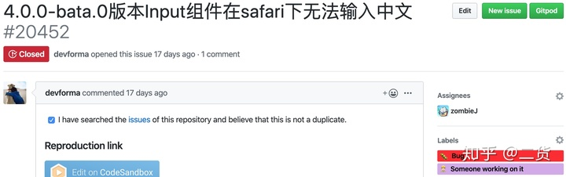

如果写过 Form 相关的库，我想你可能已经知道原因了。我们通过 `async-validator` 库对输入数据进行异步校验，在上层的 antd 中根据校验结果展示警告信息。然而 Safari 对于输入法行为和其他游览器会有些不同，我们这里对比一下：

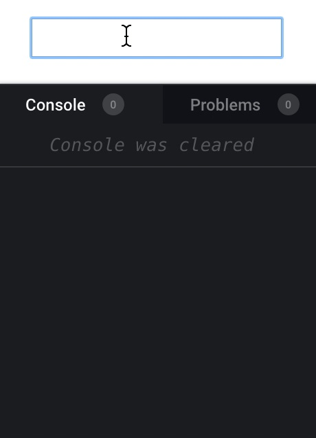

非 Safari 游览器

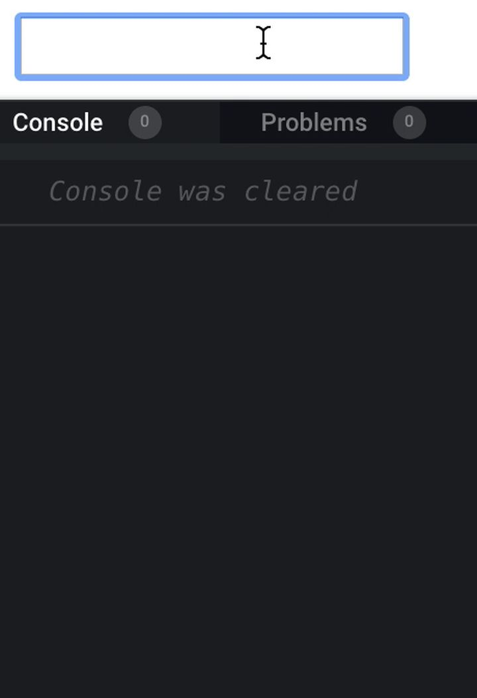

Safari

发现不同了吗？Safari 中当用户通过输入法输入完一段中文的时候，input 的值会先从拼音字母变成空字符 `''` 然后再变成输入的中文。然而这会导致如果一个 Field 设置了 `required` 的时候，空字符串使得校验发现不满足规则从而渲染错误信息。由于我们是异步校验，导致 React 认为我们是受控设置了 `value` 为 `''` 从而导致最后的 `你好` 被吞掉。

一个直观的解决方案是通过 `CompositionEvent` 来监听输入状态，只有在 IME 结束后才触发校验。当然这是不行的，就像前面聊过的，我们并不能知道传入的组件是什么，自定义组件也可能并不透传 `CompositionEvent` 。因而我们对错误信息做了额外的延迟处理，在短时间内如果状态切换是：`正确` =\> `错误` =\> `正确` 。 那么我们会将其合成为：`正确`，跳过中间状态。虽然 Safari 会额外给一个 `''` ，但是这次校验的错误我们并未对其在组件进行更新。 于是乎，问题解决了。

### 差不多了~

Form 相关主要内容，我想应该差不多了。当然还有一些其他的内容，比如说 Form 提供了 FormContext，你可以通过它方便的进行表单间的[联动效果](https://link.zhihu.com/?target=https%3A//next.ant.design/components/form-cn/%23components-form-demo-form-context)；底层实现的 `rc-field-form` 可以直接运行在强大的 [Remax](https://link.zhihu.com/?target=https%3A//remaxjs.org/) 上而无需配置；Form.Item 如何将 `noStyle` 的底层字段信息统一透传到顶层等等。

新的 Form 是否强大，由你说了算。

祝好