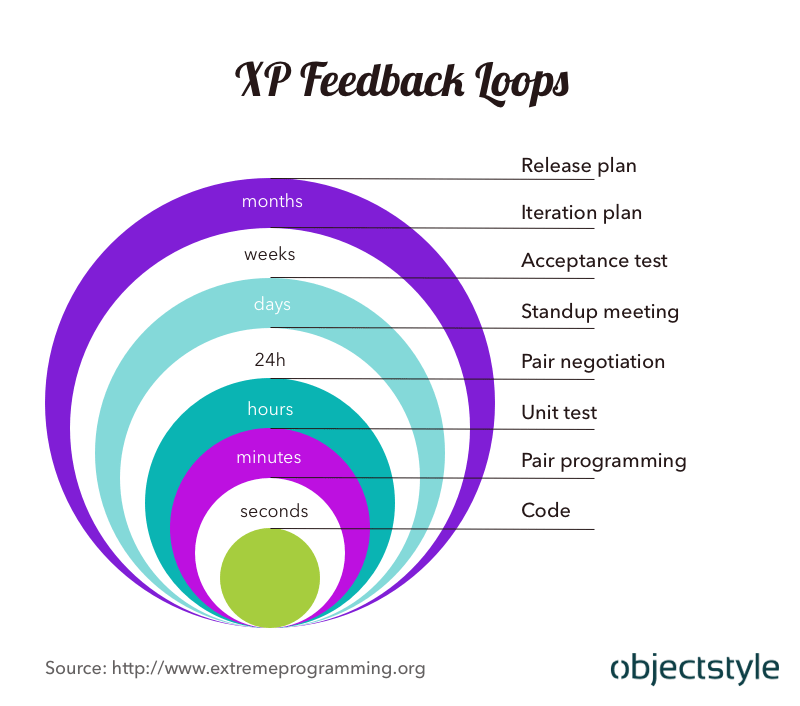
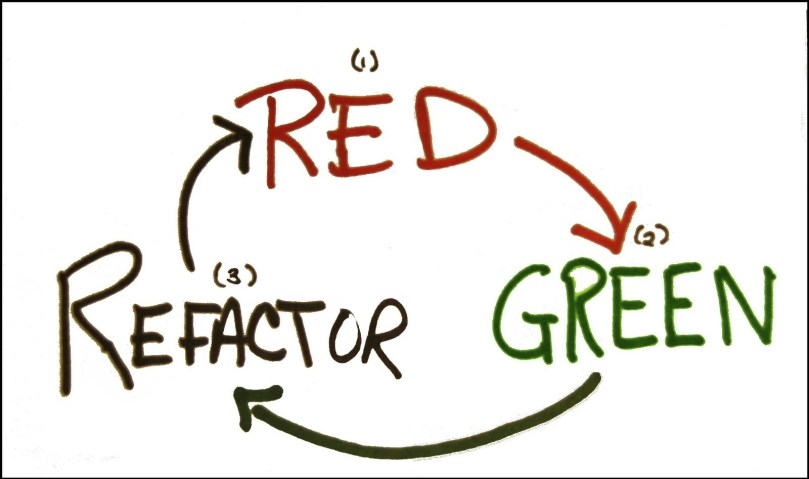

Vue 应用单元测试的策略与实践 06 - 如何落地的几点建议

> [Vue 应用单元测试的策略与实践 06 - 如何落地的几点建议 | 吕立青的博客](https://blog.jimmylv.info/2019-07-16-vue-application-unit-test-strategy-and-practice-06-execution-suggestion/)

## 本文的目标

1.  在 Vue 项目中如何推动整个团队循序渐进地采取单元测试策略？逐步提高代码质量和测试覆盖率？

```
// Given
一个需要在团队中推行测试策略的 Tech Lead👨‍💻‍
// When
当他 🚶 阅读本文的 Vue 应用测试策略落地部分
// Then
他能够在团队中循序渐进地推行测试策略，
他能够找到单元测试的反馈机制，追求技术卓越
```

## Vue 应用测试策略的落地

### 1\. 利用好“单元测试是一种政治正确”

谈到如何推进单元测试的落地，首先得要有一个开始。很多公司都在推行 OKRs 或者 KPI 机制，而技术部门如何衡量技术性的绩效呢？说实话，我们都知道技术类绩效其实不好用某些指标来衡量，但很多时候老板们都会道听途说觉得软件质量特别重要，然后大家开始用测试覆盖率来作为考核标准，先随便定个数吧，就 80% 不错。但我们都知道，哪怕 100% 测试覆盖率也无法保证软件质量，盲目追求高覆盖率反而会物极必反出现问题，最终导致大家以后对单元测试痛恨至极。

但正因为有了这样一个开始的契机，大家才开始有意识提高软件质量。而且大家最开始都会觉得“单元测试是个好东西”，认可快速开发的同时，质量也很重要，这就是我所说的政治正确。既然都有了 OKR 的支持，那么也就意味着，公司允许大家学习单元测试可能付出的成本，投入了成本当然就意味着潜在的收益。那么如何快速获得收益，就成了下一个话题。

### 2\. 诱饵：从快速见效的事情做起

前文也说过，有些同学就会在心里嘀咕：为了达到“保障质量”的目的，不一定得通过测试呀，就算需要测试，也不一定得通过单元测试。这话在最开始的时候，确实是对的，谁都想获得好处之后才能放心投入进去，不然那些网络骗子们为什么最开始总会给点回报当作诱饵呢？所以根据测试奖杯 🏆，**使用静态类型系统和 linter** 就是我们最初的诱饵，ESLint 能够捕获拼写或语法之类的基本错误，并且大多数情况下 ESLint 往往都能通过 `--fix` 进行自动修复（配合 VSCode/WebStrom 插件食用更佳）。


这一段时间，也就是养成一种反馈回路，即暗示-惯常行为-奖励（via: [《习惯的力量》](https://book.douban.com/subject/20507212/)），等到大家都习惯了“出现 Lint 错误就自动修复”的自动反馈之后，便也就是离不开这一套自动化的工作方式。而且在这一阶段，我们为此付出的成本基本为 0，最开始也没必要使用最严格的 ESLint 规则（[airbnb/javascript: JavaScript Style Guide](https://github.com/airbnb/javascript)），循序渐进就好。

### 3\. 真正理解前端数据流的好处

前文在讲测试原则的时候也提到过单一职责原则（SRP），很多同学在遗留代码之上写单元测试的时候，表示特别痛苦。“这都是些啥呀，输入/输出不明确，还各种副作用，一个函数做了 7、8 件事情，一个类承担 5、6 种角色。”所以呢，这时候我们要明白 Vue 和 Vuex 诞生的背景是什么，理解它们各自要解决的问题是什么。只有规范好各自的职责，才能够把 UI 和数据流清晰得隔离开来。只有这样，我们作为 vuex store 的使用者，才会变得简单，而不只是把 vuex action 当成一个 API 的简单 wrapper，所有数据处理逻辑全部都还是放在 UI 组件里面。

**什么是架构，其实架构就是把代码放到该放的地方。**不写代码的架构师们当然就不会知道，也不会知道代码写烂之后，该如何去补测试。那可能就不只是一种“补测试就像吃剩饭”的感觉了，那只能是一种在不明排泄物之上堆 💩 的体验。

再多说一下 Vue 组件本身，我一直觉得 template 相比于 jsx 来说，很大的一个问题就是不利于重构，即抽取组件。满屏的 `this.xxx` 就好像一个无敌的局部 global 对象一样，到处都能用，也就导致到处都有副作用，从而根本无法方便得抽取 function 或者放回 Vuex store。

所以说，只有当我们**正确地**使用 Vue 和 Vuex 之后，才能够为之后编写单元测试提供良好的基础。当然，这不是目的，哪怕不写单元测试，也应该利用好前端数据流对于代码的合理安放，遵循一定的原则就能享受该有的好处。我只是想声明，**哪些抱怨单元测试难写的人，不是因为单元测试难写，而是你的实现代码实在太挫。**

### 4\. 从性价比最高的单元测试开始写起

```
// production code
const computeTotalAmount = (products) => {
  return products.reduce((total, product) => total + product.price, 0)
}

// testing code
it('should return summed up total amount 1000 when there are three products priced 200, 300, 500', () => {
  // given - 准备数据
  const products = [
    { name: 'nike', price: 200 },
    { name: 'adidas', price: 300 },
    { name: 'lining', price: 500 },
  ]

  // when - 调用被测函数
  const result = computeTotalAmount(products)

  // then - 断言结果
  expect(result).toBe(1000)
})

```

这个测试的例子虽小，但五脏俱全。就是一个最简单的 输入/输出 function，这就是最方便测试的地方，也最具测试价值，因为这都是最重要的业务数据逻辑。想一想你的 Vue 项目中哪些地方会有这样的纯函数呢？

当然就是 Vuex 的 mutation。所以当我们开始推行前端单元测试的时候，不要从 UI 组件开始，而是从 JavaScript 开始，从最简单的 function 开始，遵循这个 given-when-then 的结构，可以让团队写出比较清晰的测试结构。这样的单元测试，既易于阅读，也易于编写。

最大的好处，其实是减少学习成本。大多数团队成员其实都是从模仿开始，只有单元测试易于编写，那么大家才会愿意跟着开始尝试写。而最开始的那份单元测试，一定得是写得标准的，得是易于阅读的，从而才是易于模仿的。反过来说，模仿，这也是“破窗理论”之所以流行的原因。

### 5\. 测试覆盖率：每次进步一点点

只要大家开始动手写单元测试，就成功了最难的 50%，接下来就需要大家坚持下来。借鉴于[《游戏改变世界》](https://book.douban.com/subject/10828002/)这本书中所提到的理论支持，我们需要为大家创造反馈，创造更满意的工作和更有把握的成功。

> 精心设计的游戏工作让人觉得更有生产力，因为它感觉起来更真实：反馈来得又强又快，影响明显而生动。对很多不喜欢自己的日常工作、觉得它没有什么直接影响的人而言，游戏里的工作提供了真正的奖励和满足感。

那么，我们该如何为团队创造游戏里打怪升级般的测试开发体验呢？顺便我们可以回答一下，该如何循序渐进提升项目单元测试覆盖率这个问题。


👆 上图的道理我们都明白，哪怕每天只进步 1%，那么一年 365 天的效果也是无比非凡的。我们可以给项目添加一个单元测试覆盖率提升的 hook，即每次 push 都会检查并更新测试覆盖率的阈值，每次提交都不能少于上一次提交，这样我们就可以持续进步、持续改进，持续提高测试覆盖率啦。

平时的工作日常，我们还会有一个电视作为 CI Monitor，所以我们可以把团队项目的测试覆盖率放上去，每次提交之后测试覆盖率都会高一点点，给每位同学一个即时的反馈，鼓励大家坚持下去。

参考 [Koleok/jest-coverage-ratchet: Uses jest coverage output to raise acceptable coverage threshold to current coverage](https://github.com/Koleok/jest-coverage-ratchet) 配置 jest 的 coverageReporters：

```
# jest.config.js
  coverageReporters: [
    "json-summary", "json", "lcov", "text", "clover"
  ],
  coverageThreshold: require('./package.json').jest.coverageThreshold

```

然后配置 Git hook，加到 `prepush` 里面自动更新 测试覆盖率阈值。

```
    "coverage": "lerna run coverage && git add **/package.json && git diff-index --quiet HEAD || git commit -m \"test(unit): update coverage threshold CASABASEA-1246\" --no-verify",
    ...
    "hooks": {
      "commit-msg": "commitlint -E HUSKY_GIT_PARAMS",
      "post-commit": "git update-index --again",
      "pre-commit": "lint-staged",
      "pre-push": "yarn lint && yarn test && yarn coverage"
    }

```


### 6\. TDD，最好的写单元测试的方式



在 XP 极限编程提到的反馈环中我们可以看出，除了结对编程以外，单元测试是我们开发者最好的反馈工具。

既然单元测试应该由开发者，在开发软件的同时编写对应的单元测试。它应该是内建的，而不是后补的：即在编写实现的同时完成单元测试，而不是写完代码再一次性补足。测试先行，这正是 TDD（测试驱动开发）的做法。使用 TDD 开发方法是得到可靠单元测试的唯一途径。

前文提到测试很难补，其实补出来的测试几乎不可能完整覆盖我们对重构和质量的要求。TDD 和单元测试是全有或全无：不做 TDD，难以得到好的单元测试；TDD 是获得可靠的单元测试的的唯一途径。除此之外别无捷径，想抛开 TDD 而获得一个好的单元测试是迷思，难以成功。

TDD（测试驱动开发）的步骤如下，能够时刻给予开发者反馈，从而坚持下去：

- 没有单元测试，不实现任何功能代码；
- 只编写仅能代表一种失败情况的测试代码；
- 只编写恰好能通过单元测试的产品代码。



## 可喜可贺，全文完。

就我自己而言，写这篇文章的同时，我也在团队中推行 Vue 单元测试的落地，与此同时也尝试了 Snapshot Testing 快照测试、Storybook 组件化测试、使用 Cypress 做 E2E 的 UI 测试等等。只能说，这过程并没有想象中的那么容易，质疑、埋怨、叫苦的声音源源不断，但每当只要有一位同学说上一句“我好像体会到写测试的好处了”，“这样写，实现代码都变得很清晰了”，哪怕只有一位，那也就足够了。

道不同不相为谋，前途茫茫，技术卓越之路艰且险，与君共勉。

**\## 单元测试基础**

- \### 单元测试与自动化的意义
- \### 为什么选择 Jest
- \### Jest 的基本用法
- \### 该如何测试异步代码？

**\## Vue 单元测试**

- \### Vue 组件的渲染方式
- \### Wrapper `find()` 方法与选择器
- \### UI 组件交互行为的测试

**\## Vuex 单元测试**

- \### CQRS 与 `Redux-like` 架构
- \### 如何对 Vuex 进行单元测试
- \### Vue 组件和 Vuex store 的交互

**\## Vue 应用测试策略**

- \### 单元测试的特点及其位置
- \### 测试奖杯 🏆：软件测试的分层策略
- \### 单元测试的 F.I.R.S.T 原则

**\## Vue 单元测试的落地**

- \### 应用测试策略落地的几点建议

## 参考资料

> 本文是[【草稿】React 应用单元测试策略](https://github.com/linesh-simplicity/linesh-simplicity.github.io/issues/200)的姊妹篇。除此之外，还有两个原因：1\. 上次在 FCC 社区讲 TDD 的时候说过单元测试的部分太干不适合讲，而是更适合写成博客文章作为技术参考；2. 公司内部已全线使用 Vue 技术栈作为产品开发的前端框架，而单元测试却因周期较紧而不得已暂且搁置。

- 特别鸣谢：[React 单元测试策略及落地 - 👍👍Linesh 的博客 👍👍](https://blog.linesh.tw/#/post/2018-07-13-react-unit-testing-strategy)
- [「技术雷达」之使用 Enzyme 测试 React（Native）组件](https://blog.jimmylv.info/2016-12-07-react-testing-with-enzyme/)
- [【译】什么是 Flux 架构？（兼谈 DDD 和 CQRS）](https://blog.jimmylv.info/2016-07-07-what-the-flux-on-flux-ddd-and-cqrs/)
- [【译】整洁代码：JavaScript 当中的面向对象设计原则（S.O.L.I.D）](https://blog.jimmylv.info/2017-01-08-clean-code-javascript-classes-design-principles/)
- [Testing JavaScript with Kent C. Dodds](https://testingjavascript.com/)