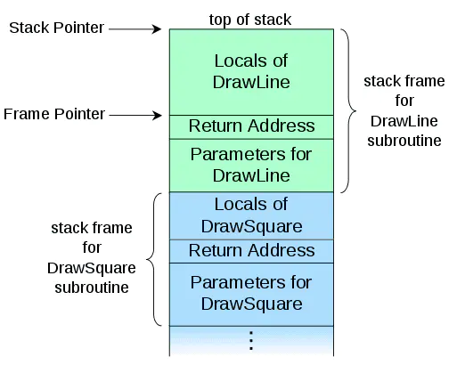

「译」如何以及为什么 React Fiber 使用链表遍历组件树

> - 原文地址：[The how and why on React’s usage of linked list in Fiber to walk the component’s tree](https://medium.com/dailyjs/the-how-and-why-on-reacts-usage-of-linked-list-in-fiber-67f1014d0eb7)
> - 原文作者：[Max Koretskyi](https://medium.com/@maxim.koretskyi)
> - 译文出自：[阿里云翻译小组](https://github.com/dawn-teams/translate)
> - 译文链接：[github.com/dawn-plex/t…](https://github.com/dawn-plex/translate/blob/master/articles/the-how-and-why-on-reacts-usage-of-linked-list-in-fiber-to-walk-the-components-tree.md)
> - 译者：[照天](https://github.com/zzwzzhao)
> - 校对者：[也树](https://github.com/xdlrt)，[眠云](https://github.com/JeromeYangtao)

### React调度器中工作循环的主要算法


工作循环配图，来自Lin Clark在ReactConf 2017精彩的[演讲](https://www.youtube.com/watch?v=ZCuYPiUIONs)

为了教育我自己和社区，我花了很多时间在[Web技术逆向工程](https://blog.angularindepth.com/practical-application-of-reverse-engineering-guidelines-and-principles-784c004bb657)和写我的发现。在过去的一年里，我主要专注在Angular的源码，发布了网路上最大的Angular出版物—[Angular-In-Depth](https://blog.angularindepth.com/)。**现在我已经把主要精力投入到React中**。[变化检测](https://medium.freecodecamp.org/what-every-front-end-developer-should-know-about-change-detection-in-angular-and-react-508f83f58c6a)已经成为我在Angular的专长的主要领域，通过一定的耐心和大量的调试验证，我希望能很快在React中达到这个水平。 在React中, 变化检测机制通常称为 "协调" 或 "渲染"，而Fiber是其最新实现。归功于它的底层架构，它提供能力去实现许多有趣的特性，比如执行非阻塞渲染，根据优先级执行更新，在后台预渲染内容等。这些特性在[并发React哲学](https://twitter.com/acdlite/status/1056612147432574976)中被称为**时间分片**。

除了解决应用程序开发者的实际问题之外，**这些机制的内部实现从工程角度来看也具有广泛的吸引力。源码中有如此丰富的知识可以帮助我们成长为更好的开发者。**

如果你今天谷歌搜索“React Fiber”，你会在搜索结果中看到很多文章。但是除了[Andrew Clark的笔记](https://github.com/acdlite/react-fiber-architecture)，所有文章都是相当高层次的解读。在本文中，我将参考Andrew Clark的笔记，**对Fiber中一些特别重要的概念进行详细说明**。一旦我们完成，你将有足够的知识来理解[Lin Clark在ReactConf 2017上的一次非常精彩的演讲](https://www.youtube.com/watch?v=ZCuYPiUIONs)中的工作循环配图。*这是你需要去看的一次演讲*。但是，在你花了一点时间阅读本文之后，它对你来说会更容易理解。

[这篇文章开启了一个React Fiber内部实现的系列文章。](https://medium.com/react-in-depth/inside-fiber-in-depth-overview-of-the-new-reconciliation-algorithm-in-react-e1c04700ef6e)我大约有70%是通过内部实现了解的，此外还看了三篇关于协调和渲染机制的文章。

让我们开始吧!

### 基础

Fiber的架构有两个主要阶段：协调/渲染和提交。在源码中，协调阶段通常被称为“渲染阶段”。这是React遍历组件树的阶段，并且：

- 更新状态和属性
- 调用生命周期钩子
- 获取组件的`children`
- 将它们与之前的`children`进行对比
- 并计算出需要执行的DOM更新

**所有这些活动都被称为Fiber内部的工作。** 需要完成的工作类型取决于React Element的类型。 例如，对于 `Class Component` React需要实例化一个类，然而对于`Functional Component`却不需要。如果有兴趣，[在这里](https://github.com/facebook/react/blob/340bfd9393e8173adca5380e6587e1ea1a23cefa/packages/shared/ReactWorkTags.js#L29-L28) 你可以看到Fiber中的所有类型的工作目标。 这些活动正是Andrew在这里谈到的：

> 在处理UI时，问题是如果**一次执行太多工作**，可能会导致动画丢帧...

具体什么是*一次执行太多*？好吧，基本上，如果React要**同步**遍历整个组件树并为每个组件执行任务，它可能会运行超过16毫秒，以便应用程序代码执行其逻辑。这将导致帧丢失，导致不顺畅的视觉效果。

那么有好的办法吗?

> 较新的浏览器（和React Native）实现了有助于解决这个问题的API ...

他提到的新API是[requestIdleCallback](https://developers.google.com/web/updates/2015/08/using-requestidlecallback) 全局函数，可用于对函数进行排队，这些函数会在浏览器空闲时被调用。以下是你将如何使用它:

```
requestIdleCallback((deadline)=>{
    console.log(deadline.timeRemaining(), deadline.didTimeout)
});
复制代码
```

如果我现在打开控制台并执行上面的代码，Chrome会打印`49.9 false`。 它基本上告诉我，我有`49.9ms`去做我需要做的任何工作，并且我还没有用完所有分配的时间，否则`deadline.didTimeout` 将会是`true`。请记住`timeRemaining`可能在浏览器被分配某些工作后立即更改，因此应该不断检查。

> `requestIdleCallback` 实际上有点过于严格，并且[执行频次不足](https://github.com/facebook/react/issues/13206#issuecomment-418923831)以实现流畅的UI渲染，因此React团队[必须实现自己的版本](https://github.com/facebook/react/blob/eeb817785c771362416fd87ea7d2a1a32dde9842/packages/scheduler/src/Scheduler.js#L212-L222)。

现在，如果我们将React对组件执行的所有活动放入函数`performWork`, 并使用`requestIdleCallback`来安排工作，我们的代码可能如下所示：

```
requestIdleCallback((deadline) => {
    // 当我们有时间时，为组件树的一部分执行工作    
    while ((deadline.timeRemaining() > 0 || deadline.didTimeout) && nextComponent) {
        nextComponent = performWork(nextComponent);
    }
});
复制代码
```

我们对一个组件执行工作，然后返回要处理的下一个组件的引用。如果不是因为如[前面的协调算法实现](https://reactjs.org/docs/codebase-overview.html#stack-reconciler)中所示，你不能同步地处理整个组件树，这将有效。 这就是Andrew在这里谈到的问题：

> 为了使用这些API，你需要一种方法将渲染工作分解为增量单元

因此，为了解决这个问题，React必须重新实现遍历树的算法，**从依赖于内置堆栈的同步递归模型，变为具有链表和指针的异步模型**。这就是Andrew在这里写的：

> 如果你只依赖于\[内置\]调用堆栈，它将继续工作直到堆栈为空。。。 如果我们可以随意中断调用堆栈并手动操作堆栈帧，那不是很好吗？这就是React Fiber的目的。 **Fiber是堆栈的重新实现，专门用于React组件**。 你可以将单个Fiber视为一个虚拟堆栈帧。

这就是我现在将要讲解的内容。

#### 关于堆栈想说的

我假设你们都熟悉调用堆栈的概念。如果你在断点处暂停代码，则可以在浏览器的调试工具中看到这一点。以下是[维基百科](https://en.wikipedia.org/wiki/Call_stack?fbclid=IwAR06VWEQnwoEawg0NsoR8loBJwIbmPWsXXKqbAuOFBjkawHThK7zlIBsJ_U#Structure)的一些相关引用和图表：

> 在计算机科学中，**调用堆栈**是一种堆栈数据结构，它存储有关计算机程序的活跃子程序的信息...调用堆栈存在的主要原因是跟踪每个活跃子程序在完成执行时应该返回控制的位置...调用堆栈由堆栈帧组成...每个堆栈帧对应于一个尚未返回终止的子例程的调用。例如，如果由子程序`DrawSquare`调用的一个名为`DrawLine`的子程序当前正在运行，则调用堆栈的顶部可能会像在下面的图片中一样。



#### 为什么堆栈与React相关？

正如我们在本文的第一部分中所定义的，React在协调/渲染阶段遍历组件树，并为组件执行一些工作。协调器的先前实现使用依赖于内置堆栈的同步递归模型来遍历树。[关于协调的官方文档](https://reactjs.org/docs/reconciliation.html#recursing-on-children)描述了这个过程，并谈了很多关于递归的内容：

> 默认情况下，当对DOM节点的子节点进行递归时，React会同时迭代两个子节点列表，并在出现差异时生成突变。

如果你考虑一下，**每个递归调用都会向堆栈添加一个帧。并且是同步的**。假设我们有以下组件树：


用`render`函数表示为对象。你可以把它们想象成组件实例：

```
const a1 = {name: 'a1'};
const b1 = {name: 'b1'};
const b2 = {name: 'b2'};
const b3 = {name: 'b3'};
const c1 = {name: 'c1'};
const c2 = {name: 'c2'};
const d1 = {name: 'd1'};
const d2 = {name: 'd2'};

a1.render = () => [b1, b2, b3];
b1.render = () => [];
b2.render = () => [c1];
b3.render = () => [c2];
c1.render = () => [d1, d2];
c2.render = () => [];
d1.render = () => [];
d2.render = () => [];
复制代码
```

React需要迭代树并为每个组件执行工作。为了简化，要做的工作是打印当前组件的名字和获取它的children。下面是我们如何通过递归来完成它。

#### 递归遍历

循环遍历树的主要函数称为`walk`，实现如下：

```
walk(a1);

function walk(instance) {
    doWork(instance);
    const children = instance.render();
    children.forEach(walk);
}

function doWork(o) {
    console.log(o.name);
}
复制代码
```

这里是我的得到的输出：

`a1, b1, b2, c1, d1, d2, b3, c2`

如果你对递归没有信心，请查看[我关于递归的深入文章](https://medium.freecodecamp.org/learn-recursion-in-10-minutes-e3262ac08a1)。

递归方法直观，非常适合遍历树。但是正如我们发现的，它有局限性。最大的一点就是我们无法分解工作为增量单元。我们不能暂停特定组件的工作并在稍后恢复。通过这种方法，React只能不断迭代直到它处理完所有组件，并且堆栈为空。

**那么React如何实现算法在没有递归的情况下遍历树？它使用单链表树遍历算法。它使暂停遍历并阻止堆栈增长成为可能。**

### 链表遍历

我很幸运能找到SebastianMarkbåge在[这里](https://github.com/facebook/react/issues/7942#issue-182373497)概述的算法要点。 要实现该算法，我们需要一个包含3个字段的数据结构：

- child — 第一个子节点的引用
- sibling — 第一个兄弟节点的引用
- return — 父节点的引用

在React新的协调算法的上下文中，包含这些字段的数据结构称为Fiber。在底层它是一个代表保持工作队列的React Element。更多内容见我的下一篇文章。

下图展示了通过链表链接的对象的层级结构和它们之间的连接类型：


我们首先定义我们的自定义节点的构造函数：

```
class Node {
    constructor(instance) {
        this.instance = instance;
        this.child = null;
        this.sibling = null;
        this.return = null;
    }
}
复制代码
```

以及获取节点数组并将它们链接在一起的函数。我们将它用于链接`render`方法返回的子节点：

```
function link(parent, elements) {
    if (elements === null) elements = [];

    parent.child = elements.reduceRight((previous, current) => {
        const node = new Node(current);
        node.return = parent;
        node.sibling = previous;
        return node;
    }, null);

    return parent.child;
}
复制代码
```

该函数从最后一个节点开始往前遍历节点数组，将它们链接在一个单独的链表中。它返回第一个兄弟节点的引用。 这是一个如何工作的简单演示：

```
const children = [{name: 'b1'}, {name: 'b2'}];
const parent = new Node({name: 'a1'});
const child = link(parent, children);

// 下面两行代码的执行结果为true
console.log(child.instance.name === 'b1');
console.log(child.sibling.instance === children[1]);
复制代码
```

我们还将实现一个辅助函数，为节点执行一些工作。在我们的情况是，它将打印组件的名字。但除此之外，它也获取组件的`children`并将它们链接在一起：

```
function doWork(node) {
    console.log(node.instance.name);
    const children = node.instance.render();
    return link(node, children);
}
复制代码
```

好的，现在我们已经准备好实现主要遍历算法了。这是父节点优先，深度优先的实现。这是包含有用注释的代码：

```
function walk(o) {
    let root = o;
    let current = o;

    while (true) {
        // 为节点执行工作，获取并连接它的children
        let child = doWork(current);

        // 如果child不为空, 将它设置为当前活跃节点
        if (child) {
            current = child;
            continue;
        }

        // 如果我们回到了根节点，退出函数
        if (current === root) {
            return;
        }

        // 遍历直到我们发现兄弟节点
        while (!current.sibling) {

            // 如果我们回到了根节点，退出函数
            if (!current.return || current.return === root) {
                return;
            }

            // 设置父节点为当前活跃节点
            current = current.return;
        }

        // 如果发现兄弟节点，设置兄弟节点为当前活跃节点
        current = current.sibling;
    }
}
复制代码
```

虽然代码实现并不是特别难以理解，但你可能需要稍微运行一下代码才能理解它。[在这里做](https://stackblitz.com/edit/js-tle1wr)。 思路是保持对当前节点的引用，并在向下遍历树时重新给它赋值，直到我们到达分支的末尾。然后我们使用`return`指针返回根节点。

如果我们现在检查这个实现的调用堆栈，下图是我们将会看到的：


正如你所看到的，当我们向下遍历树时，堆栈不会增长。但如果现在放调试器到`doWork`函数并打印节点名称，我们将看到下图：


**它看起来像浏览器中的一个调用堆栈。**所以使用这个算法，我们就是用我们的实现有效地替换浏览器的调用堆栈的实现。这就是Andrew在这里所描述的：

> Fiber是堆栈的重新实现，专门用于React组件。你可以将单个Fiber视为一个虚拟堆栈帧。

因此我们现在通过保持对充当顶部堆栈帧的节点的引用来控制堆栈：

```
function walk(o) {
    let root = o;
    let current = o;

    while (true) {
            ...

            current = child;
            ...

            current = current.return;
            ...

            current = current.sibling;
    }
}
复制代码
```

我们可以随时停止遍历并稍后恢复。这正是我们想要实现的能够使用新的`requestIdleCallback` API的情况。

### React中的工作循环

这是在React中实现工作循环的[代码](https://github.com/facebook/react/blob/95a313ec0b957f71798a69d8e83408f40e76765b/packages/react-reconciler/src/ReactFiberScheduler.js#L1118)：

```
function workLoop(isYieldy) {
    if (!isYieldy) {
        // Flush work without yielding
        while (nextUnitOfWork !== null) {
            nextUnitOfWork = performUnitOfWork(nextUnitOfWork);
        }
    } else {
        // Flush asynchronous work until the deadline runs out of time.
        while (nextUnitOfWork !== null && !shouldYield()) {
            nextUnitOfWork = performUnitOfWork(nextUnitOfWork);
        }
    }
}
复制代码
```

如你所见，它很好地映射到我上面提到的算法。`nextUnitOfWork`变量作为顶部帧，保留对当前Fiber节点的引用。

该算法可以**同步地**遍历组件树，并为树中的每个Fiber点执行工作（nextUnitOfWork）。 这通常是由UI事件（点击，输入等）引起的所谓交互式更新的情况。或者它可以**异步地**遍历组件树，检查在执行Fiber节点工作后是否还剩下时间。 函数`shouldYield`返回基于[deadlineDidExpire](https://github.com/facebook/react/blob/95a313ec0b957f71798a69d8e83408f40e76765b/packages/react-reconciler/src/ReactFiberScheduler.js#L1806)和[deadline](https://github.com/facebook/react/blob/95a313ec0b957f71798a69d8e83408f40e76765b/packages/react-reconciler/src/ReactFiberScheduler.js#L1809)变量的结果，这些变量在React为Fiber节点执行工作时不停的更新。

[这里](https://medium.com/react-in-depth/inside-fiber-in-depth-overview-of-the-new-reconciliation-algorithm-in-react-e1c04700ef6e#1a7d)深入介绍了`peformUnitOfWork`函数。

* * *

#### 我正在写一系列深入探讨React中Fiber变化检测算法实现细节的文章。

### 请继续在[Twitter](https://twitter.com/maxim_koretskyi)和[Medium](https://medium.com/@maxim.koretskyi)上关注我，我会在文章准备好后立即发tweet。

谢谢阅读！如果你喜欢这篇文章，请点击下面的点赞按钮👏。这对我来说意义重大，并且可以帮助其他人看到这篇文章。

[](https://react-grid.ag-grid.com/?utm_source=medium&utm_medium=banner&utm_campaign=reactcustom)