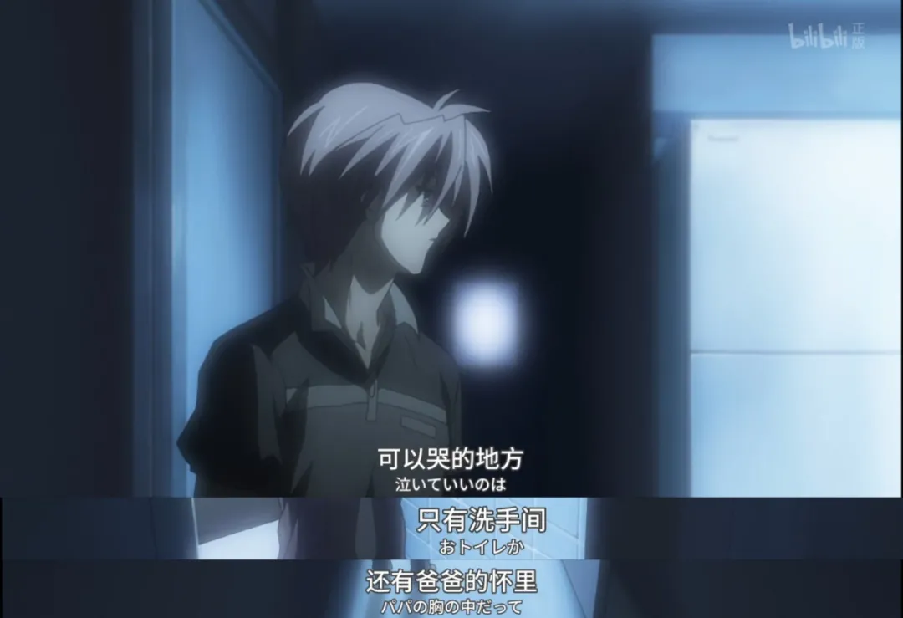
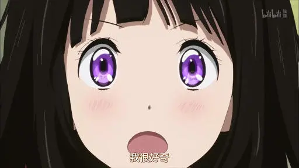

京阿尼回来了，这八部人气作品你都看过吗？

2019年7月18日，京都动画在一场意外的大火中损伤惨重。

从那天起，京都动画的重生便牵动着世界各地动画爱好者的心，祝福与援助纷至沓来，就像一颗颗光玉缓缓汇集在一起。

无数人默默到现场献花。

一年多以来，京都动画有序地进行着复建的工作，对家属的安抚、旧址的待改建、自家动画私塾的重开业……京都动画表现着它的坚强。

2020年7月18日的悼念会上，京都动画对所有关注他们的人说道：

**“从今往后，我们仍将为全世界的人们，献上孕育梦想、希望以及感动的动画作品。”**

8月10日，一个令人惊喜的消息出现在公众视野里 ——《小林家的龙女仆》第二季将于2021年放送。

《小林家的龙女仆》导演正是在纵火事件中遇难的武本康弘。

京都动画像在用这种方式默默地告诉全世界 —— **我们回来了！**

借着这个振奋人心的消息宣布之际，我们精选了京都动画八部最具人气的作品，希望能勾起你内心的回忆与共鸣，感受京都动画所焕发的光芒。

**《AIR》**  

**一越千年的夏天**

那是一个长长的夏天，一位乐观、坚强的小镇女孩神尾观铃，遇上了旅人国崎往人。

国崎往人的家族，世代都在寻找着传说中的“天空中的女孩”。这个女孩承受了千年的诅咒，随着时间的推移会回忆起另一个世界的梦，并在做最后一个梦时死去。

往人发现，神尾观铃似乎便是那个女孩。自此之后，和平的日常变得不安定了起来。

遇见往人后，观铃身上的诅咒越来越严重，她的记忆与生命被蚕食着，甚至忘记了母亲晴子是谁。小小的女孩承载着远超于她所能承受的东西。

知道自己大限将至，观铃便在这个夏天把梦想的事情一一实现，享受了所有的幸福。

最终，在夏风吹拂的海边，坚强的观铃一步步迈向母亲的怀抱，经历千年的轮回，释然地走向生命的终结。

“我的幸福与终点，一起抵达了。”

封闭小镇与神话时代跨越千年时空的联结，为故事赋上了强烈的孤寂感、神秘感与沉重感。

观铃以自我的牺牲斩断了诅咒的延续，《AIR》试图告诉我们，生离死别并非只有绝望，也孕育了新的希望。

奇迹与传承之意充斥在《AIR》的每个角落。

在被誉为神曲的《鸟之诗》与《夏影》响起的时候，那个夏天里的凄美、燥热与希望总会再一次传达到每个人心中。

**《凉宫春日的忧郁》**

**寻找不平凡中的平凡**

在开学自我介绍时，霸气少女凉宫春日是这样说的：

“我对普通人没有兴趣，如果你们之中有外星人、未来人，或者异世界人，就来我这里吧。”

本想过平凡日子的高中生阿虚，逐渐被这位热情少女卷入名为“SOS团”的社团中，而团员里果真有外星人、未来人和异世界人，不平凡的社团开启了一个又一个活动。

作为21世纪日本动画的里程碑作品之一，《凉宫春日的忧郁》颇为时髦又脑洞大开，还塑造了凉宫春日、阿虚等一众铭刻观众心中的名角色，其知名度和影响力都经得起时间的洗礼。

其实每个人心里，总是期望着平凡的生活中埋藏着许多不平凡。

期望着遇到陪你疯狂的小伙伴，贯彻很多任性的想法，发生很多新奇的事情，在校园里度过一段五光十色的学生时代。

而守护青春时期身边的那位女孩，说出“不论做什么，我都会把你带回来”这种霸气的话，曾是每一位少年的梦想。

出自剧场版《凉宫春日的消失》。

《凉宫春日的忧郁》赋予了我们一个做梦的机会，一个关于学生时代的、疯狂的、浪漫的、不可思议的梦。

**《clannad》  
**

**在樱花盛开的坡道上的梦**

在一条长长的坡道上，不良少年冈崎朋也和病弱少女古河渚相遇了，原本无趣的校园生活多了几分乐趣。

在校园日常里，他们帮助不少角色克服心结，达成梦想，收集了一颗又一颗象征着心愿的光玉。

从相识到相爱，故事跨越了校园，迈入了社会，尔后的种种磨难与离别，都考验着两人的感情，而最终曾经的一颗颗光玉化为奇迹，为所有历练带来了童话般美好的结局。

《clannad》长期霸占着催泪动画的榜首，经历了十余年时光依然能够征服无数人的心。

它为我们展示了一段从恋爱到婚姻的人生历程，里面有为家庭辛苦打工的隐忍，失落时的互相扶持，独自照顾子女的辛酸……

爱情、友情、亲情，《clannad》歌颂了太多太多的温馨与爱，当冈崎朋也的女儿扑到爸爸的怀里，说出 ——

当朋也打算接父亲回去养老，告诉父亲你已经可以休息了，不用再担心自己时，父亲缓缓说出——

三代人的辛酸与和解，直击肺腑。

爱，原来可以如此沉默却又伟大。

《clannad》确实是一段人生百态的缩影，以触动人心的方式娓娓道来，如悲伤的童话，又如温暖的现实。

**《轻音少女》**

**校园青春里相遇天使**

天然呆少女平泽唯在开学之际，跌跌撞撞地加入了一个即将废部的社团 —— 轻音部，与另外三个少女开展了喝茶摸鱼弹奏轻音乐的社团活动。

《轻音少女》曾获得极高的商业成绩和口碑，是无数动画爱好者的入宅回忆。

导演山田尚子与编剧吉田玲子强强联合，用女性的独特视角，为《轻音少女》披上了一层晶莹唯美的纱衣 ——

无瑕的少女，纯净的空间感，饱含活力与浪漫的社团活动，细腻平凡的青春期烦恼。

《轻音少女》描绘了时间宛如静止般温馨的日常。

少女们每天慵懒、欢快地嬉戏与追梦，缓慢而悠闲的社团日常与现实快节奏的生活形成鲜明对比，显得如此令人向往。

在轻音部毕业的那天，所有思念与回忆交织出了动人的名曲《相遇天使》。

天使にふれたよ! 放課後ティータイム - 放課後ティータイム in MOVIE   

*不过了 我遇见了呦 美丽的天使*

*毕业并不是终结*

*今后仍然是好同伴如果你说最喜欢我    *

*我会用最最喜欢回应你*

*没有遗忘的东西吧*

*要永远永远地在一起呦*

一首《相遇天使》，寄托了毕业季无尽的依恋与思念，毕业并不是终结，愿你我的青春都能遇上一位天使。

**《冰菓》**

**当灰色的青春沾上了玫瑰色**

主张节能主义的高中生折木奉太郎，口头禅是“没必要的事不做，必要的事尽快解决”。

加入学校的古典文学部后，他被一名有着强烈好奇心的女生千反田爱瑠缠上，于是擅长观察和推理的折木被迫为其解决事件。

随后，古典文学部的成员们接二连三碰到奇怪事件，一个青春日常推理故事由此展开。

作为名梗“我很好奇”的出处，或许很多人对《冰菓》的第一印象是如下表情包：

纵然好看的角色，精妙的演出，出色的制作都是《冰菓》吸引观众的地方，但倘若静下心细细品味，《冰菓》更像是一碗茗茶，故事多有留白而回香悠长。

不知道各位的学生时代，是否曾因身边一些很普通的事情而引发好奇呢？

或是同班同学的八卦，或是莫名丢失的课本，或是学校里的“闹鬼传说”。也许只是一瞬即逝的念头，《冰菓》却把这些渺小的事情构造成一道道日常的景观。

去探索，去解疑，为无趣的事物赋予趣味，《冰菓》呈现了一种主观能动性的生活态度 —— 身边很多事物并非不美，而是要去发现美，创造美。

即便是认为自己只过灰色生活就好的折木，后来也发生了一点点改变。面对千反田的烦恼，他不再置身事外，而是逐渐学会主动去帮助她，尝试融入别人的生活中。

当你在人生路上漫步时，不妨多留意一下沿途的景色，也许会看到新的道路，发现未知而珍贵的宝物。

**《中二病也要谈恋爱！》**

**致我们逝去的中二**

打算封印自己中二病历史的富㭴勇太，在高中开学日遇上了现任中二病患者暨同班同学小鸟游六花。

自称为邪王真眼的小鸟游六花，看出勇太中二病的残余症状，并得知勇太曾经自封漆黑的烈焰使，于是六花以此威逼勇太与她“立下契约”，一段伴随着中二病的羞耻故事由此开幕。

作为曾经火爆 ACG 圈的名作，小鸟游六花的人设可谓相当出色，极具辨识度的中二状态和卖萌的反差，以及 OP 那魔性洗脑的转圈圈，无一例外都是动漫表情包的常客。

许多人的童年都曾经幻想过自己是公主、王子，或是超能力者，这些中二病行为会随着年龄的增长慢慢消失，变得现实起来。

但人为什么要中二病呢？是否借此隐藏了内心的一些东西？

导演石原立也深层次地挖掘了中二病的内在动因，在故事的后期，勇太意识到了六花总是通过中二病逃避些什么。

当发生一些不愉快、不想面对的事情时，六花往往通过中二病的行为强加人设，假装乐观，就像五月天那首歌所唱：“你不是真正的快乐，你的笑容只是你的保护色。”

在我们不知道的地方，其实有无数人，都在被自己曾经的中二病拯救着，就像是一个精神港湾一般，缓解着现实所不能承受的苦痛。

当六花摘下眼罩，不再中二病的时候，其实并非代表着成长，而是陷入更深的迷茫。

勇太却用两句话打醒了她：

六花因怀疑自我而放弃中二病，其实不过是另一种逃避。这两句话也是在质问屏幕前的观众，你是否因为向现实妥协而成为了无趣的自己呢？

故事的最后一段独白，颇为耐人寻味：　　

*人们有时候会说胡话，幻想世界会在瞬间变化，想着遥远的未来 。　　*

*在脑中描绘一场轰轰烈烈的恋爱，这些都在人的一生中永远重复着。　　*

*永无止境的重复，悲伤、害羞却又可爱。　*

*名为“自我意识过剩”的疾病，名为“自己”的不可绕行之路。　　*

*所以，人一辈子都活在中二病里。*

**《吹响吧！上低音号》**

**如山上漫天星辰般迷人**

刚升入高中的黄前久美子，在同学叶月的热烈影响下加入了该校的吹奏部。

吹奏部有着高光的历史，如今却逐渐衰落，音乐老师泷升加入成为新的顾问后，吹奏部便以挺进全国大赛为目标，开始了新的征程。

在那里，久美子遇见了冷美人高坂丽奈，互相吸引的二人开始接触，美妙的音乐交织着彼此的心声。

随着故事的发展，吹奏乐器在二人心中的意义愈发深化，输掉比赛的不甘、成为自我的迷茫、追逐梦想的奋斗，都被浓缩成了一首首曲子寄托在乐器之上。

二人互相追逐彼此的身影，夹杂着轻百合的朦胧美感，少女间的亲密互动传递出了禁欲般的诱惑，这种宝石般的精美感在第八集达到巅峰 ——

*“我想成为特别的人，我想与众不同，因此我吹起了小号。”*

*“好像快被吸进去了，我想，如果是此刻，让我在这里殒命也无妨。”*

飘动的长裙，耀眼的万家灯火，轻轻撩动的唇瓣，会心的笑容。

在夜色之中，青春与友情宛如山上漫天星辰般迷人，少女一言一行所焕发的美感，撩动了无数观众的心弦。

**《紫罗兰永恒花园》  
**

**我想知道「我爱你」的含义**

战争结束后，世界重归和平，曾经作为军人的冷漠少女薇尔莉特离开了军队，心头却无法忘怀救她于危难之中的少佐。

薇尔莉特找到一份给人代写书信的工作，在接触不同人的内心世界时，她也逐渐接近并理解少佐最后对她说的话语的真正含义。

《紫罗兰永恒花园》是一个关于“诉说和传达”的故事。

如何诉说自己的情感，如何传达到对方心中，小小的书信凝聚着人间百态。薇尔莉特仿佛是人间的观察者，把每个人不同的答卷呈现给观众。

诉说总是拥有神奇的魔力，会感染着每一个倾听者。

即使是毫无感情宛如冰冷人偶的薇尔莉特，在慢慢体会到哭泣、愤怒、喜悦等情绪背后的意味后，也逐渐完善了“心”的形状。

故事从头到尾始终抛出一个疑问 —— **爱为何物**。

但始终没有正面回答“爱”的含义，而是一直展现着市井百态，展现着各类人群的经历去引起观众的共鸣，留下了不同的感悟空间。

或许，当我们情不自禁地大声说出“爱”的时候，便是找到答案的时候。

关于京都动画的记忆，绝不仅于此，每个人心中都有一份独属于自己的感动，这八部作品也定不能包揽京都动画的全部魅力。

**以上动画都可以在B站直接观看。**或许我们的每一次点击，每一条留言，都能汇聚成光，成为传达给京都动画的一份又一份支持的力量。

作者 | 格调

编辑 | 会厌

运营 | 鸡血

 bilibili长期招聘作者 

 稿费千字500到1000 

 公众号后台回复“招聘”即可查看 

