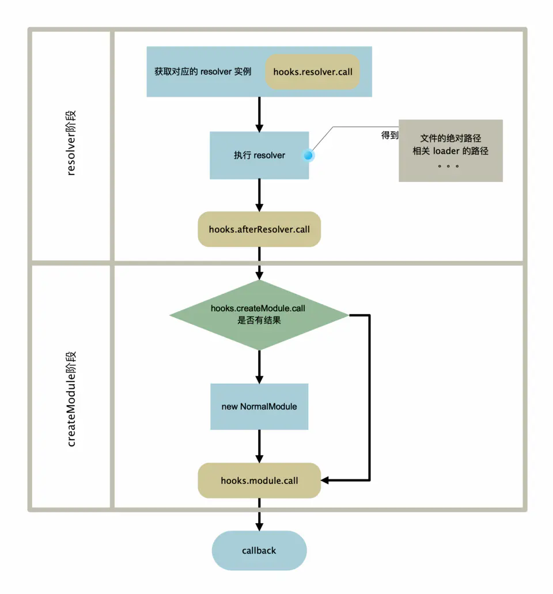
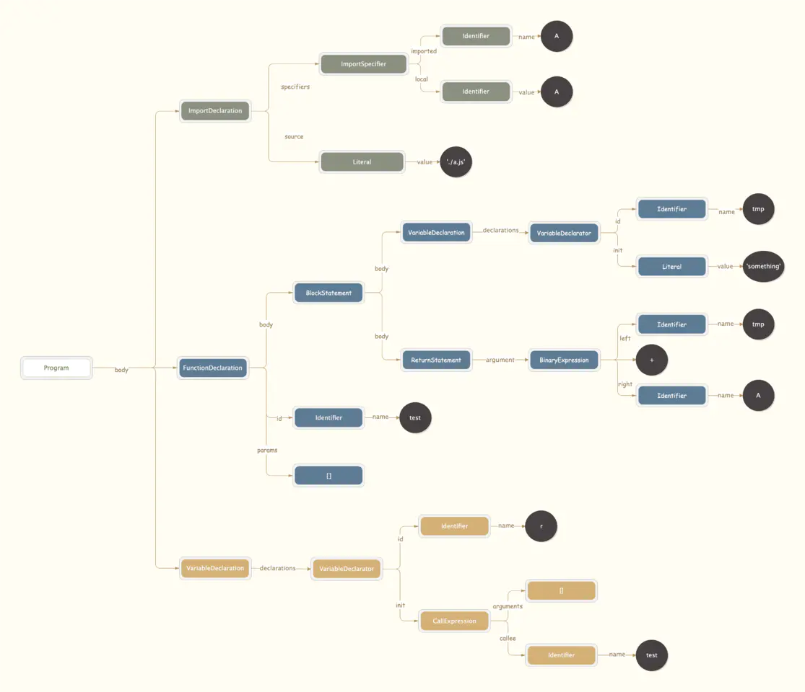
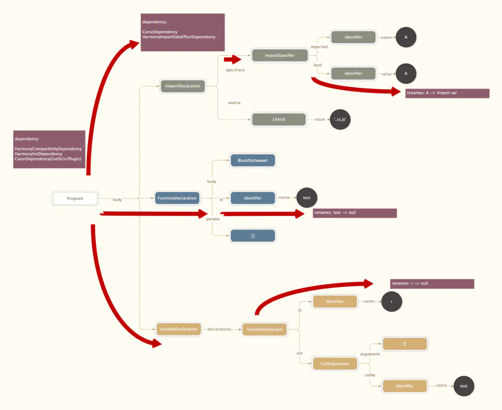
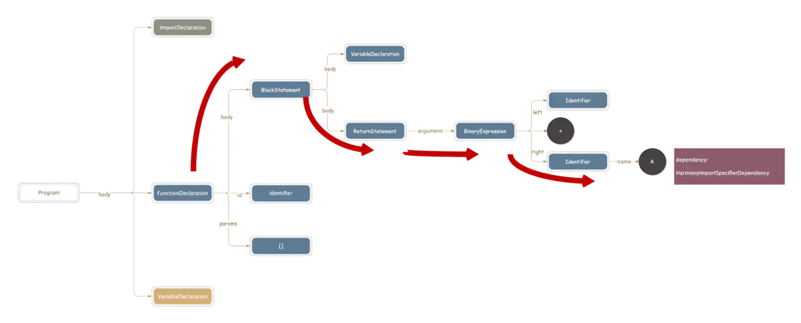
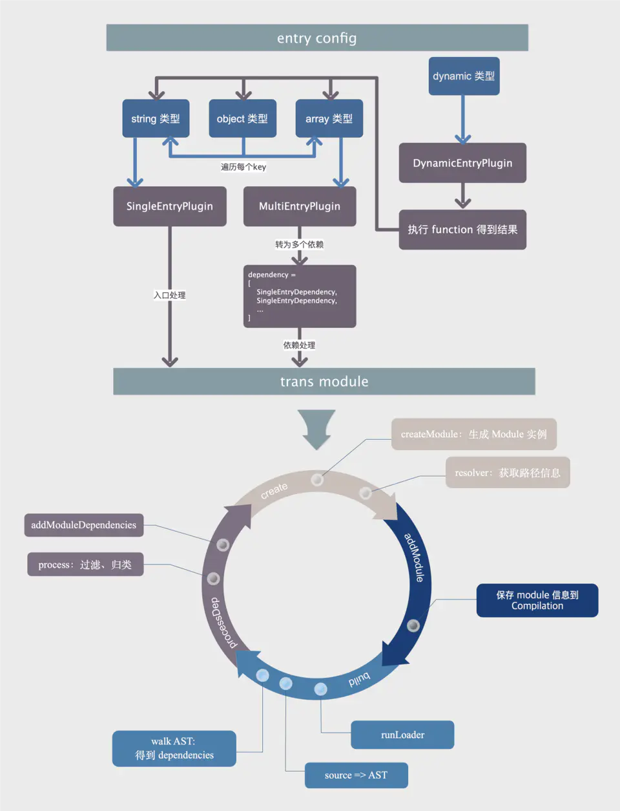

webpack系列之五module生成2

> 作者：崔静

在[上一篇 module生成1](https://juejin.im/post/6844903830266576909)中我们已经分析了 webpack 是如何根据 entry 配置找到对应的文件的，接下来就是将文件转为 module 了。这个长长的过程，可以分成下面几个阶段

1.  create: 准备数据，生成 module 实例。
2.  add: 信息保存到 Compilation 实例上。
3.  build: 分析文件内容。
4.  processDep: 处理3步骤中解析得到的依赖，添加到编译链条中。

后面会以一个简单的 js 文件为例，看整个主流程

```
// a.js
export const A = 'a'

// demo.js，webpack 入口文件
import { A } from './a.js'
function test() {
  const tmp = 'something'
  return tmp + A
}
const r = test()
复制代码
```

### create

`_addModuleChain` 之后就是文件的 create 阶段，正式进入文件处理环节。上面一节我们介绍 MultipleEntryPlugin 中曾简单提到过：`_addModuleChain` 的回调中执行的是 `moduleFactory.create`。对于上面例子来说这里 create 方法，其实执行是 `nromalModuleFactory.create` 方法，代码主逻辑如下：

```
create(data, callback) {
	//...省略部分逻辑
	this.hooks.beforeResolve.callAsync(
		{
			contextInfo,
			resolveOptions,
			context,
			request,
			dependencies
		},
		(err, result) => {
			//...
			// 触发 normalModuleFactory 中的 factory 事件。
			const factory = this.hooks.factory.call(null);
			// Ignored
			if (!factory) return callback();
			factory(result, (err, module) => {
				//...
				callback(null, module);
			});
		}
	);
}
复制代码
```

单独看 create 内部逻辑：

- 触发 beforeResolve 事件：这里 beforeResolve 事件中没有做任务处理，直接进入回调函数
- 触发 NormalModuleFactory 中的 factory 事件。在 NormalModuleFactory 的 constructor 中有一段注册 factory 事件的逻辑。
- 执行 factory 方法（具体代码位于 NormalModuleFactory 的 constructor 中），主要流程如下：



1.  resolver 阶段：得到 demo.js 的路径信息以及涉及到的 loader 和 loader 的路径(详细过程参考 resolver 和 loader)。这一步完成后，生成 module 的准备工作已经完成。
2.  createModule 阶段：生成一个 module 实例，将上一步的数据存入实例中。

到此已经得到了一个 module 实例。为了方便，后文我们将这个 module 实例称为 demo module。

### addModule

得到 demo module 之后，需要将其保存到全局的 Compilation.modules 数组中和 _modules 对象中。

这个过程中还会为 demo module 添加 reason ，即哪个 module 中依赖了 demo module。由于是 demo.js 是入口文件，所以这个 reason 自然就是 SingleEntryDependency。 并且对于入口文件来说，还会被添加到 Compilation.entries 中。

```
// moduleFactory.create 的 callback 函数
(err, module) => {
	//...
	
	let afterFactory;
	
	//...
	
	// addModule 会执行 this._modules.set(identifier, module); 其中 identifier 对于 normalModule 来说就是 module.request，即文件的绝对路径
	// 和 this.modules.push(module);
	const addModuleResult = this.addModule(module);
	module = addModuleResult.module;
	
	// 对于入口文件来说，这里会执行 this.entries.push(module);
	onModule(module);
	
	dependency.module = module;
	module.addReason(null, dependency);
	
	//... 开始 build 阶段
}
复制代码
```

这个阶段可以认为是 add 阶段，将 module 的所有信息保存到 Compilation 中，以便于在最后打包成 chunk 的时候使用。随后在这个回调函数中，会调用 `this.buildModule` 进入 build 阶段。

### build

demo module 是 NormalModule 的实例，所以 Compilation.buildModule 中调用的 module.build 方法实际为 NormalModule.build 方法。build 方法主逻辑如下：

```
// NormalModule.build 方法
build(options, compilation, resolver, fs, callback) {
  //...
  return this.doBuild(options, compilation, resolver, fs, err => {
    //...
    try {
       // 这里会将 source 转为 AST，分析出所有的依赖
		const result = this.parser.parse(/*参数*/);
		if (result !== undefined) {
			// parse is sync
			handleParseResult(result);
		}
	} catch (e) {
		handleParseError(e);
	}
  })
}

// NormalModule.doBuild 方法
doBuild(options, compilation, resolver, fs, callback) {
	//...
	// 执行各种 loader
	runLoaders(
		{
			resource: this.resource,
			loaders: this.loaders,
			context: loaderContext,
			readResource: fs.readFile.bind(fs)
		},
		(err, result) => {
			//...
			// createSource 会将 runLoader 得到的结果转为字符串以便后续处理
			this._source = this.createSource(
				this.binary ? asBuffer(source) : asString(source),
				resourceBuffer,
				sourceMap
			);
			//...
		}
	);
}
复制代码
```

build 分成两大块: doBuild 和 doBuild 的回调。

#### doBuild：获取 source

在 doBuild 之前，我们实际上只得到了文件的路径，并没有获取到文件的真正内容，而在这一环节在 doBuild 的 runLoader 方法中会根据这个路径得到读取文件的内容，然后经过各种 loader 处理，得到最终结果，这部分已经在 loader 中分析过，参见 [webpack系列之四loader详解2](https://juejin.im/post/6844903780777984008)。

#### 回调：处理 source

上一步得到了文件的 source 是 demo.js 的字符串形式，如何从这个字符串中得到 demo.js 的依赖呢？这就需要对这个字符串进行处理了，`this.parser.parse` 方法被执行。

接下来我们详细看一下 parse 的过程，具体的代码在 lib/Parser.js 中。代码如下:

```
parse(source, initialState) {
	let ast;
	let comments;
	if (typeof source === "object" && source !== null) {
		ast = source;
		comments = source.comments;
	} else {
		comments = [];
		ast = Parser.parse(source, {
			sourceType: this.sourceType,
			onComment: comments
		});
	}

	const oldScope = this.scope;
	const oldState = this.state;
	const oldComments = this.comments;
	
	// 设置 scope，可以理解为和代码中个作用域是一致的
	this.scope = {
		topLevelScope: true,
		inTry: false,
		inShorthand: false,
		isStrict: false,
		definitions: new StackedSetMap(),
		renames: new StackedSetMap()
	};
	const state = (this.state = initialState || {});
	this.comments = comments;
	
	// 遍历 AST，找到所有依赖
	if (this.hooks.program.call(ast, comments) === undefined) {
		this.detectStrictMode(ast.body);
		this.prewalkStatements(ast.body);
		this.walkStatements(ast.body);
	}
	this.scope = oldScope;
	this.state = oldState;
	this.comments = oldComments;
	return state;
}
复制代码
```

在 parse 方法中，source 参数可能会有两种形式：ast 对象或者 string。为什么会有 ast 对象呢？要解释这个问题，我们先看一个参数 source 从哪里来的。回到 runLoaders 的回调中看一下

```
runLoaders({...}, (err, result) => {
  //...省略其他内容
  const source = result.result[0];
  const sourceMap = result.result.length >= 1 ? result.result[1] : null;
  const extraInfo = result.result.length >= 2 ? result.result[2] : null;
  //...
  this._ast =
		typeof extraInfo === "object" &&
		extraInfo !== null &&
		extraInfo.webpackAST !== undefined
			? extraInfo.webpackAST
			: null;
})
复制代码
```

runLoader 结果是一个数组： `[source, sourceMap, extraInfo]`, extraInfo.webpackAST 如果存在，则会被保存到 module._ast 中。也就是说，loader 除了返回处理完了 source 之后，还可以返回一个 AST 对象。在 doBuild 的回调中会优先使用 `module._ast` 。

```
const result = this.parser.parse(
	this._ast || this._source.source(),
	//...
)
复制代码
```

这时传入 parse 方法中的就是 loader 处理之后，返回的 extraInfo.webpackAST，类型是 AST 对象。这么做的好处是什么呢？如果 loader 处理过程中已经执行过将文件转化为 AST 了，那么这个 AST 对象保存到 extraInfo.webpackAST 中，在这一步就可以直接复用，以避免重复生成 AST，提升性能。

回到正题 parse 方法中，如果 source 是字符串，那么会经过 `Parser.parse` 之后被转化为 AST（webpack 中使用的是 [acorn](https://github.com/acornjs/acorn)）。到这里 demo.js 中的源码会被解析成一个树状结构，大概结构如下图



接下来就是对这个树进行遍历了，流程为： program事件 -> detectStrictMode -> prewalkStatements -> walkStatements。这个过程中会给 module 增加很多 dependency 实例。每个 dependency 类都会有一个 template 方法，并且保存了原来代码中的字符位置 range，在最后生成打包后的文件时，会用 template 的结果替换 range 部分的内容。所以最终得到的 dependency 不仅包含了文件中所有的依赖信息，还被用于最终生成打包代码时对原始内容的修改和替换，例如将 `return 'sssss' + A` 替换为 `return 'sssss' + _a_js__WEBPACK_IMPORTED_MODULE_0__["A"]`

**program 事件**

program 事件中，会触发两个 plugin 的回调：HarmonyDetectionParserPlugin 和 UseStrictPlugin

**HarmonyDetectionParserPlugin** 中，如果代码中有 import 或者 export 或者类型为 javascript/esm，那么会增加了两个依赖：HarmonyCompatibilityDependency, HarmonyInitDependency 依赖。

**UseStrictPlugin** 用来检测文件是否有 `use strict`，如果有，则增加一个 ConstDependency 依赖。这里估计大家会有一个疑问：文件中已经有了，为什么还有增加一个这样的依赖呢？在 UseStrictPlugin.js 的源码中有一句注释

> Remove "use strict" expression. It will be added later by the renderer again. This is necessary in order to not break the strict mode when webpack prepends code.

意识是说，webpack 在处理我们的代码的时候，可能会在开头增加一些代码，这样会导致我们原本写在代码第一行的 `"use strict"` 不在第一行。所以 UseStrictPlugin 中通过增加 ConstDependency 依赖，来放置一个“占位符”，在最后生成打包文件的时候将其再转为 `"use strict"`。

总的来说，program 事件中，会根据情况给 demo module 增加依赖。

**detectStrictMode**

检测当前执行块是否有 `use strict`，并设置 `this.scope.isStrict = true`

**prewalkStatements**

prewalk 阶段负责处理变量。结合上面的 demo AST ，我们看 prewalk 代码怎么处理变量的。

首先进入 prewalkStatements 函数，该函数，对 demo AST 中第一层包含的三个结点分别调用 `prewalkStatement`

```
prewalkStatements(statements) {
	for (let index = 0, len = statements.length; index < len; index++) {
		const statement = statements[index];
		this.prewalkStatement(statement);
	}
}
复制代码
```

prewalkStatement 函数是一个巨大的 switch 方法，根据 statement.type 的不同，调用不同的处理函数。

```
prewalkStatement(statement) {
	switch (statement.type) {
		case "BlockStatement":
			this.prewalkBlockStatement(statement);
			break;
	    //...
	}
}
复制代码
```

第一个节点的 type 是 importDeclaration，所以会进入 prewalkImportDeclaration 方法。

```
prewalkImportDeclaration(statement) {
   // source 值为 './a.js'
	const source = statement.source.value;
	this.hooks.import.call(statement, source);
	// 如果原始代码为 import x, {y} from './a.js'，则 statement.specifiers 包含 x 和 { y } ，也就是我们导入的值
	for (const specifier of statement.specifiers) {
		const name = specifier.local.name; // 这里是 import { A } from './a.js' 中的 A
		// 将 A 写入 renames 和 definitions
		this.scope.renames.set(name, null);
		this.scope.definitions.add(name);
		switch (specifier.type) {
			case "ImportDefaultSpecifier":
				this.hooks.importSpecifier.call(statement, source, "default", name);
				break;
			case "ImportSpecifier":
				this.hooks.importSpecifier.call(
					statement,
					source,
					specifier.imported.name,
					name
				);
				break;
			case "ImportNamespaceSpecifier":
				this.hooks.importSpecifier.call(statement, source, null, name);
				break;
		}
	}
}
复制代码
```

涉及到的几个插件： import 事件会触发 HarmonyImportDependencyParserPlugin，增加 ConstDependency 和 HarmonyImportSideEffectDependency。

importSpecifier 事件触发 HarmonyImportDependencyParserPlugin，这个插件中会在 rename 中设置 A 的值为 'imported var'

```
parser.hooks.importSpecifier.tap(
	"HarmonyImportDependencyParserPlugin",
	(statement, source, id, name) => {
	   // 删除 A
		parser.scope.definitions.delete(name);
		// 然后将 A 设置为 import var
		parser.scope.renames.set(name, "imported var");
		if (!parser.state.harmonySpecifier)
			parser.state.harmonySpecifier = new Map();
		parser.state.harmonySpecifier.set(name, {
			source,
			id,
			sourceOrder: parser.state.lastHarmonyImportOrder
		});
		return true;
	}
);
复制代码
```

第一个节结束后，继续第二个节点，进入 prewalkFunctionDeclaration。这里只会处理函数名称，并不会深入函数内容进行处理。

```
prewalkFunctionDeclaration(statement) {
	if (statement.id) {
	   // 将 function 的名字，test 添加到 renames 和 definitions 中
		this.scope.renames.set(statement.id.name, null);
		this.scope.definitions.add(statement.id.name);
	}
}
复制代码
```

其余的这里不一一介绍了，prewalkStatements 过程中会处理当前作用域下的变量，将其写入 `scope.renames` 中，同时为 import 语句增加相关的依赖。



**walkStatements**

上一步中 prewalkStatements 只负责处理当前作用域下的变量，如果遇到函数并不会深入内部。而在 walk 这一步则主要负责深入函数内部。对于 demo 的 AST 会深入第二个节点 FunctionDeclaration。

```
walkFunctionDeclaration(statement) {
	const wasTopLevel = this.scope.topLevelScope;
	this.scope.topLevelScope = false;
	for (const param of statement.params) this.walkPattern(param);
	// inScope 方法会生成一个新的 scope，用于对函数的遍历。在这个新的 scope 中会将函数的参数名 和 this 记录到 renames 中。
	this.inScope(statement.params, () => {
		if (statement.body.type === "BlockStatement") {
			this.detectStrictMode(statement.body.body);
			this.prewalkStatement(statement.body);
			this.walkStatement(statement.body);
		} else {
			this.walkExpression(statement.body);
		}
	});
	this.scope.topLevelScope = wasTopLevel;
}
复制代码
```

在遍历之前会先调用 `inScope` 方法，生成一个新的 scope，然后对于 `function(){}` 的方法，继续 detectStrictMode -> prewalkStatement -> walkStatement。这个过程和遍历 body 类似，我们这里跳过一下，直接看 `return temp + A` 中的 A，即 AST 中 BinaryExpression.right 叶子节点。因为其中的 A 是我们引入的变量, 所以会有所不同，代码如下

```
walkIdentifier(expression) {
    // expression.name = A
	if (!this.scope.definitions.has(expression.name)) {
		const hook = this.hooks.expression.get(
			this.scope.renames.get(expression.name) || expression.name
		);
		if (hook !== undefined) {
			const result = hook.call(expression);
			if (result === true) return;
		}
	}
}
复制代码
```

在 prewalk 中针对 A 变量有一个处理，重新设置会将其从 definitions 中删除掉（HarmonyImportDependencyParserPlugin 插件中逻辑）。

```
// 删除 A
parser.scope.definitions.delete(name);
// 然后将 A 设置为 import var
parser.scope.renames.set(name, "imported var");
复制代码
```

所以这里会进入到 if 逻辑中，同时`this.scope.renames.get(expression.name)` 这个值的结果就是 'import var'。同样是在 HarmonyImportDependencyParserPlugin 插件中，还注册了一个 'import var' 的 expression 事件：

```
parser.hooks.expression
.for("imported var")
.tap("HarmonyImportDependencyParserPlugin", expr => {
	const name = expr.name;// A
	// parser.state.harmonySpecifier 会在 prewalk 阶段写入
	const settings = parser.state.harmonySpecifier.get(name);
	// 增加一个 HarmonyImportSpecifierDependency 依赖
	const dep = new HarmonyImportSpecifierDependency(
		settings.source,
		parser.state.module,
		settings.sourceOrder,
		parser.state.harmonyParserScope,
		settings.id,
		name,
		expr.range,
		this.strictExportPresence
	);
	dep.shorthand = parser.scope.inShorthand;
	dep.directImport = true;
	dep.loc = expr.loc;
	parser.state.module.addDependency(dep);
	return true;
});
复制代码
```

因此在 walkIdentifier 方法中通过 `this.hooks.expression.get` 获取到这个事件的 hook，然后执行。执行结束后，会给 module 增加一个 HarmonyImportSpecifierDependency 依赖，同样的，这个依赖同时也是一个占位符，在最终生成打包文件的时候会对 `return tmp + A` 中的 A 进行替换。



**parse总结**

整个 parse 的过程关于依赖的部分，我们总结一下：

1.  将 source 转为 AST（如果 source 是字符串类型）
2.  遍历 AST，遇到 import 语句就增加相关依赖，代码中出现 A(import 导入的变量) 的地方也增加相关的依赖。 ('use strict'的依赖和我们 module 生成的主流程无关，这里暂时忽略)

所有的依赖都被保存在 module.dependencies 中，一共有下面4个

```
HarmonyCompatibilityDependency
HarmonyInitDependency
ConstDependency
HarmonyImportSideEffectDependency
HarmonyImportSpecifierDependency
复制代码
```

到此 build 阶段就结束了，回到 module.build 的回调函数。接下来就是对依赖的处理

### 依赖处理阶段

首先回到的是 module.build 回调中，源码位于 Compilation.js 的 buildModule 中。对 dependencies 按照代码在文件中出现的先后顺序排序，然后执行 `callback`，继续返回，回到 `buildModule` 方法的回调中，调用 afterBuild。

```
const afterBuild = () => {
	if (currentProfile) {
		const afterBuilding = Date.now();
		currentProfile.building = afterBuilding - afterFactory;
	}
	
	// 如果有依赖，则进入 processModuleDependencies
	if (addModuleResult.dependencies) {
		this.processModuleDependencies(module, err => {
			if (err) return callback(err);
			callback(null, module);
		});
	} else {
		return callback(null, module);
	}
};
复制代码
```

这时我们有4个依赖，所以会进入 processModuleDependencies。

```
processModuleDependencies(module, callback) {
	const dependencies = new Map();
	
	// 整理 dependency
	const addDependency = dep => {
		const resourceIdent = dep.getResourceIdentifier();
		// 过滤掉没有 ident 的，例如 constDependency 这些只用在最后打包文件生成的依赖
		if (resourceIdent) {
		   // dependencyFactories 中记录了各个 dependency 对应的 ModuleFactory。
		   // 还记得前一篇文章中介绍的处理入口的 xxxEntryPlugin 吗？
		   // 在 compilation 事的回调中会执行 `compilation.dependencyFactories.set` 方法。
		   // 类似的，ImportPlugin，ConstPlugin 等等，也会在 compilation 事件回调中执行 set 操作，
		   // 将 dependency 与用来处理这个 dependency 的 moduleFactory 对应起来。
			const factory = this.dependencyFactories.get(dep.constructor);
			if (factory === undefined)
				throw new Error(
					`No module factory available for dependency type: ${
						dep.constructor.name
					}`
				);
			let innerMap = dependencies.get(factory);
			if (innerMap === undefined)
				dependencies.set(factory, (innerMap = new Map()));
			let list = innerMap.get(resourceIdent);
			if (list === undefined) innerMap.set(resourceIdent, (list = []));
			list.push(dep);
		}
	};
	
	const addDependenciesBlock = block => {
		if (block.dependencies) {
			iterationOfArrayCallback(block.dependencies, addDependency);
		}
		if (block.blocks) {
			iterationOfArrayCallback(block.blocks, addDependenciesBlock);
		}
		if (block.variables) {
			iterationBlockVariable(block.variables, addDependency);
		}
	};

	try {
		addDependenciesBlock(module);
	} catch (e) {
		callback(e);
	}

	const sortedDependencies = [];
	// 将上面的结果转为数组形式
	for (const pair1 of dependencies) {
		for (const pair2 of pair1[1]) {
			sortedDependencies.push({
				factory: pair1[0],
				dependencies: pair2[1]
			});
		}
	}
	
	this.addModuleDependencies(/*参数*/);
}
复制代码
```

> block, variable 哪里来的？

build 阶段得到的 dependency 在这一步都会进入 addDependency 逻辑。我们 demo 中得到的全部都是 dependency，但是除此之外还有 block 和 variable 两种类型。

**block 依赖**

当我们使用 webpack 的懒加载时 `import('xx.js').then()` 的写法，在 parse 阶段，解析到这一句时会执行

```
//...省略其他逻辑
else if (expression.callee.type === "Import") {
	result = this.hooks.importCall.call(expression);
	//...
}
//...
复制代码
```

这时会进入到 `ImportParserPlugin` 中，这个插件中默认是 lazy 模式，即懒加载。在该模式下，会生成一个 `ImportDependenciesBlock` 类型的依赖，并加入到 module.block 中。

```
// ImportParserPlugin
const depBlock = new ImportDependenciesBlock(
	param.string,
	expr.range,
	Object.assign(groupOptions, {
		name: chunkName
	}),
	parser.state.module,
	expr.loc,
	parser.state.module
);
// parser.state.current 为当前处理的 module 
parser.state.current.addBlock(depBlock);
复制代码
```

ImportDependenciesBlock 是一个单独的 chunk ，它自己也会有 dependency, block, variable 类型的依赖。

**variables 依赖**

如果我们使用到了 webpack 内置的模块变量 `__resourceQuery` ，例如下面的代码

```
// main.js
require('./a.js?test')

// a.js
const a = __resourceQuery
console.log(a)
复制代码
```

a.js 的模块中 module.variables 中就会存在一个 `__resourceQuery` 。variables 依赖用来存放 webpack 内全局变量(测试的时候暂时只发现 `__resourceQuery` 会存入 variables 中)，一般情况下也很少用到（在最新的 webpack5 处理模块依赖中关于 variables 的部分已经被去掉了）。

回到我们的 demo 中，前面我们得到的 4 个 dependency 中，有一些是纯粹用作“占位符”(HarmonyCompatibilityDependency,HarmonyInitDependency,ConstDependency)，addDependency 中第一步`dep.getResourceIdentifier();` 逻辑则会将这些依赖都过滤掉，然后再将剩下的 dependency 按照所对应的 moduleFactory 和 dependency 的 ident 归类，最终得到下面的结构：

```
dependencies = {
  NormalModuleFactory: {
    "module./a.js": [
       HarmonyImportSideEffectDependency,
       HarmonyImportSpecifierDependency
    ]
  }
}
复制代码
```

之后再转化为数组形式

```
sortedDependencies = [
  {
    factory: NormalModuleFactory,
    dependencies: [
      HarmonyImportSideEffectDependency,
      HarmonyImportSpecifierDependency
    ]
  }
]
复制代码
```

然后在 addModuleDependencies 方法中会对 sortedDependencies 数组中的每一项执行相同的处理，将其加入到编译链条中。细看一下 addModuleDependencies 中处理依赖的代码

```
// addModuleDependencies
addModuleDependencies(
  module,
  dependencies,
  bail,
  cacheGroup,
  recursive,
  callback
) {
  //...
  asyncLib.forEach(
    dependencies,
    (item, callback) => {
      const dependencies = item.dependencies;
      //...
      semaphore.acquire(() => {
        const factory = item.factory;
        // create 阶段
        factory.create(
          {/*参数*/},
          (err, dependentModule) => {
            let afterFactory;
            const isOptional = () => {
              return dependencies.every(d => d.optional);
            };
            //...
            // addModule 阶段
            const iterationDependencies = depend => {
              for (let index = 0; index < depend.length; index++) {
                const dep = depend[index];
                dep.module = dependentModule;
                dependentModule.addReason(module, dep);
              }
            };
            const addModuleResult = this.addModule(
              dependentModule,
              cacheGroup
            );
            dependentModule = addModuleResult.module;
            // 将 module 信息写入依赖中
            iterationDependencies(dependencies);

            // build 阶段
            const afterBuild = () => {
              //...
              // build 阶段结束后有依赖的话继续处理依赖
              if (recursive && addModuleResult.dependencies) {
                this.processModuleDependencies(dependentModule, callback);
              } else {
                return callback();
              }
            };
            //...
            if (addModuleResult.build) {
              this.buildModule(/*参数*/);
            } else {
              //...
            }
          }
        );
      });
    },
    err => {
      //...
    }
  );
}
复制代码
```

上面代码可以看到，对于所有的依赖再次经过 create->build->add->processDep。如此递归下去，最终我们所有的文件就都转化为了 module，并且会得到一个 module 和 dependencies 的关系结构

```
_preparedEntrypoints:
  \
    module: demo.js module
			  |\
			  |  HarmonyImportSideEffectDependency
			  |    module: a.js module
			   \
			     HarmonyImportSpecifierDependency
			       module: a.ja module
复制代码
```

这个结构会交给后续的 chunck 和 生成打包文件代码使用。module 生成的过程结束之后，最终会回到 Compiler.js 中的 compile 方法的 make 事件回调中：

```
compile(callback) {
	const params = this.newCompilationParams();
	this.hooks.beforeCompile.callAsync(params, err => {
		//...
		this.hooks.make.callAsync(compilation, err => {
		   // 回到这个回调中
			if (err) return callback(err);

			compilation.finish();

			compilation.seal(err => {
				if (err) return callback(err);

				this.hooks.afterCompile.callAsync(compilation, err => {
					if (err) return callback(err);

					return callback(null, compilation);
				});
			});
		});
	});
复制代码
```

回调的 seal 方法中，将运用这些 module 以及 module 的 dependencies 信息整合出最终的 chunck(具体过程，我们会在下一篇文章《webpack 系列之chunk生成》中介绍)。

### 总结

到此，module 生成的过程就结束了，我们以一张流程图来整体总结一下 module 生成的过程：

