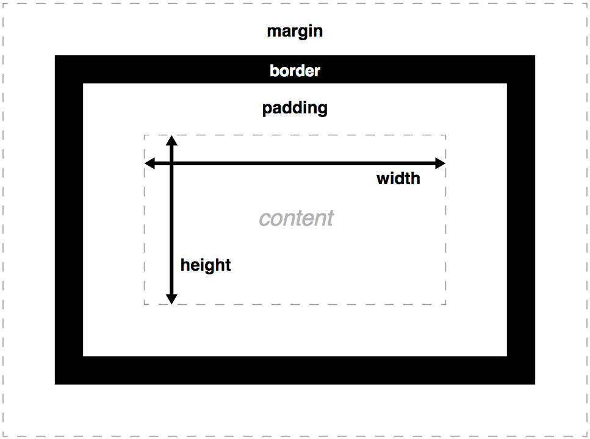

CSS

CSS选择器

- 简单选择器（Simple selectors）：通过元素类型、class或id匹配一个或多个元素

- 属性选择器(Atrribute selectors): 通过属性/属性值匹配

- 伪类（Pseudo-classes):匹配处于特定状态的元素，如被鼠标指针悬停的元素，或当前被选中或未选中的复选框

- 伪元素(Pseudo-elements): 匹配处于相关特定位置的元素，如段落的第一个字

- zuheqi（Combinators):

- 多用选择器（Multiple selector): 

简单选择器

- 类型选择器，所有制定类型的元素

- 类选择器 “."+”类名“ 多个类.class_1.class_2

- ID选择器 ”#“+”id名“

- 通用选择器（*）所有元素，不匹配body

属性选择器

- [attr]: 包含attr属性的所有去元素

- [attr=val]: attr属性被赋值为val的所有元素

- [attr=val]: attr属性的的值(以空格分隔的多个值)中包含val值的所有元素

子串值（Substring value)属性选择器

- [attr|=val]：attr属性的值是val或值以val-开头(-用来处理语言编码）

- [attr^=val]: attr属性的值以val开头

- [attr$=val]: attr属性的值以val结尾

- [attr*=val]: attr属性的值包含字符串val的元素

伪类（Pseudo class)

元素的选择器后加上 对应的伪类名, 伪类名以":"开头。表示指定的元素在指定的状态下时被选中

- a:visited 被访问过的链接

- :hover鼠标指针悬停； :active 鼠标按键按下到松开； :focus获得焦点

- :first-child		:nth-child()	:last-child()

- :first-of-type	:nth-of-type()	:last-of-type

伪元素（Pseudo element)

选择器后加上伪元素名，伪元素名以”::"开头，表示某个元素的制定某个部分

- ::after

- ::before

- ::fist-letter

- ::first-line

- ::selection  选中部分

- ::backdrop

组合器

- A,B 

- A B	B是A的后代节点（子节点 或子节点的子节点）

- A>B 	B是A的直接子节点

- 2A+B 	B是A的下一个兄弟节点(AB有相同的父节点，B紧跟在A后面）

- A~B	B是A之后的兄弟节点中的任意一个（AB有相同的父节点，B在A之后，但不一定紧挨着A）

层叠

CSS的属性按按一下三种因素的优先级应用（前一种优先于后一种）

1. 重要性

!important

2. 专用性

专用性的值，四列值：

1. 千位：style属性中的声明

1. 百位：ID选择器，每有一个加1分

1. 十位：类选择器（属性选择器 和 伪类），每有一个加1分

1. 个位：元素选择器（和伪元素），每有一个加1分

继承

四种通用属性值

- inherit

- initial

- unset

- revert

盒子模型

文档的每个元素被构造成文档布局内的一个矩形框，框每层的大小都可以使用一些特定的CSS属性调整。相关属性如下:

width 和 height

width 和 height 设置内容框（content box）的宽度和高度。内容框是框内容显示的区域——包括框内的文本内容，以及表示嵌套子元素的其它框。

注意: 还有其他属性可以更巧妙地处理内容的大小——设置大小约束而不是绝对的大小。这些属性包括min-width、max-width、min-height 和 max-height。

padding

padding 表示一个 CSS 框的内边距 ——这一层位于内容框的外边缘与边界的内边缘之间。该层的大小可以通过简写属性padding 一次设置所有四个边，或用 padding-top、padding-right、padding-bottom 和 padding-left 属性一次设置一个边。

border

CSS 框的边界（border）是一个分隔层，位于内边距的外边缘以及外边距的内边缘之间。边界的默认大小为0——从而让它不可见——不过我们可以设置边界的厚度、风格和颜色让它出现。 border 简写属性可以让我们一次设置所有四个边，例如  border: 1px solid black; 但这个简写可以被各种普通书写的更详细的属性所覆盖：

- border-top, border-right, border-bottom, border-left: 分别设置某一边的边界厚度／风格／颜色。

- border-width, border-style, border-color: 分别仅设置边界的厚度／风格／颜色，并应用到全部四边边界。

- 你也可以单独设置某一个边的三个不同属性，如 border-top-width, border-top-style, border-top-color，等。 

margin

外边距（margin）代表 CSS 框周围的外部区域，称为外边距，它在布局中推开其它 CSS 框。其表现与 padding 很相似；简写属性为 margin，单个属性分别为 margin-top、margin-right、margin-bottom 和 margin-left。

外边距塌陷

仅margin-top 和margin-bottom 当两个框彼此接触时，它们的间距将取两个相邻外边界的最大值，而非两者的总和。 https://developer.mozilla.org/zh-CN/docs/Web/CSS/CSS_Box_Model/Mastering_margin_collapsing

display

- box

- inline

- inline-box

注意

- 盒子的高度height和border的宽度会忽略百分比长度设置，如果高度设置了百分比长度，则总是会采用盒子内容的高度

- width/height一般为盒子内容的宽度和高度，可用box-sizing改变宽高的应用方式

- boxing-sizing: content-box （默认）/ border-box

- background-clip: border-box（默认）/ padding-box/ content-box

- overflow: 当用绝对的长度设置盒子的大小时，内容可能会超出设置的大小。 auto显示滚动条；hidden隐藏；visible显示在盒子之外

- 没有明确设置时，边界默认使用文本的颜色

background

- background-color:默认transparent

- background-image

- url 图片

- 渐变：线性渐变linear-gradient

- background-repeat: no-repeat/ repeat-x/repeat-y    默认在x和y方向都重复

- background-position: 以左上角为原点，接受两个以空格分割的值

- 绝对长度px

- 相对长度em，rem

- 百分比

- 关键字，两个值分别可取left,center,right和top,center,bottom

- background-attachment:scroll/fixed/local

- 简写：background

- 多个背景，用逗号分割，第一个在最顶部，第二个在下面，第三个在更下面，以此类推

- background-size: 背景尺寸

- length

- 百分比

- auto: 

- auto 

auto auto:

图像如果有两个长度，则按这个尺寸。如果没有固有尺寸与固有比例，则按背景区的大小。如果没有固有尺寸但是有固有比例， 效果同 contain。如果有一个长度与比例，则由此长度与比例计算大小。如果有一个长度但是没有比例，则使用此长度与背景区相应的长度。

一个为 auto 另一个不是auto:

如果图像有固有比例，则指定的长度使用指定值，未指定的长度由指定值与固有比例计算。如果图像没有固有比例，则指定的长度使用指定值，未指定的长度使用图像相应的固有长度，若没有固有长度，则使用背景区相应的长度。

- cover: 缩放背景图片以完全覆盖背景区，保持图片宽高比

- contain:缩放背景图片以完全装入背景区，保持图片宽高比

边界border

- border可以分开写

- border-top border-right border-bottom border-left

- border-width border-style border-color

- border-top-widht border-top-style border-top-color等

- border-radius

- border-top-left-radius，border-top-right-radius，border-bottom-left-radius和 border-bottom-right-radius

- 椭圆形角 border-radius: 10px / 20px;

- 百分比

- border变为圆形， border-radius:50%

- border-image 边框图像

高级盒子效果

- box-shadow

- filter

- background-blend-mode

- mix-blend-mode

- -webkit-background-clip:text

字体样式

字体大小

- px

- em

- rem

font-style

打开或关闭xieti

- normal

- italic

- oblique

font-weight

- normal, bold

- lighter, bolder相比父元素更细或更粗； 100-900数值粗体值

text-transform

- none

- uppercase: 所有文本转为大写

- lowercase: 所有文本转为小写

- capitalize: 所有单词转为首字母大写

- full-width: 所有字形转为固定宽度的正方形

text-decoration

text-decoration-line, text-decoration-style, text-decoration-color的缩写

- none

- underline: 下划线

- overline: 上划线

- linethrough:

text-shadow

文字阴影

例如text-shadow: 4px 4px 5px red;

4个值

1. 阴影与原始文本的水平偏移

1. 阴影与原始文本的垂直偏移

1. 模糊半径

1. 阴影颜色

文本布局

text-align

文本对齐

- left:左对齐

- right: 右对齐

- center: 居中文字

- justify: 分散对齐

line-height

行高，每行高度

- normal：浏览器默认1.2

- 无单位的值，如1.5，字体高度的1.5倍

列表特定样式

list-style-type列表符号样式

https://developer.mozilla.org/zh-CN/docs/Web/CSS/list-style-type

list-style-position 列表符号位置

outside / inside

list-style-image 使用自定义的列表项目图片

list-style-image:img(url)

list-style缩写

list-style: square url(example.png) inside;

如果同时制定了type和image，则使用image，如果image无法加载，回退为type

CSS布局

- 浮动

- 定位

- CSS表格

- flex弹性

- grid网格

