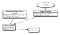
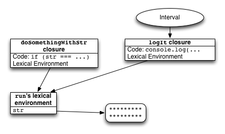

An interesting kind of JavaScript memory leak

Recently, Avi and David tracked down a surprising [JavaScript memory leak](https://github.com/meteor/meteor/issues/1157) in Meteor’s live HTML template rendering system. The fix will be in the 0.6.5 release (in its final stages of QA right now).

I searched the web for variations on `javascript closure memory leak` and came up with nothing relevant, so it seemed like this is a relatively little-known issue in the JavaScript context. (Most of what you find for that query talks about the bad garbage collection algorithm in old versions of IE, but this problem affects even my current Chrome install!) I later found a [great blog post](http://mrale.ph/blog/2012/09/23/grokking-v8-closures-for-fun.html) on this subject by a V8 developer, but it still seems like most users of JavaScript don't know they have to watch out for this.

JavaScript is secretly a functional programming language, and its functions are *closures*: function objects get access to variables defined in their enclosing scope, even when that scope is finished. Local variables which are captured by a closure are garbage collected once the function they are defined in has finished and all functions defined inside their scope are themselves GCed.

Now, consider this code:

var theThing = null;  
var replaceThing = function () {  
  var originalThing = theThing;  
  theThing = {  
    longStr: new Array(1000000).join('*')  
  };  
};  
setInterval(replaceThing, 1000);

Every second, we’ll execute the `replaceThing` function. It replaces `theThing` with a new object containing a newly allocated giant string, saving the original value of `theThing` in the local variable `originalThing`. After it returns, the old value of `theThing` can be garbage collected, including the long string inside it, since nothing remains that refers to it. So the memory used by this code is roughly constant: it does keep allocating big strings, but each time it can delete the previous big string.

But what if we had a closure that outlasted `replaceThing`?

var theThing = null;  
var replaceThing = function () {  
  var originalThing = theThing;  
  theThing = {  
    longStr: new Array(1000000).join('*'),  
    someMethod: function () {  
      console.log(someMessage);  
    }  
  };  
};  
setInterval(replaceThing, 1000);

The body of `someMethod` could theoretically refer to to `originalThing`, so shouldn't`originalThing` be retained for as long as the `someMethod` is alive? This would lead to boundless memory growth, since each version of `theThing` would essentially hang on to a pointer to the previous version.

Fortunately, modern JavaScript implementations (including, say, the current V8 in Chrome and Node) are smart enough to notice that `originalThing` isn't *actaully* used in the closure`someMethod`, so it's not put into `someMethod`'s lexical environment, and it's OK to GC the previous `theThing` when `replaceThing` finishes.

(But wait, you ask! What if somebody had earlier run `console.log = eval`, and so the seemingly innocuous line `console.log(someMessage)` was actually `eval`ing some code that refers to `originalThing`? Well, the JavaScript standard is one step ahead of you. If you use`eval` in a sneaky fashion like this (in any way other than by just calling it `eval`), it's called an "indirect `eval`", and it doesn't actually get to access the lexical environment! If, on the other hand, `someMethod` did contain a direct call to `eval` with that name, it could in fact access`originalThing`, and the JavaScript environment is forbidden from keeping `originalThing`out of the lexical environment and this would end up leaking.)

Well, great! JavaScript protects us from memory leaks, right? Well, let’s try one more version, combining the first two examples.

var theThing = null;  
var replaceThing = function () {  
  var originalThing = theThing;  
  var unused = function () {  
    if (originalThing)  
      console.log("hi");  
  };  
  theThing = {  
    longStr: new Array(1000000).join('*'),  
    someMethod: function () {  
      console.log(someMessage);  
    }  
  };  
};  
setInterval(replaceThing, 1000);

Open up the Timeline tab in your Chrome Developer Tools, switch to the Memory view, and hit record:

Looks like we’re using an extra megabyte every second! And even clicking the garbage can icon to force a manual GC doesn’t help. So it looks like we are leaking `longStr`.

But isn’t this just the same situation as before? `originalThing` is only referenced in the main body of `replaceThing`, and in `unused`. `unused` itself (which we never even run!) gets cleaned up once `replaceThing` ends... the only thing from `replaceThing` that escapes is the second closure, `someMethod`. And `someMethod` doesn't refer to `originalString` at all!

So even though there’s no way for any code to ever refer to `originalThing` again, it never gets garbage collected! Why? Well, the typical way that closures are implemented is that every function object has a link to a dictionary-style object representing its lexical scope. If both functions defined inside `replaceThing` actually used `originalThing`, it would be important that they both get the same object, even if `originalThing` gets assigned to over and over, so both functions share the same lexical environment. Now, Chrome's V8 JavaScript engine is apparently smart enough to keep variables out of the lexical environment if they aren't used by*any* closures: that's why the first example doesn't leak.

But as soon as a variable is used by *any* closure, it ends up in the lexical environment shared by*all* closures in that scope. And that can lead to memory leaks.

You could imagine a more clever implementation of lexical environments that avoids this problem. Each closure could have a dictionary containing only the variables which it actually reads and writes; the values in that dictionary would themselves be mutable cells that could be shared among the lexical environments of multiple closures. Based on my casual reading of the ECMAScript 5th Edition standard, this would be legitimate: its description of Lexical Environment describes them as being “purely specification mechanisms \[which\] need not correspond to any specific artefact of an ECMAScript implementation”. That said, this standard doesn’t actually contain the word “garbage” and only says the word “memory” once. (Here’s a [paper about this issue with an optimal implementation](http://flint.cs.yale.edu/flint/publications/escc.pdf), though not in a JavaScript context. Some other language implementations do get this right, such as Go.)

Fixing memory leaks of this form, once you notice them, is straightforward, as demonstrated by [the fix to the Meteor bug](https://github.com/meteor/meteor/commit/49e9813). Just add `originalThing = null` to the end of `replaceThing`. That way, even though the name `originalThing` is still in the lexical environment of `someMethod`, there won't be a link to the big old value.

var theThing = null;  
var replaceThing = function () {  
  var originalThing = theThing;  
  // Define a closure that references originalThing but doesn't ever  
  // actually get called. But because this closure exists,  
  // originalThing will be in the lexical environment for all  
  // closures defined in replaceThing, instead of being optimized  
  // out of it. If you remove this function, there is no leak.  
  var unused = function () {  
    if (originalThing)  
      console.log("hi");  
  };  
  theThing = {  
    longStr: new Array(1000000).join('*'),  
    // While originalThing is theoretically accessible by this  
    // function, it obviously doesn't use it. But because  
    // originalThing is part of the lexical environment, someMethod  
    // will hold a reference to originalThing, and so even though we  
    // are replacing theThing with something that has no effective  
    // way to reference the old value of theThing, the old value  
    // will never get cleaned up!  
    someMethod: function () {}  
  };  
  // If you add \`originalThing = null\` here, there is no leak.  
};  
setInterval(replaceThing, 1000);

So in summary: If you have a large object that is used by some closures, but not by any closures that you need to keep using, just make sure that the local variable no longer points to it once you’re done with it. Unfortunately, these bugs can be pretty subtle; it would be much better if JavaScript engines didn’t require you to have to think about them.

(Originally posted at [my personal blog](http://point.davidglasser.net/2013/06/27/surprising-javascript-memory-leak.html) with interesting [discussion on Hacker News](https://news.ycombinator.com/item?id=5959020).)