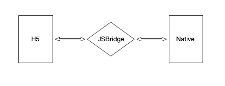
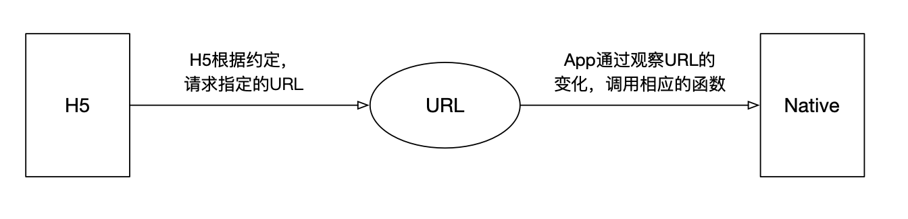
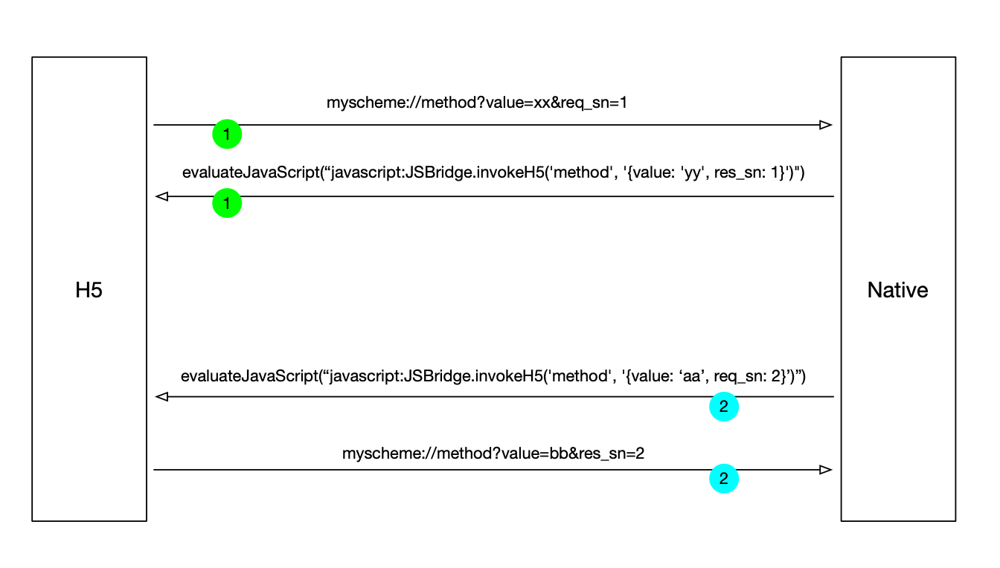
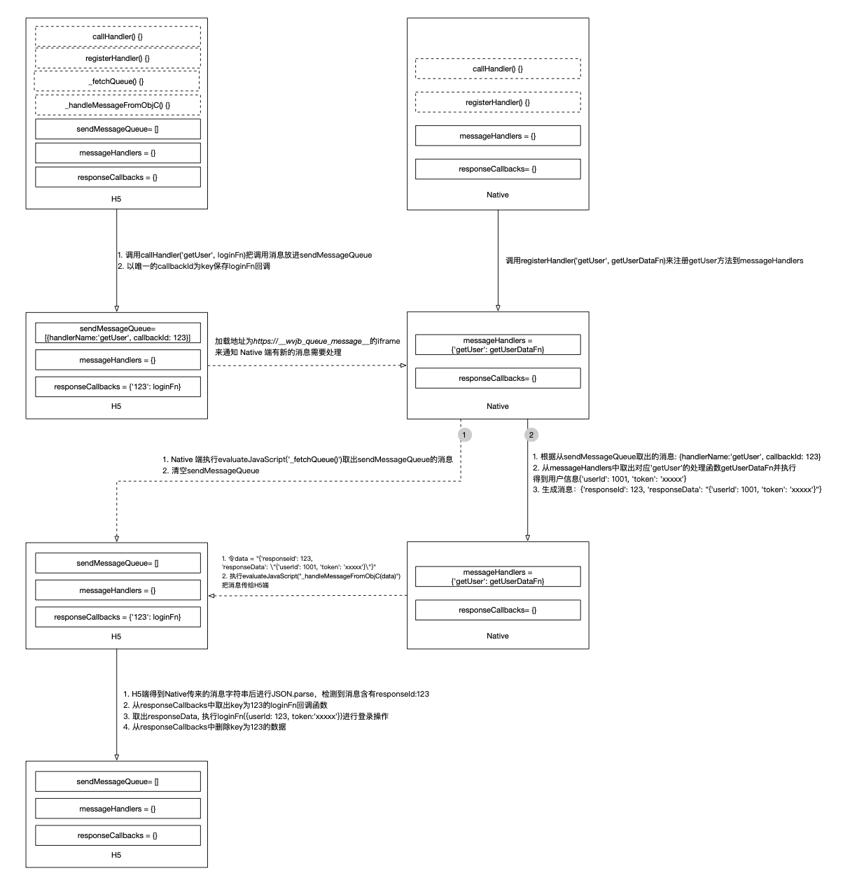
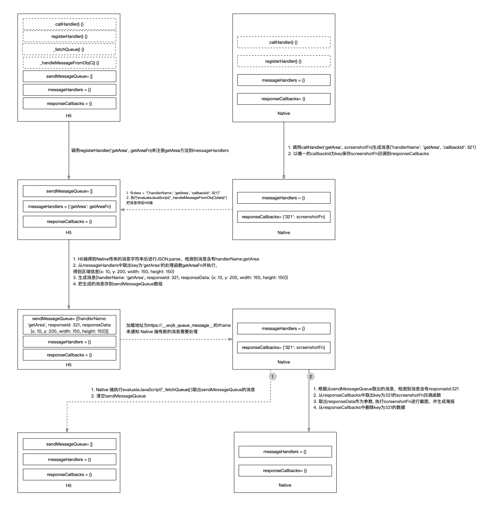

JSBridge 通信原理

## 存在背景

随着移动互联网下半场的到来和产业互联网概念的兴起，越来越多的线下服务搬到了线上来。而对于只服务特定群体或者有限场景的业务，使用 iOS 和 Android 开发似乎成本过高了，于是 Hybrid APP、React Native、Weex、Flutter、小程序等技术方案层出不穷。其中，Hybrid APP 方案最容易在已有 Native APP 中实施且兼容性最好。Hybrid APP 即混合模式开发的 APP，它可以把低成本、高效率、跨平台的 H5 技术和追求极致用户体验的 Native 技术混合在一起来为用户提供服务。而 Hybrid 技术实施的前提，是实现 H5 和 Native APP 之间的通信，这个实现，我们称之为 JSBridge。

## 通信基础

所谓通信，是指发送者通过某种媒体以某种格式来传递信息到收信者以达致某个目的。所以通信的基础，是收信方必须能通过某种方式接收到发送方的信息。那么两个不同语言的平台 H5(JavaScript) 和 Native(Java/Object-C) 是怎么样实现消息传递的呢？

首先要知道的是，Native(Java/Object-C) 的代码编译成二进制后，是操作系统(iOS/Andriod)来执行相关代码，从而作为一个 APP 运行。而对于 H5 ，是 Native 使用了一个 WebView 容器，在容器里解析相关的 HTML/CSS/JavaScript 代码，从而实现一个 Web 页面的显示。所以 H5 和 Native 的通信，实际上是 Native 代码通过 WebView 容器与 JavaScript 代码通信。

### H5 调用 Native

H5 调用 Native 在实现上有 2 种方式：

1.  理论上，无论是 iOS 还是 Android，提供的 WebView 容器是可以拦截一切 H5 发起的请求的，无论是标准协议（如 http://、https:// 等）还是私有协议（如 weixin:// ）。基于这个原理，H5 采用私有协议模拟发起 URL 请求，Native 解析这类 URL 并定制相应的处理函数，这就实现了 H5 调用 Native。

2.  在 Native 的开发中，开发者可以给 WebView 容器注入全局变量并挂载在 `window` 对象上，这样前端 js 就可以通过 `window` 上全局对象方法 来调用一些 Native 的方法。这里需要注意的是方法注入的时机，一般是 WebView 一旦加载页面就需要注入变量。

### Native 调用 H5

上面提到的*给 WebView 容器注入全局变量并挂载在 `window` 对象上*，实际上是 Native 代码执行了一个 `evaluateJavaScript` 函数，直接运行 js 字符串代码(类似 js 的 eval 函数)，从而实现注入。所以 Native 代码也一样可以通过这个 `evaluateJavaScript` 函数来调用约定好的 js 函数来实现 H5 的调用。

PS: Android 4.4+ 之前，`evaluateJavaScript` 函数是指 Webview 类的 `loadUrl` 方法，在 Android 4.4+ 之后，官方给提供了原生的 `evaluateJavascript` 方法支持调用 JS。 在 iOS 中，`evaluateJavaScript` 方法也有不同，在 UIWebView 中，iOS7+ 提供了 JavascriptCore 的 `evaluateScript` 方法，而 WKWebView 提供了 `evaluateJavaScript` 方法，两个 WebView 还提供了另外一种实现方式 `stringByEvaluatingJavaScriptFromString`。它们之间的区别就不在这里展开了，下面统一用 `evaluateJavaScript` 函数表示。

## 通信实现

前面说的只是 H5 和 Native 之间通信的可能性，在实际业务中，还需要考虑到两者调用时参数传递的方式，抹平两端互相调用的细节，为 H5 业务层提供一致性的调用接口。

下面描述的是一个 H5 和 Native 之间的通信实现也即 JSBridge 可能的实现方式(从开源的 [hybrid-js](https://github.com/chemdemo/hybrid-js) 演化而来)，整个架构如下：

### 调用与回调

- H5 调 Native：

|     |     |
| --- | --- |
| 1   | JSBridge.invokeNative(api, params) |

这是 H5 调用 Native 的抽象，而 `invokeNative` 可以用私有协议的方式实现，也可以用注入全局变量的方式实现。一般来讲，两种方式没有什么优劣之分，不过，私有协议是监听 WebView 请求，比较通用，而变量注入是 WebView 加载时注入，注入时机不对的话容易出问题，下面的方案都采用私有协议来实现。

前面说过， WebView 可以拦截 H5 发起的 URL 请求， 通过对约定规则的 URL 进行解析，即可实现 H5 调用 Native。而这个 URl 请求， H5 可以通过加载 `iframe` 来发起：

|     |     |
| --- | --- |
| 1   2   3   4 | const frame = document.createElement('iframe')   frame.style.display = 'none'   frame.src = 'myscheme://method?params=value'   document.documentElement.appendChild(frame) |

Native 拦截到 `myscheme` 的请求后，就解析 URL 上面的 method 和 params，并把它们传到对应的处理函数。

- Native 调 H5：

|     |     |
| --- | --- |
| 1   2   3   4   5 | // android   webview.loadUrl("javascript:JSBridge.invokeH5(api\[, ...args\])")       // iOS   \[self.webView evaluateJavaScript:"javascript:JSBridge.invokeH5(api\[, ...args\])" completionHandler:nil\] |

`invokeH5` 函数是 Native 调 H5 的入口，在这之前，H5 需要声明全局对象 `JSBridge` 和实现对应的 `invokeH5`方法。

H5 和 Native 之间的调用不都是单向的，还需要考虑回调的情况。

由于同时存在 H5 调用 Native 然后 Native 再回调 H5，和 Native 调用 H5 然后 H5 再返回值给 Native 的情况，所以这里将发起请求的一方叫调用方，另一方叫被调方。为了区分多次不同的调用，在调用方发起请求时会带上一个特殊的标记 **sn**，这样保证回调的顺序不乱。

同时由于调用方调用被调用方和调用方回调被调用方在代码层面都是同一个接口（例如 H5 调用 Native API 和 H5 回调 Native 的调用这两种情况都是调用 JSBridge.invokeNative 方法），为了区分本次调用是 API 调用还是回调调用，sn 需要做区分，比如请求方带过去的 key 名叫 **req_sn**，回调带过去的叫 **res_sn**。

发起带 **req_sn** 的请求前，如果有回调函数，会以 **req_sn** 的值为 key，把回调函数存到对应的回调函数列表。当接收到带有 **res_sn** 的调用后，会以 **res_sn** 的值为 key，从对应的回调函数列表取出回调函数，并以接收到的数据为参数，执行回调函数：

|     |     |
| --- | --- |
| 1   2   3   4   5   6   7   8   9   10   11   12   13   14   15   16   17   18   19   20   21   22   23   24   25   26   27   28   29   30   31   32 | let current_sn = 1 // sn 需要保持唯一   JSBridge.callbacks = \[\]      // H5 调用 Native 入口   JSBridge.invokeNative = (api, params) => {    const { callback, ...data } = params    if (typeof callback === 'function') {    // 把回调放到回调函数列表    JSBridge.callbacks\[current_sn\] = callback    }    const frame = document.createElement('iframe')    frame.style.display = 'none'    frame.src = `myscheme://${api}?${querystring.parse(data)&req\_sn=${current\_sn}}`    document.documentElement.appendChild(frame)    current_sn += 1   }      // Native 调用 H5 入口   JSBridge.invokeH5 = (api, params) => {    const { res_sn, ...data } = params    if (res_sn) {    // 回调    if (JSBridge.callbacks\[res_sn\]) {    const callback = JSBridge.callbacks\[res_sn\]    delete JSBridge.callbacks\[res_sn\]    return callback(data)    }    } else {    // 非回调的情况，调用对应的 api 处理函数    return callApi(api, params)    }   } |

### 事件监听

在实际业务中，除了 H5 和 Native 之间的主动回调，还有很多事件监听的需求，比如 H5 需要在 APP 分享成功之后传递分享成功事件给 H5 来做一些业务逻辑。而这些事件其实和 push 很相似，都是一方主动向另一方推送一些数据，而自己不需要知道对方是否接收以及处理结果。

所以事件和 API 调用的接口可以是分开的：

|     |     |
| --- | --- |
| 1   2   3   4   5 | // android   webview.loadUrl("javascript:JSBridge.notifyH5(eventname\[, data\])")       // iOS   \[self.webView evaluateJavaScript:"javascript:JSBridge.notifyH5(eventname\[, data\])" completionHandler:nil\] |

如上述，Native 通过 JSBridge.notifyH5 接口向 H5 推送事件，第一个参数是事件名，理论上事件可以是 Native 真实的事件，也可以是自定义事件，第二个参数是事件对应的对象。

不过，如果事件是键盘事件或其他交互事件，每次都传递给 H5 看起来似乎没有必要，在 Web 世界中事件都遵循**监听则处理，不监听则不处理**的原则，所以这里对于交互事件，还需要一个监听的操作，即 H5 事先告诉 Native 需要监听某个事件，当事件真正发生时 Native 才会传递给 H5：

|     |     |
| --- | --- |
| 1   | JSBridge.on(eventname, handler) |

内部则会发起类似 *myscheme:listen?eventname=value* 的请求，同时用 eventname 的值为 key，把 handler 回调函数保存到回调函数列表中：

|     |     |
| --- | --- |
| 1   2   3   4   5   6   7 | JSBridge.on = (eventname, handler) {    JSBridge.callbacks\[eventname\] = handler    const frame = document.createElement('iframe')    frame.style.display = 'none'    frame.src = `myscheme:listen?eventname=${eventname}`    document.documentElement.appendChild(frame)   } |

当 Native 调用了 `notifyH5` 后，JS 就可以通过 eventname 从回调函数列表取出 handler 并执行，实现回调。

|     |     |
| --- | --- |
| 1   2   3   4   5 | JSBridge.notifyH5 = (eventname, data) => {    if (JSBridge.callbacks\[eventname\]) {    JSBridge.callbacks\[eventname\](https://sevody.github.io/2019/11/10/jsbridge-mechanisms/data)    }   } |

### 更优雅的实现

上面的 JSBridge 通信设计是考虑到大部分调用场景的其中一种实现方式，事实上，只要 H5 和 Native 约定好规则，你完全可以针对自己的需求，有不同的实现方式。另外，JSBridge 通信跟实际业务是分离的，不同的 Hybrid APP 完全可以使用同一套通信实现。实际上，目前很多 iOS 端 Hybrid APP 的 JSBridge 通信实现都使用了一个名为 [WebViewJavascriptBridge](https://github.com/marcuswestin/WebViewJavascriptBridge) 的开源库，它实现了 JS 和 Object-C 的之间的通信，是一种更优雅的通信实现。

PS：android 端为了保持 H5 调用接口的统一，一般也设计成跟 WebViewJavascriptBridge 一样的通信方式，开源实现可以参考 [lzyzsd/JsBridge](https://github.com/lzyzsd/JsBridge)。

那么，下面就来看下 WebViewJavascriptBridge 的实现原理。

首先，H5 端定义了 4 个方法和 3 个数据结构：

|     |     |
| --- | --- |
| 1   2   3   4   5   6   7   8   9   10   11   12   13 | // WebViewJavascriptBridge_JS.m   window.WebViewJavascriptBridge = {    registerHandler: registerHandler, // 注册供 Native 调用的 JS 方法    callHandler: callHandler, // 调用 Native 端的方法    \_fetchQueue: \_fetchQueue, // 供 Native 调用，取出 sendMessageQueue 的数据    \_handleMessageFromObjC: \_handleMessageFromObjC // 供 Native 调用，把通信消息传给 H5   };      // ...      var sendMessageQueue = \[\]; // 保存要传给 Native 的通信消息   var messageHandlers = {}; // 保存注册的 JS 方法   var responseCallbacks = {}; // 保存回调方法 |

同时，Native 端也定义了 2 个对应的方法和 2 个数据结构：

|     |     |
| --- | --- |
| 1   2   3   4   5   6   7   8   9   10   11   12   13   14   15   16 | // WKWebViewJavascriptBridge.m   @interface WKWebViewJavascriptBridge : NSObject<WKNavigationDelegate, WebViewJavascriptBridgeBaseDelegate>   // 注册供 JS 调用的 Native 方法   \- (void)registerHandler:(NSString*)handlerName handler:(WVJBHandler)handler;   // 调用 JS 端的方法   \- (void)callHandler:(NSString*)handlerName data:(id)data responseCallback:(WVJBResponseCallback)responseCallback;   @end      // WebViewJavascriptBridgeBase.m   \- (id)init {    if (self = \[super init\]) {    self.messageHandlers = \[NSMutableDictionary dictionary\]; // 保存注册的 Native 方法    self.responseCallbacks = \[NSMutableDictionary dictionary\]; // 保存回调方法    }    // ...   } |

当 WebView 加载 H5 页面的时候，H5 需要加载一个地址为 *https://**bridge_loaded*** 的 iframe 通知 Native 端注入 JSBridge 通信相关的 JS 代码以完成初始化。

下面以 H5 调用 Naive 定义的 `getUserData` 方法来获取 APP 的用户信息来进行登录操作为例，看看 WebViewJavascriptBridge 是怎样通信的，具体的调用逻辑如下图：

可以看出，与第一种实现方式不同的是，H5 传递消息给 Native 的时候，只是通过加载地址为 *https://**wvjb\_queue\_message*** 的iframe 来告知 Native 有新的消息，具体的信息存到了 `sendMessageQueue` 队列里。不过，一样的是，每个调用的回调都是通过唯一的id来识别的(callbackId对应req\_sn，responseId对应res\_sn)。

虽然 Hybrid APP 的通信基本上都是 H5 调 Native， 不过也存在 Native 调用 H5 的需求，比如 Native 需要截取 H5 页面特定区域的截图来生成海报图片。Native 可以通过调用 H5 定义的 `getArea` 来获取特定区域的坐标轴和宽高来确定截取图的区域，具体的调用逻辑如下图：

从上图可以看出，Native 调用 H5 基本上是 H5 调用 Native 的一个镜像操作，无论调用还是回调，实现逻辑都是一致的。H5 和 Native 就像桥的两端，WebViewJavascriptBridge 就是对称地架在它们之间的桥梁，无论是从 H5 到 Native 还是 Native 到 H5，走到对面的方式都是一样的。

这就是 WebViewJavascriptBridge 的设计美学：**接口对等**，**逻辑对称**。

## 总结

通过上面的剖析，我们了解了 JSBridge 实现通信的基本原理。同时，通过两种不同的 JSBridge 实现方式的对比，我们看到了代码设计的美学。正如吴军在《数学之美》上所说：**数学之美，首先在于其内容或许复杂而深奥，但形式常常很简单。简单即是美，这不仅在科学和工程上成立，而且在产品开发和设计上也是如此。**

Ref:  
[https://github.com/marcuswestin/WebViewJavascriptBridge](https://github.com/marcuswestin/WebViewJavascriptBridge)  
[https://github.com/lzyzsd/JsBridge](https://github.com/lzyzsd/JsBridge)  
[https://github.com/chemdemo/hybrid-js](https://github.com/chemdemo/hybrid-js)