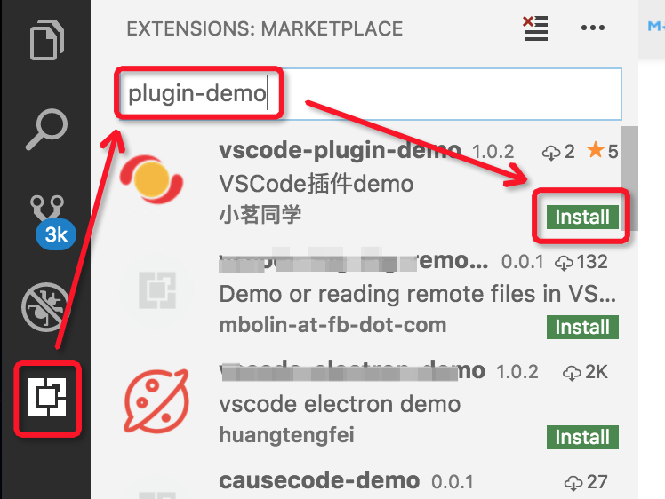
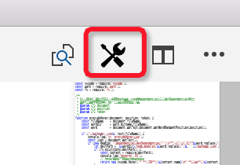
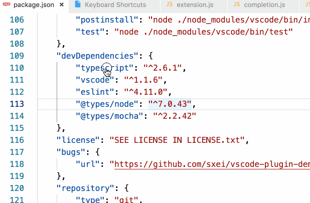
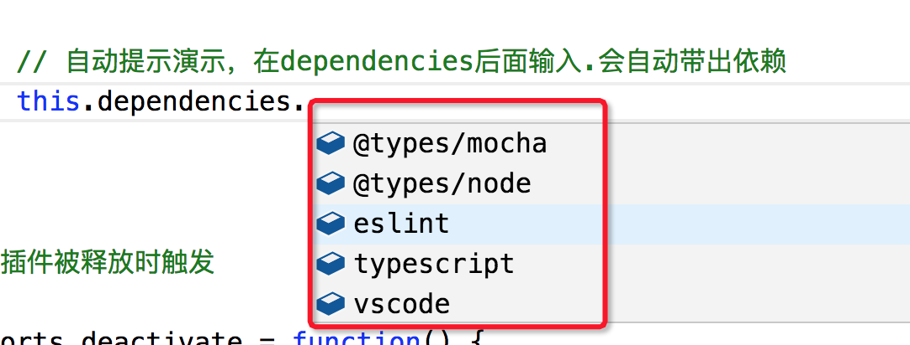
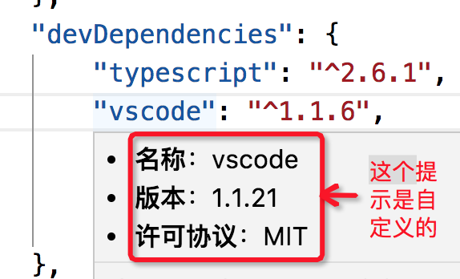
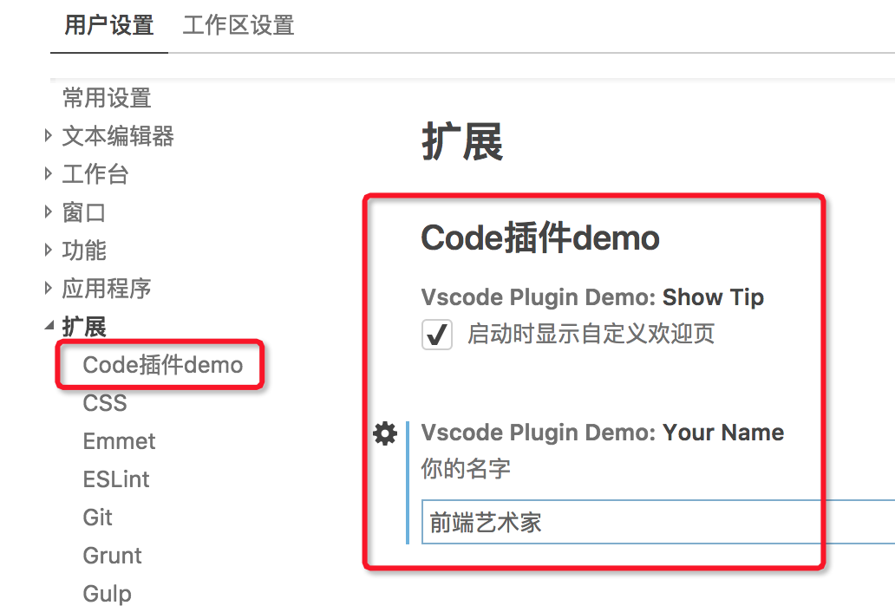
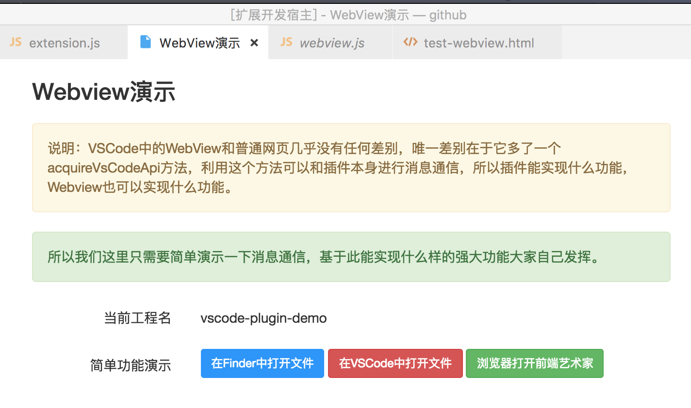
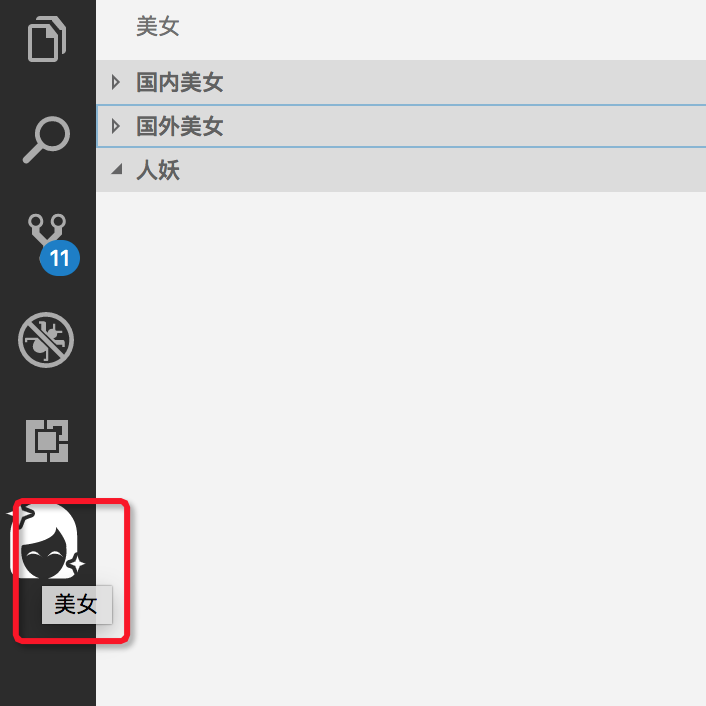
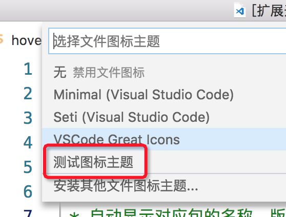

VSCode插件开发全攻略（一）概览 - 我是小茗同学 - 博客园

- [VSCode插件开发全攻略（一）概览](https://www.cnblogs.com/liuxianan/p/vscode-plugin-overview.html)
- [VSCode插件开发全攻略（二）HelloWord](https://www.cnblogs.com/liuxianan/p/vscode-plugin-hello-world.html)
- [VSCode插件开发全攻略（三）package.json详解](https://www.cnblogs.com/liuxianan/p/vscode-plugin-package-json.html)
- [VSCode插件开发全攻略（四）命令、菜单、快捷键](https://www.cnblogs.com/liuxianan/p/vscode-plugin-command-and-menu.html)
- [VSCode插件开发全攻略（五）跳转到定义、自动补全、悬停提示](https://www.cnblogs.com/liuxianan/p/vscode-plugin-jump-completion-hover.html)
- [VSCode插件开发全攻略（六）开发调试技巧](https://www.cnblogs.com/liuxianan/p/vscode-plugin-develop-tips.html)
- [VSCode插件开发全攻略（七）WebView](https://www.cnblogs.com/liuxianan/p/vscode-plugin-webview.html)
- [VSCode插件开发全攻略（八）代码片段、设置、自定义欢迎页](https://www.cnblogs.com/liuxianan/p/vscode-plugin-snippets-and-settings.html)
- [VSCode插件开发全攻略（九）常用API总结](https://www.cnblogs.com/liuxianan/p/vscode-plugin-common-api.html)
- [VSCode插件开发全攻略（十）打包、发布、升级](https://www.cnblogs.com/liuxianan/p/vscode-plugin-publish.html)

本系列文章同步首发于多个平台，限于精力有限，后续如有更新和修改，仅更新我的[个人博客](https://haoji.me/)上的内容，欢迎戳这里查看最新版：[http://blog.haoji.me/vscode-plugin-overview.html](http://blog.haoji.me/vscode-plugin-overview.html)

一年前我写了一篇3万多字的[Chrome插件(扩展)开发全攻略](http://blog.haoji.me/chrome-plugin-develop.html)，反响还不错，帮助了很多新手快速上手，甚至包括大名鼎鼎的红芯浏览器（[戳这里了解更多](https://www.zhihu.com/question/290426793/answer/470060833)）。

最近因工作需要又接触到了vscode插件开发，所以趁势再写一篇有关vscode插件开发的文章，记录一些自己踩过的坑以及接触vscode插件开发这2个多月以来的心得体会，让大家少走一些弯路避免重复踩坑。

目前网上有关介绍vscode插件开发的文章也有挺多的，但都不够深入，基本上都是点到为止，篇幅不大，本系列文章争取多讲一些，涵盖面会更广，干货更多。

鉴于之前写过几篇内容较多的文章大家都反馈说阅读麻烦，一篇文章内容太多看起来太累，所以这次就拆分来写。

相信大家对vscode应该都不陌生，VSCode是微软出的一款轻量级代码编辑器，免费而且功能强大，以功能强大、提示友好、不错的性能和颜值俘获了大量开发者的青睐，对JavaScript和NodeJS的支持非常好，自带很多功能，例如代码格式化，代码智能提示补全、Emmet插件等。

再强大的IDE那也不可能面面俱到什么功能都塞进去，那样只会导致IDE本身太臃肿。功能嘛，按需索取，所以，vscode的很多强大功能都是基于插件实现的，IDE只提供一个最基本的框子和最基本功能，由插件来丰富和扩展它的功能。

vscode插件可以很轻松的在应用商店搜索并下载到，应用商店官网是：[https://marketplace.visualstudio.com/vscode](https://marketplace.visualstudio.com/vscode) ，vscode推出时间本身并不长，但生态发展得非常好，应用商店已经有各种各样丰富的插件供大家使用了。

因为vscode本身都是用浏览器实现的，所以其插件不用说肯定也是基于`HTML+JS`等前端技术实现，从形式上看就是一个类似于npm包的`vsix`文件，只不过按照一些特殊规范来实现一些特殊功能，所以vscode插件开发难度不大，甚至可以说熟悉了相关API之后很容易。

有！而且非常有必要！每个人都会多多少少有一些自己的特殊定制需求，当你不知道开发一个`IDE`插件其实也很容易、或者你没有意识到通过开发插件可以帮你提升多大效率时，你并不会下意识的将一些问题的解决方式往IDE插件开发上去想。至少我曾经就是这样的，提升开发效率大部分时候想到的都是写一些脚本工具、写一些浏览器插件、写一些客户端工具等，接触到IDE插件开发之后发现原来有些问题可以通过更高效的方式来解决，毕竟IDE才是我们程序员每天接触最多的东西。

但至于可以开发什么样的插件、实现什么样的功能、以什么样的形式呈现，这就要靠你从工作和生活中去发现、去找灵感并提炼了。

本系列文章所有demo均在这个仓库里：[https://github.com/sxei/vscode-plugin-demo](https://github.com/sxei/vscode-plugin-demo) ，可以直接下载运行。当然还有更简单的，这个demo已经发布到应用市场了，大家可以直接[点击这里](https://marketplace.visualstudio.com/items?itemName=sxei.vscode-plugin-demo)下载安装，或则您也可以直接在vscode里面搜索`plugin-Demo`就能搜到：

既然前面讲到学习vscode插件开发很有必要，那插件到底能做什么呢？能实现什么功能？能从哪些方面动手脚？下面我们就来列举一些好让大家有个大概了解。

## 6.1. 不受限的本地磁盘访问

因为vscode是基于`Electron`开发的，可以使用`nodejs`随意读写本地文件、跨域请求、甚至创建一个本地server，这都是没有任何限制的，所以只要你想做，基本上没有不能实现的。

## 6.2. 自定义命令、快捷键、菜单

vscode插件很多功能都是基于一个个命令实现的，我们可以自定义一些命令，这个命令将出现在按下`Ctrl+Shift+P`后的命令列表里面，同时可以给命令配置快捷键、配置资源管理器菜单、编辑器菜单、标题菜单、下拉菜单、右上角图标等。

## 6.3. 自定义跳转、自动补全、悬浮提示

自定义跳转：

自动补全：

提示：

## 6.4. 自定义设置、自定义欢迎页

## 6.5. 自定义WebView

## 6.6. 自定义左侧功能面板

## 6.7. 自定义颜色、图标主题

## 6.8. 新增语言支持

给某一种原有没有的`语言`提供语言支持，语言支持包括很多方面，比如代码高亮、语法解析、折叠、跳转、补全等；

## 6.9. Markdown增强

你可以自定义markdown预览的样式、添加一些新语法、新功能的支持。

## 6.10. 其它

其它还有比如状态栏修改、通知提示、编辑器控制、git源代码控制、任务定义、Language Server、Debug Adapter等等。

本文作为开篇，不做太多详细介绍，只是为了让大家对`vscode`插件有一个大致了解，后面再分篇慢慢细讲。

微软VSCode插件开发官方文档：[https://code.visualstudio.com/docs/extensions/overview](https://code.visualstudio.com/docs/extensions/overview)