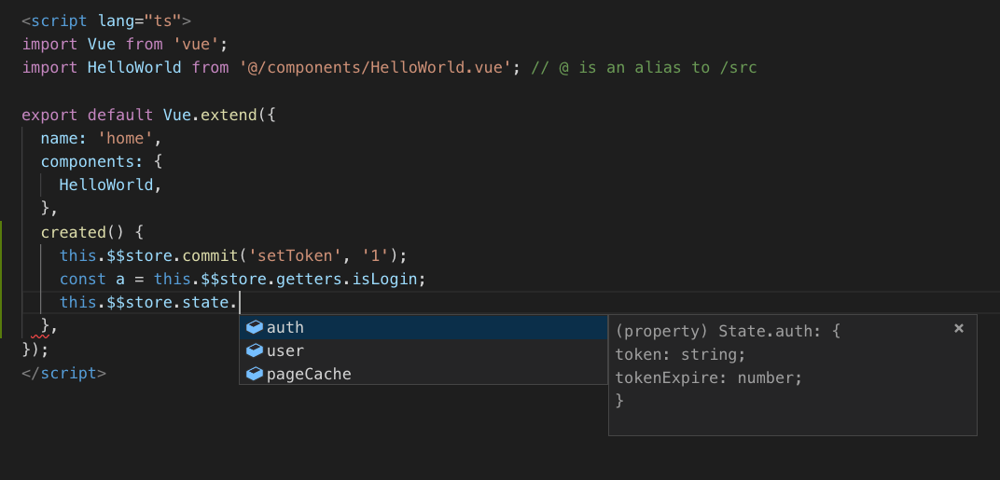
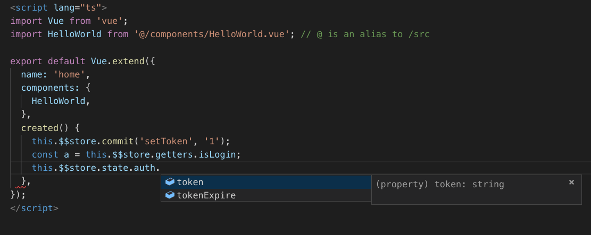
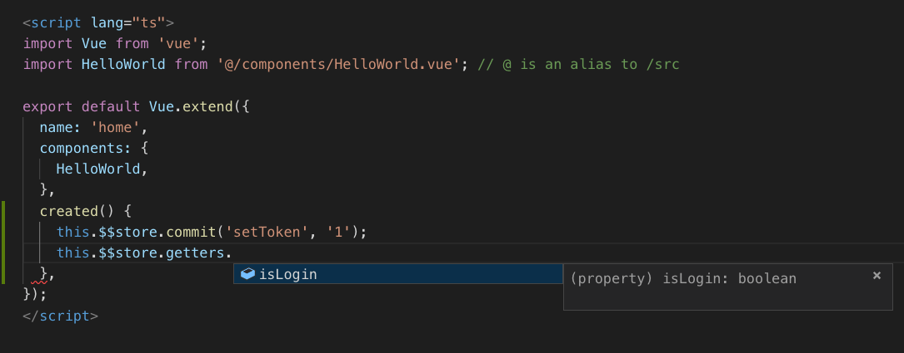
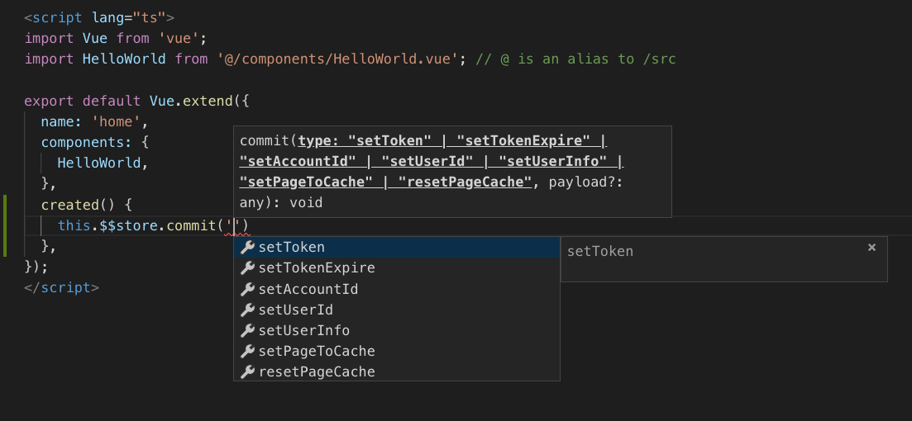
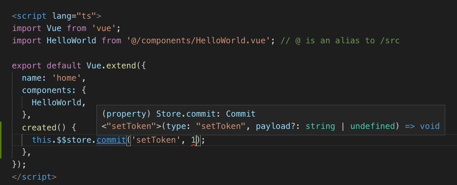

一个让 vuex 更好的支持 typescript 的解决方案 - 中文 - Vue Forum

传统 vuex 编码让人觉得麻烦的一点就是 state、getters、mutation、dispatch 在调用时无法获得编辑器的智能提示，必须切换文件去查找。本以为用上 typescript 后这个问题可以得到解决，却发现vuex官方提供的types并没有那么强大…

在找寻了一会儿各种解决方案后，觉得都存在这样或那样的问题（类型需要重复定义、侵入严重，和原本写法完全不一样），所以便自己写了这么一个解决方案，在获得了typescript的智能提示支持下却不需要重复写各种type和interface，和vuex原本写法保持一致，对业务代码侵入极小。

[demo 项目 76](https://github.com/BarneyZhao/vuex-typescript-demo)由 vue-cli 3 生成，IDE 为 VSCODE

## 效果展示

### 1\. state

[](https://github.com/BarneyZhao/vuex-typescript-demo/raw/master/mdimgs/WX20190618-155234.png "WX20190618-155234.png")

[](https://github.com/BarneyZhao/vuex-typescript-demo/raw/master/mdimgs/WX20190618-155250.png "WX20190618-155250.png")

state 会显示所有的 module、里面的属性及属性的类型

**/src/store/modules/auth.ts**

```
const moduleState = {
  token: '',
  tokenExpire: 0,
}

```

### 2\. getters

getter 可以显示值类型

[](https://github.com/BarneyZhao/vuex-typescript-demo/raw/master/mdimgs/WX20190618-155157.png "WX20190618-155157.png")

**/src/store/modules/auth.ts**

```
const moduleGetters = {
  isLogin(state: State, getters: any, rootState: Store['state'], rootGetters: any) {
    return !!state.token && (!!rootState.user.userId || !!rootState.user.accountId);
  },
};

```

### 3\. commit

[](https://github.com/BarneyZhao/vuex-typescript-demo/raw/master/mdimgs/WX20190618-155037.png "WX20190618-155037.png")

[](https://github.com/BarneyZhao/vuex-typescript-demo/raw/master/mdimgs/WX20190618-155113.png "WX20190618-155113.png")

commit 会显示所有注册的 mutation 以及对应 payload 的类型， 如果 payload 类型不对还会报错

[效果图 8](https://github.com/BarneyZhao/vuex-typescript-demo/raw/master/mdimgs/WX20190618-155122.png)  
(貌似只能贴5张图)

**/src/store/modules/auth.ts**

```
const mutations = {
  setToken(state: State, payload: State['token']) {
    state.token = payload || '';
  },
  setTokenExpire(state: State, payload: State['tokenExpire']) {
    state.tokenExpire = payload || 0;
  },
};

```

**/src/store/modules/user.ts**

```
const mutations = {
  setAccountId(state: State, payload: State['accountId']) {
    state.accountId = payload || '';
  },
  setUserId(state: State, payload: State['userId']) {
    state.userId = payload || '';
  },
  setUserInfo(state: State, payload: State['info']) {
    state.info = payload || {};
  },
};

```

**/src/store/modules/pageCache.ts**

```
const mutations = {
  setPageToCache(state: State, payload: any) {
    state.pagesName.unshift(payload.pageName);
    setTimeout(() => {
      if (payload.callback) payload.callback();
    }, 0);
  },
  resetPageCache(state: State) {
    state.pagesName = [...cachePages];
  },
};

```

### 4\. dispatch

和 commit 类似

[效果图 20](https://github.com/BarneyZhao/vuex-typescript-demo/raw/master/mdimgs/WX20190618-155337.png)  
[效果图 4](https://github.com/BarneyZhao/vuex-typescript-demo/raw/master/mdimgs/WX20190618-155417.png)

**/src/store/modules/auth.ts**

```
const actions = {
  updateAuthData({ commit }: ActionContext<State, Getters>, payload: any) {
    commit('setToken', payload.token);
    commit('setTokenExpire', payload.expire);
  },
  cleanAuthData({ commit }: ActionContext<State, Getters>) {
    commit('setToken', '');
    commit('setTokenExpire', 0);
  },
};

```

## 实现方式

上面可以看到，这个方案在保证了 vuex 原来的写法（稍微有一点点变化，从 this.$store 换为 this.$$store）上支持了 typescript 的类型检查，为了实现它，vuex 的 store 在初始化的时候我们需要做一些额外的工作，但是也仅限于这一点额外的工作了，后续的 module（业务）的增加，也完全像 vuex 本来的写法那样去定义各种 state、getters、mutation、action，一劳永逸的获得 typescript 对 vuex 各种调用的支持。

### 1\. 改造 vuex 部分

先来看看最基本的 vuex 代码

**/store/modules/auth.ts**

```

const moduleState = {
  token: '',
  tokenExpire: 0,
};

const moduleGetters = {
  isLogin(state, getters, rootState, rootGetters) {
    return !!state.token && (!!rootState.user.userId || !!rootState.user.accountId);
  },
};

const mutations = {
  setToken(state, payload) {
    state.token = payload || '';
  },
  setTokenExpire(state, payload) {
    state.tokenExpire = payload || 0;
  },
};

const actions = {
  updateAuthData({ commit }, payload) {
    commit('setToken', payload.token);
    commit('setTokenExpire', payload.expire);
  },
  cleanAuthData({ commit }) {
    commit('setToken', '');
    commit('setTokenExpire', 0);
  },
};

export default {
  state: moduleState,
  getters: moduleGetters,
  mutations,
  actions,
};

```

**/store/index.ts**

```
import Vue from 'vue';
import Vuex from 'vuex';

import auth from './modules/auth';
import user from './modules/user';
import pageCache from './modules/pageCache';

Vue.use(Vuex);

const store = new Vuex.Store({
  modules: {
    auth,
    user,
    pageCache,
  },
});
export default store;

```

* * *

### ***下面我们给它加一点 `Magic`***

**/store/index.ts**

```
import Vue from 'vue';
import Vuex from 'vuex';

import auth from './modules/auth';
import user from './modules/user';
import pageCache from './modules/pageCache';

Vue.use(Vuex);


interface State {
  auth: typeof auth.state;
  user: typeof user.state;
  pageCache: typeof pageCache.state;
}

export type ReturnGetters<T extends { [key: string]: (...args: any) => any }> = {
  [P in keyof T]: ReturnType<T[P]>;
}

type GettersFuncs = (
  typeof auth.getters
  & typeof user.getters
  & typeof pageCache.getters
)

type Getters = ReturnGetters<GettersFuncs>

type CommitFuncs = (
  typeof auth.mutations
  & typeof user.mutations
  & typeof pageCache.mutations
)

interface Commit {
  <T extends keyof CommitFuncs>(type: T, payload?: Parameters<CommitFuncs[T]>[1]): void;
}

type DispatchFuncs = (
  typeof auth.actions
  & typeof user.actions
  & typeof pageCache.actions
)
interface Dispatch {
  <T extends keyof DispatchFuncs>(type: T, payload?: Parameters<DispatchFuncs[T]>[1]): Promise<any>;
}

const store = new Vuex.Store<State>({
  modules: {
    auth,
    user,
    pageCache,
  },
});
export default store;


export const { state } = store;
export const { getters }: { getters: Getters } = store; 
export const { commit }: { commit: Commit } = store; 
export const { dispatch }: { dispatch: Dispatch } = store; 


export interface Store {
  state: State;
  getters: Getters;
  commit: Commit;
  dispatch: Dispatch;
}

```

为了避免循环引用，我们需要在 /src/types/ 下面建一个 .d.ts 文件 ，来让各个 module 可以引用到全局的 State (rootState、commit、dispatch)

**/src/types/store.d.ts**

```
import { Store as s } from '../store/index';

export { ReturnGetters } from '../store/index';
export interface Store extends s {}
export interface ActionContext<S, G> {
  dispatch: Store['dispatch']; 
  commit: Store['commit']; 
  state: S;
  getters: G;
  rootState: Store['state']; 
  rootGetters: any; 
}

```

**最后去修改我们的 module（仅举例auth）**

**/src/store/modules/auth.ts**

```
import { ReturnGetters, Store, ActionContext } from '../../types/store';

const moduleState = {
  token: '',
  tokenExpire: 0,
};
type State = typeof moduleState; 

const moduleGetters = {
  isLogin(state: State, getters: any, rootState: Store['state'], rootGetters: any) {
    return !!state.token && (!!rootState.user.userId || !!rootState.user.accountId);
  },
};
type Getters = ReturnGetters<typeof moduleGetters>; 

const mutations = {
  setToken(state: State, payload: State['token']) {
    state.token = payload || '';
  },
  setTokenExpire(state: State, payload: State['tokenExpire']) {
    state.tokenExpire = payload || 0;
  },
};

const actions = {
  updateAuthData({ commit }: ActionContext<State, Getters>, payload: any) {
    commit('setToken', payload.token);
    commit('setTokenExpire', payload.expire);
  },
  cleanAuthData({ commit }: ActionContext<State, Getters>) {
    commit('setToken', '');
    commit('setTokenExpire', 0);
  },
};

export default {
  state: moduleState,
  getters: moduleGetters,
  mutations,
  actions,
};

```

### 2.改造 vue 实例化 vuex 部分

**/src/main.ts**

```
import Vue from 'vue';
import App from './App.vue';
import router from './router';
import store, { Store } from './store/index'; 


Vue.config.productionTip = false;

const app = new Vue({
  router,
  store,
  render: h => h(App),
}).$mount('#app');


Vue.prototype.$$store = app.$store;

declare module 'vue/types/vue' {
  interface Vue {
    $$store: Store;
  }
}


```

### 至此 vuex 的 typescript 支持改造就完成了（其中 /src/store/index.ts 完全可以用nodejs写个脚本读取所有module文件名然后用mustache根据模板来生成，每次新增模块时跑一行命令就更新了），之后就可以愉快的使用 vuex 原本的写法又不用来回切文件找各种命名了，并且写错的时候 ts 还会校验错误，妈妈再也不用担心我犯这种低级错误了~

ps: 这个方案可能还不够好（rootGetters 类型没有实现等…），欢迎各位交流学习

ppps: 下一步想将这些 ts 类型的代码抽离成一个工具库，但是初步想了一下有点难度，就先以 demo 的形式分享一下

## demo

地址：[github 76](https://github.com/BarneyZhao/vuex-typescript-demo)

代码拉下来以后

```
yarn install

```

之后就可以在 .vue 文件和 .ts 文件中体验 vuex 获得智能提示的便利了~

如果对你有帮助的话，麻烦给个star呗~

- 作者：BarneyZhao
- 著作权归作者所有。商业转载请联系作者获得授权，非商业转载请注明出处。