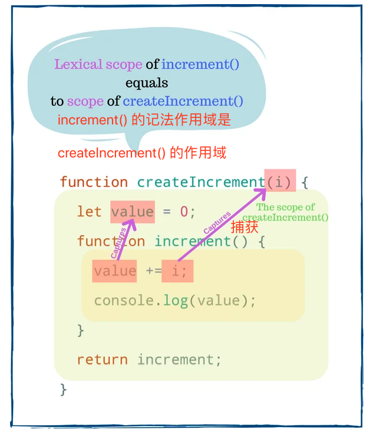

使用 JS 及 React Hook 时需要注意过时闭包的坑(文中有解决方法)

> 作者：Dmitri Pavlutin  
> 译者：前端小智  
> 来源：dmitripavlutin

* * *

**阿里云`双12`已开启，新老用户均可参与，2核1G云服务器仅需`79元`，，更多服务器配置及价格请关注：[Hi拼团](https://www.aliyun.com/minisite/goods?userCode=pxuujn3r&share_source=copy_link)，或点此了解[“云上爆款1折特惠活动”](https://www.aliyun.com/minisite/goods?userCode=pxuujn3r&share_source=copy_link)。同时，建议在购买阿里云相关产品前[先领取阿里云2000元代金券](https://www.aliyun.com/minisite/goods?userCode=pxuujn3r&share_source=copy_link)会更优惠哦。**

* * *

**为了保证的可读性，本文采用意译而非直译。**

## 1\. JS 中的闭包

下面定义了一个工厂函数 `createIncrement(i)`，它返回一个`increment`函数。之后，每次调用`increment`函数时，内部计数器的值都会增加`i`。

```
function createIncrement(i) {
  let value = 0;
  function increment() {
    value += i;
    console.log(value);
  }
  return increment;
}

const inc = createIncrement(1);
inc(); 
inc(); 

```

`createIncrement(1)` 返回一个增量函数，该函数赋值给`inc`变量。当调用`inc()`时，`value` 变量加`1`。

第一次调用`inc()`返回`1`，第二次调用返回`2`，依此类推。

这挺趣的，只要调用`inc()`还不带参数，JS 仍然知道当前 `value` 和 `i` 的增量，来看看这玩意是如何工作的。

原理就在 `createIncrement()` 中。当在函数上返回一个函数时，有会有闭包产生。闭包捕获词法作用域中的变量 `value` 和 `i`。

词法作用域是定义闭包的外部作用域。在本例中，`increment()` 的词法作用域是`createIncrement()`的作用域，其中包含变量 `value` 和 `i`。



无论在何处调用 `inc()`，甚至在 `createIncrement()` 的作用域之外，它都可以访问 `value` 和 `i`。

> 闭包是一个可以从其词法作用域记住和修改变量的函数，不管执行作用域是什么。

继续这个例子，可以在任何地方调用 `inc()`，甚至在异步回调中也可以:

```
(function() {
  inc(); 
}());

setTimeout(function() {
  inc(); 
}, 1000);


```

## 2\. React Hooks 中的闭包

通过简化状态重用和副作用管理，Hooks 取代了基于类的组件。此外，咱们可以将重复的逻辑提取到自定义 Hook 中，以便在应用程序之间重用。

Hooks 严重依赖于 JS 闭包,但是闭包有时很棘手。

当咱们使用一个有多种副作用和状态管理的 React 组件时，可能会遇到的一个问题是过时的闭包，这可能很难解决。

咱们从提炼出过时的闭包开始。然后，看看过时的闭包如何影响 React Hook，以及如何解决这个问题。

## 3\. 过时的闭包

工厂函数`createIncrement(i)`返回一个`increment`函数。`increment` 函数对 `value` 增加i`请输入代码` ，并返回一个记录当前 `value` 的函数

```
function createIncrement(i) {
  let value = 0;
  function increment() {
    value += i;
    console.log(value);
    const message = `Current value is ${value}`;
    return function logValue() {
      console.log(message);
    };
  }
  
  return increment;
}

const inc = createIncrement(1);
const log = inc(); 
inc();             
inc();             

log();             

```

在第一次调用`inc()`时，返回的闭包被分配给变量 `log`。对 `inc()` 的 `3` 次调用的增量 `value` 为 `3`。

最后，调用`log()` 打印 message `“Current value is 1”`，这是出乎意料的，因为此时 `value` 等于 `3`。

`log()`是过时的闭包。在第一次调用 `inc()` 时，闭包 `log()` 捕获了具有 `“Current value is 1”` 的 `message` 变量。而现在，当 `value` 已经是 `3` 时，`message` 变量已经过时了。

> 过时的闭包捕获具有过时值的变量。

## 4.修复过时闭包的问题

#### 使用新的闭包

解决过时闭包的第一种方法是找到捕获最新变量的闭包。

咱们找到捕获了最新 `message` 变量的闭包。就是从最后一次调用 inc() 返回的闭包。

```
const inc = createIncrement(1);

inc();  
inc();  
const latestLog = inc(); 

latestLog(); 

```

`latestLog` 捕获的 `message` 变量具有最新的的值 “Current value is 3”。

顺便说一下，这大概就是 React Hook 处理闭包新鲜度的方式。

Hooks 实现假设在组件重新渲染之间，作为 Hook 回调提供的最新闭包(例如 `useEffect(callback)`) 已经从组件的函数作用域捕获了最新的变量。

#### 关闭已更改的变量

第二种方法是让`logValue()`直接使用 `value`。

让我们移动行 `const message = ...;` 到 `logValue()` 函数体中：

```
function createIncrementFixed(i) {
  let value = 0;
  function increment() {
    value += i;
    console.log(value);
    return function logValue() {
      const message = `Current value is ${value}`;
      console.log(message);
    };
  }
  
  return increment;
}

const inc = createIncrementFixed(1);
const log = inc(); 
inc();             
inc();             

log();             

```

`logValue()` 关闭 `createIncrementFixed()` 作用域内的 `value` 变量。`log()` 现在打印正确的消息“`Current value is 3`”。

## 5\. Hook 中过时的闭包

#### useEffect()

现在来研究一下在使用 `useEffect()` Hook 时出现过时闭包的常见情况。

在组件 `<WatchCount>` 中，`useEffect()`每秒打印 `count` 的值。

```
function WatchCount() {
  const [count, setCount] = useState(0);

  useEffect(function() {
    setInterval(function log() {
      console.log(`Count is: ${count}`);
    }, 2000);
  }, []);

  return (
    <div>
      {count}
      <button onClick={() => setCount(count + 1) }>
        加1
      </button>
    </div>
  );
}

```

打开 [CodeSandbox](https://codesandbox.io/s/stale-closure-use-effect-broken-2-gyhzk) 并单击几次**加1**按钮。然后看看控制台，每2秒打印 `Count is: 0`。

咋这样呢？

在第一次渲染时，`log()` 中闭包捕获 `count` 变量的值 `0`。过后，即使 `count` 增加，`log()`中使用的仍然是初始化的值 `0`。`log()` 中的闭包是一个过时的闭包。

解决方案是让 `useEffect()`知道 `log()` 中的闭包依赖于`count`：

```
function WatchCount() {
  const [count, setCount] = useState(0);

  useEffect(function() {
    const id = setInterval(function log() {
      console.log(`Count is: ${count}`);
    }, 2000);
    return function() {
      clearInterval(id);
    }
  }, [count]); 

  return (
    <div>
      {count}
      <button onClick={() => setCount(count + 1) }>
        Increase
      </button>
    </div>
  );
}
```

适当地设置依赖项后，一旦 `count` 更改，`useEffect()` 就更新闭包。

同样打开修复的 [codesandbox](https://codesandbox.io/s/stale-closure-use-effect-fixed-2-ybv47)，单击几次**加1**按钮。然后看看控制台，这次打印就是正确的值了。

正确管理 Hook 依赖关系是解决过时闭包问题的关键。推荐安装 [eslint-plugin-react-hooks](https://www.npmjs.com/package/eslint-plugin-react-hooks),它可以帮助咱们检测被遗忘的依赖项。

#### useState()

组件`<DelayedCount>`有 2 个按钮：

- 点击按键 **“Increase async”** 在异步模式下以`1`秒的延迟递增计数器
- 在同步模式下，点击按键 **“Increase sync”** 会立即增加计数器。
    
    function DelayedCount() {  
    const \[count, setCount\] = useState(0);
    
    function handleClickAsync() {
    
    ```
    setTimeout(function delay() {
      setCount(count + 1);
    }, 1000);
    ```
    
    }
    
    function handleClickSync() {
    
    ```
    setCount(count + 1);
    ```
    
    }
    
    return (
    
    ```
    <div>
      {count}
      <button onClick={handleClickAsync}>Increase async</button>
      <button onClick={handleClickSync}>Increase sync</button>
    </div>
    ```
    
    );  
    }
    

现在[打开 codesandbox 演示](https://codesandbox.io/s/use-state-broken-0q994)。点击 **“Increase async”** 按键然后立即点击 **“Increase sync”** 按钮，`count` 只更新到 `1`。

这是因为 `delay()` 是一个过时的闭包。

来看看这个过程发生了什么：

1.  初始渲染：`count` 值为 `0`。
2.  点击 **'Increase async'** 按钮。`delay()` 闭包捕获 `count` 的值 `0`。`setTimeout()` 1 秒后调用 `delay()`。
3.  点击 **“Increase async”** 按键。`handleClickSync()` 调用 `setCount(0 + 1)` 将 `count` 的值设置为 `1`，组件重新渲染。
4.  `1` 秒之后，`setTimeout()` 执行 `delay()` 函数。但是 `delay()` 中闭包保存 `count` 的值是初始渲染的值 `0`，所以调用 `setState(0 + 1)`，结果`count`保持为 `1`。

`delay()` 是一个过时的闭包，它使用在初始渲染期间捕获的过时的 `count` 变量。

为了解决这个问题，可以使用函数方法来更新 `count` 状态：

```
function DelayedCount() {
  const [count, setCount] = useState(0);

  function handleClickAsync() {
    setTimeout(function delay() {
      setCount(count => count + 1); 
    }, 1000);
  }

  function handleClickSync() {
    setCount(count + 1);
  }

  return (
    <div>
      {count}
      <button onClick={handleClickAsync}>Increase async</button>
      <button onClick={handleClickSync}>Increase sync</button>
    </div>
  );
}

```

现在 `setCount(count => count + 1)` 更新了 `delay()` 中的 `count` 状态。React 确保将最新状态值作为参数提供给更新状态函数，过时的闭包的问题就解决了。

## 总结

闭包是一个函数，它从定义变量的地方(或其词法范围)捕获变量。闭包是每个 JS 开发人员都应该知道的一个重要概念。

当闭包捕获过时的变量时，就会出现过时闭包的问题。解决过时闭包的一个有效方法是正确设置 React Hook 的依赖项。或者，对于过时的状态，使用函数方式更新状态。

你认为闭包使得 React Hook 很难理解吗？

**代码部署后可能存在的BUG没法实时知道，事后为了解决这些BUG，花了大量的时间进行log 调试，这边顺便给大家推荐一个好用的BUG监控工具 [Fundebug](https://www.fundebug.com/?utm_source=xiaozhi)。**

原文：  
[https://dmitripavlutin.com/si...](https://dmitripavlutin.com/simple-explanation-of-javascript-closures/)  
[https://dmitripavlutin.com/re...](https://dmitripavlutin.com/react-hooks-stale-closures/)

## 交流（欢迎加入群，群工作日都会发红包，互动讨论技术）

阿里云最近在做活动，低至2折，有兴趣可以看看：[https://promotion.aliyun.com/...](https://promotion.aliyun.com/ntms/yunparter/invite.html?userCode=pxuujn3r)

干货系列文章汇总如下，觉得不错点个Star，欢迎 加群 互相学习。

> [https://github.com/qq449245884/xiaozhi](https://github.com/qq449245884/xiaozhi)

因为篇幅的限制，今天的分享只到这里。如果大家想了解更多的内容的话，可以去扫一扫每篇文章最下面的二维码，然后关注咱们的微信公众号，了解更多的资讯和有价值的内容。


**每次整理文章，一般都到2点才睡觉，一周4次左右，挺苦的，还望支持，给点鼓励**

