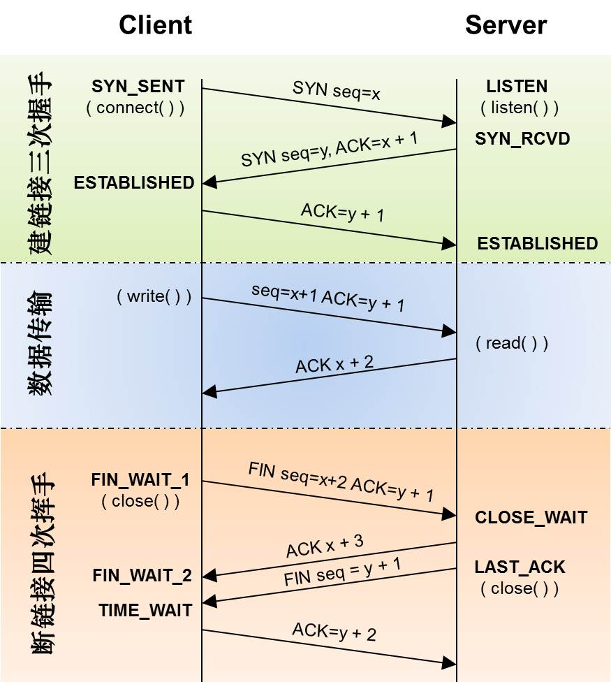

HTTP & 网络

    # HTTP
超文本传输协议

## URI URL
URI 统一资源标识符 Universal Resource Identifier
URL 统一资源定位符 Universal Resource Locator

## 报文

### 请求报文

```
<method> <path> <version>
<headers>

<entity-body>
```

### 响应报文
```
<version> <status code> <status message>
<headers>

<entity-body>
```

### HTTP Headers
- 通用头：同时适用于请求和响应消息

header | 描述
---|---
Connection |	客户端和服务器是否保持连接
Date |	日期，报文创建时间
Update |	给出了发送端可能想要升级使用新版本或协议
Via	| 显示了报文经过的中间节点（代理、网关）
Trailer	|如果报文采用分块传输编码方式，可以利用这个首部列出位于报文trailer部分的首部集合
Trailer-Encoding	|告诉接收端对报文采用什么编码格式
Cache-Control	|随报文传送缓存指示
Pragma	|早期的随报文传送指示方式

- 请求头

header 1 | header 2
---|---
Host | 接收请求的服务器的主机名和端口号
Referer | 当前页面的URL
User-Agent | 客户端应用程序
Accept | 期望接收的 MIME类型
Accept Charset | 
Accept-Encoding | 
Accept-Language |
If-Match | 控制缓存
If-None-Match |
If-Modified-Since |
If-Unmodified-Since |
If-Range |
Cookie |

- 响应头

header 1 | header 2
---|---
Allow | 可用的HTTP方法
Location | 重定向地址
Content-Base|	解析主体中相对URL的基础URL
Content-Encoding|	主体编码格式
Content-Language|	解析主体时适用的语言
Content-Length|	主体的长度或尺寸
Content-Location|	资源实际位置
Content-MD5|	主体的MD5校验和
Content-Range|	在整个资源中此实体部分的字节范围
Content-Type|	主体的MIME
Expires |
Last-Modified |

## 方法
- GET 获取数据
- POST 发送数据到服务器，通常导致服务端状态的更改
- PUT replace target resource with request payload
- DELETE 删除指定的资源
- HEAD 请求一个与GET请求的响应相同的响应，但没有响应体，主要用于：1.获取资源信息（类型、大小）2. 通过状态码查看资源是否存在 3.通过查看响应头，测试资源是否别修改了
- OPTIONS 获取服务器支持的请求方法，响应包含Allow响应头
- CONNECT
- PATCH

## 响应状态码
1xx 
2xx 成功响应
3xx 重定向
4xx 客户端错误
5xx 服务端错误

状态码 | 状态信息 | 描述 
---|---|--
100  | Continue | 客户端继续发送请求其余的部分
101 | Switching Protocol | 切换协议，响应客户端的`Upgrade`头部
200 | OK | 
201 | Created | 创建了新的资源 通常是`PUT`请求的响应
202 | Accepted | 已收到请求，但未完成处理
204 | No Content | 服务器成功处理了请求，但不需要返回任何实体内容
205 | reset Content |
206 | Partial Content | 分段下载，请求应包含`Range`头或`If-Range`
300 | Multiple Choice |
301 | Moved Permanently | 资源已永久一定到新位置，永久重定向，客户端未来应通过新的URI访问，请求自动跳转到新地址
302 | Found | 临时重定向，客户端未来仍应通过原有地址访问
304 | Not Modified | 访问缓存
401 | Unauthorized | 未授权
403 | Forbidden | 资源不可用，服务器已理解请求，但拒绝执行
404 | Not Found
500 | Internal Server Error

## 缓存
200 OK 返回正常的结果
200 from cache 强缓存 Cache-Control max-age expires 不发请求
304 Not Modified 协商缓存 Etag/If-None-Match Last-Modified/If-Modified-Since 

### Cache-Control：
- public 响应可被任何中间节点缓存
- privete 中间节点不允许缓存
- no-cache 不使用Cache-Control来控制缓存，而是使用Etag或者Last-Modified
- no-store 真正的不使用缓存
- max-age 资源的有效时间，单位为秒

### Etag
如果响应头包含`Etag`，客户端后续请求可以带上`If-None-Match`

### Last-Modified
如果响应头包含`Last-Modified`，客户端后续请求包含`If-Modified-Since`

## HTTPS
HTTP + SSL

### 工作原理
- 客户端使用HTTPS URL访问服务器，要求web服务器简历ssl连接
- 服务器将网站的CA证书（包含公钥）传给客户端
- 客户端和服务器端吸上ssl链接的安全等级，也就是加密等级
- 客户端建立会话密钥，用网站的公钥加密会话密钥，传给服务端
- 服务端用自己的私钥解密出会话密钥
- 服务端通过会话密钥加密与客户端的通信

CA是第三方认证组织，CA证书的安全性由操作系统或浏览器验证，他们带有CA证书列表

会话密钥 -- 非对称加密
HTTP报文 -- 对称加密

## TCP 
[https://github.com/jawil/blog/issues/14](https://github.com/jawil/blog/issues/14)



ACK ： TCP协议规定，只有ACK=1时有效，也规定连接建立后所有发送的报文的ACK必须为1

SYN(SYNchronization) ： 在连接建立时用来同步序号。当SYN=1而ACK=0时，表明这是一个连接请求报文。对方若同意建立连接，则应在响应报文中使SYN=1和ACK=1. 因此, SYN置1就表示这是一个连接请求或连接接受报文。

FIN （finis）即完，终结的意思， 用来释放一个连接。当 FIN = 1 时，表明此报文段的发送方的数据已经发送完毕，并要求释放连接。

## 网络
TCP 面向连接的、可靠的、基于字节流的、全双工的传输层通信协议
UDP无连接、不可靠的、基于报文的、支持一对多

### OSI 七层
7. 应用层
6. 表示层  应用层数据编码和转化
5. 会话层
4. 传输层  TCP UDP
3. 网络层  IP
2. 数据链路层 MAC地址
1. 物理层

### TCP/IP 分层
- 应用层
- 传输层 TCP可靠的 UDP不可靠的
- 网际层 ICMP（互联网控制消息协议，传递查询报文和差错报文 不可靠，ping, traceroute） IP ARP地址解析（Address resolution protocol）
- 链路层

## HTTP2.0
- 二进制格式，而不是文本格式
- 对消息头压缩  
- 多路复用，通过同一个Tcp连接
- server push
 
## WebSocket
- TCP
- HTTP兼容，握手阶段使用HTTP
- 数据格式轻量，性能开销小，通信高效
- 文本&二进制
- 没有同源
- 双向